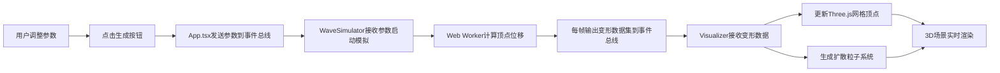

## 1. 产品概述

GeoWave 是一个轻量级的3D地形震波可视化应用，让用户通过输入简单的地震参数（震中经纬度、震级、深度）直观地观察地震波在地形上的传播效果。相比专业地震模拟软件，GeoWave 提供了更轻量、更直观的交互体验。

- 面向用户：地震学爱好者、学生、教育工作者、科普展示场景
- 核心价值：将抽象的地震物理过程转化为直观的3D视觉体验

## 2. 核心功能

### 2.1 功能模块

1. **3D地形渲染**：基于Three.js的500x500单位网格地形平面
2. **震波物理模拟**：独立的WaveSimulator模块计算顶点位移和震波传播
3. **粒子扩散动画**：Visualizer模块驱动的彩色粒子环扩散效果
4. **参数控制面板**：经度、纬度、震级、深度四个参数滑块 + 触发按钮
5. **相机轨道控制**：鼠标拖拽旋转/平移、滚轮缩放
6. **实时性能监控**：FPS计数器和粒子数量显示

### 2.2 页面详情

| 页面名称 | 模块名称 | 功能描述 |
|-----------|-------------|---------------------|
| 主页面 | 3D场景容器 | 全屏Three.js渲染，地形平面、粒子系统、相机控制 |
| 主页面 | 参数控制面板 | 经度(-180~180)、纬度(-90~90)、震级(1.0~9.0)、深度(0~100km)滑块 |
| 主页面 | 生成按钮 | 触发震波模拟，带动画反馈 |
| 主页面 | 性能监控 | 左上角显示FPS和粒子数量 |

## 3. 核心流程

用户在右侧面板调整地震参数 → 点击生成按钮 → WaveSimulator模块基于参数计算地形变形和震波传播 → 事件总线传递变形数据 → Visualizer模块更新网格顶点和生成粒子 → 3D场景实时渲染动画 → 地形在3秒内达到最大变形后缓慢恢复至10%永久形变

## 4. 用户界面设计

### 4.1 设计风格

- **整体主题**：深色科幻风格
- **背景色**：#0a0a12（深空蓝黑）
- **主色调**：
  - 暖橙强调色：#ff6b35（震波相关UI元素）
  - 冰蓝强调色：#00d4ff（科技感元素）
  - 面板底色：#2a2a3a / rgba(20,20,30,0.9)
  - 滑块按钮：#f1c40f（金黄色）
  - 地形初始色：#4a7c59（军绿色）
  - 粒子渐变：#ff4500（橙红）→ #1e90ff（道奇蓝）
- **按钮样式**：圆角8px，高44px，红色(#e74c3c)背景，hover时变深(#c0392b)，点击放大1.05倍并带脉冲动画
- **字体**：system-ui, -apple-system, sans-serif（无衬线体）
- **排版**：标题18px加粗，正文14px普通，行高1.5
- **动效**：所有UI元素过渡0.2s ease，hover时带0.3px外发光

### 4.2 页面设计概览

| 页面名称 | 模块名称 | UI元素 |
|-----------|-------------|-------------|
| 主页面 | 3D场景 | 全屏500x500网格平面，初始平坦，半透明网格线 |
| 主页面 | 参数面板 | 固定右侧，宽320px，圆角12px，背景rgba(20,20,30,0.9)，内边距24px |
| 主页面 | 滑块控件 | 轨道高6px圆角3px背景#3a3a4a，按钮直径20px圆角50%背景#f1c40f，hover时发光 |
| 主页面 | 性能监控 | 左上角，13px深绿#2ecc71字体，背景rgba(0,0,0,0.5)，圆角6px，内边距8px 12px |

### 4.3 响应式设计

- 桌面端（≥768px）：UI面板固定在屏幕右侧，3D场景占满剩余空间
- 移动端（<768px）：UI面板折叠到顶部，3D场景占满全屏下方
- 触控优化：支持触摸手势控制相机

### 4.4 3D场景设计

- **环境**：深色背景，微弱环境光 + 方向光从上方照射
- **光照设置**：AmbientLight(0x404040, 0.5) + DirectionalLight(0xffffff, 0.8)
- **相机设置**：默认位于震中上方30度俯角，距离震中30单位，观察范围5-50单位
- **相机运动**：左键拖拽旋转(0.5弧度/秒)、右键拖拽平移(2单位/秒)、滚轮缩放(步进0.5单位)
- **地形网格**：平面几何体分段数控制在约50x50，顶点数不超过2500个
- **粒子系统**：直径0.3-0.8随机，寿命3秒，总数2000-4000，环半径每秒增长50单位至最大300单位
- **后处理**：无额外后处理，保证性能
- **性能预算**：帧率≥40FPS，粒子更新≥30次/秒
