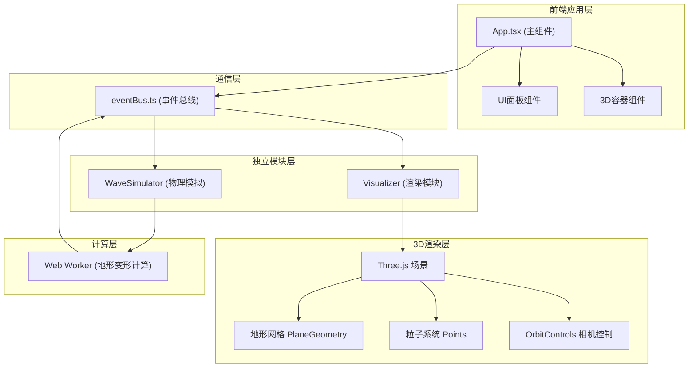

## 1. 架构设计



## 2. 技术描述

- **前端框架**：React@18 + TypeScript
- **构建工具**：Vite@5
- **3D渲染**：three@latest + @types/three
- **状态管理**：轻量级事件总线（自定义），无需额外状态库
- **性能优化**：Web Worker 处理物理计算，避免阻塞主线程

## 3. 文件结构

```
auto141/
├── index.html                      # 入口页面
├── package.json                    # 项目依赖
├── tsconfig.json                   # TypeScript配置
├── vite.config.js                  # Vite配置
└── src/
    ├── App.tsx                     # 主组件：UI面板 + 3D容器
    ├── eventBus.ts                 # 事件总线：模块间通信
    ├── waveSimulator.ts            # WaveSimulator模块：物理模拟
    └── visualizer.ts               # Visualizer模块：3D渲染 + 粒子
```

## 4. 模块定义

### 4.1 事件总线 (eventBus.ts)

```typescript
// 事件类型定义
type EventType =
  | 'earthquake:trigger'      // 触发地震，携带参数
  | 'terrain:update'          // 地形变形数据更新
  | 'particles:update'        // 粒子系统数据更新
  | 'performance:report';     // 性能数据报告

interface EarthquakeParams {
  longitude: number;  // -180 ~ 180
  latitude: number;   // -90 ~ 90
  magnitude: number;  // 1.0 ~ 9.0
  depth: number;      // 0 ~ 100 km
}

interface TerrainData {
  vertices: Float32Array;  // 顶点位移数据
  timestamp: number;
}

interface ParticleData {
  positions: Float32Array;
  colors: Float32Array;
  count: number;
}
```

### 4.2 WaveSimulator模块

- **职责**：接收震源参数，每帧计算网格顶点位移，输出变形数据集
- **实现**：使用Web Worker在后台线程计算，不阻塞主线程
- **核心算法**：
  - 震源坐标映射到地形平面中心
  - 基于震级计算最大振幅 (magnitude * 0.5)
  - 震波传播速度与深度相关（深度越深，速度越快）
  - 振幅随距离指数衰减
  - 3秒内从平坦过渡到最大变形（ease-out缓动），然后恢复至10%永久形变

### 4.3 Visualizer模块

- **职责**：接收变形数据，更新Three.js网格顶点，管理粒子系统
- **核心功能**：
  - Three.js场景初始化（相机、灯光、渲染器）
  - 50x50分段地形平面（顶点数 ≤ 2500）
  - OrbitControls相机控制（旋转/平移/缩放）
  - 粒子系统（Points + BufferGeometry）
    - 粒子直径0.3-0.8随机
    - 颜色从#ff4500渐变到#1e90ff
    - 寿命3秒
    - 总数2000-4000动态调整
    - 环半径每秒增长50单位，最大300单位
    - 透明度从1.0线性递减到0.2

### 4.4 App.tsx主组件

- **职责**：
  - 集成UI参数面板和3D容器
  - 监听事件总线更新React状态
  - 左上角FPS和粒子数量显示
- **UI面板规格**：
  - 宽度320px，固定右侧距上边80px
  - 背景rgba(20,20,30,0.9)，圆角12px，内边距24px
  - 响应式：<768px时折叠到顶部
  - 四个滑块：经度、纬度、震级、深度
  - 生成按钮：全宽44px高，红色背景，脉冲动画

## 5. 性能优化策略

1. **Web Worker计算分离**：物理模拟在Worker线程，主线程只处理渲染
2. **顶点数量控制**：50x50分段平面 = 2601顶点，≤2500限制
3. **粒子池复用**：使用对象池避免频繁创建销毁粒子
4. **BufferGeometry**：使用类型化数组直接操作GPU缓冲区
5. **帧率控制**：粒子更新节流到30FPS，渲染维持60FPS
6. **动态粒子数**：根据当前FPS动态调整粒子数量（2000-4000范围）
