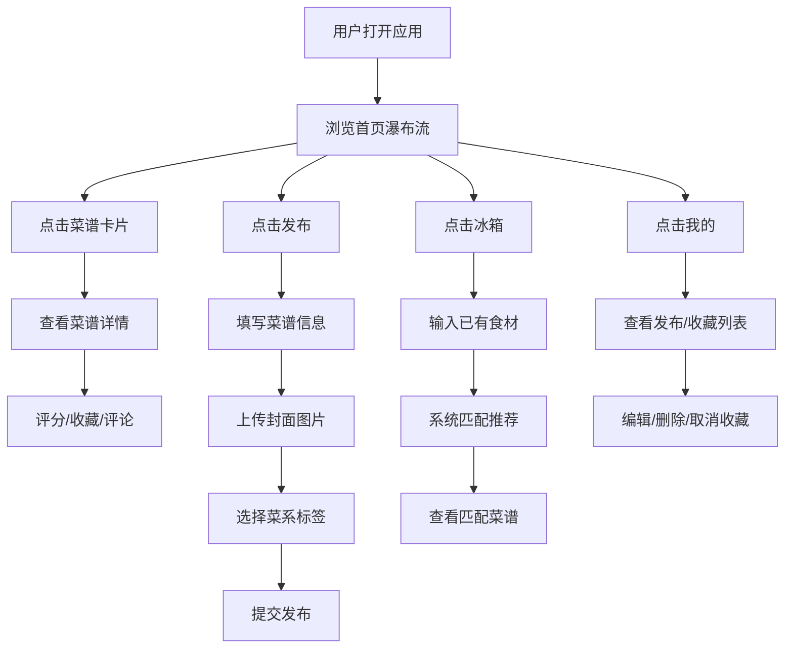

## 1. 产品概述

RecipeSwap 是一个面向家庭厨师的菜谱分享与智能推荐平台，帮助用户分享拿手菜谱、根据冰箱剩余食材智能推荐可制作的菜品，比传统菜谱书籍和短视频更加实用高效。

- **核心问题**：家庭主妇/煮夫经常面临"冰箱里有这些食材能做什么菜"的困惑，以及想分享自己拿手菜但缺乏便捷平台的问题
- **目标用户**：热爱烹饪的家庭厨师、希望提高食材利用率的日常做饭人群
- **产品价值**：连接美食爱好者，减少食材浪费，提供精准的食材匹配推荐

## 2. 核心功能

### 2.1 用户角色

| 角色 | 注册方式 | 核心权限 |
|------|----------|----------|
| 普通用户 | 直接使用（无需注册，演示模式） | 浏览菜谱、发布菜谱、评分、评论、收藏、冰箱食材管理 |

### 2.2 功能模块

1. **首页（瀑布流菜谱墙）**：瀑布流卡片展示所有菜谱，支持评分、收藏
2. **菜谱发布页**：上传菜谱（标题、步骤、封面图、菜系标签）
3. **冰箱清单页**：输入已有食材，智能匹配推荐可做的菜品
4. **菜谱详情页**：完整步骤、封面大图、评分、评论列表、点赞/踩
5. **个人中心页**：我发布的菜谱、我收藏的菜谱，支持编辑/删除/取消收藏

### 2.3 页面详情

| 页面名称 | 模块名称 | 功能描述 |
|----------|----------|----------|
| 首页 | 导航栏 | 品牌Logo、页面跳转（首页、发布、冰箱、我的） |
| 首页 | 瀑布流卡片墙 | 无限滚动加载，每张卡片显示封面、菜名、标签、星级评分，hover微上移动效 |
| 菜谱发布页 | 标题输入 | 最多30字，实时字数统计 |
| 菜谱发布页 | 步骤编辑 | 文本区域，支持换行和简单标记 |
| 菜谱发布页 | 封面上传 | 拖拽/点击上传，400x250预览框，虚线边框，上传后缩略图铺满 |
| 菜谱发布页 | 菜系标签 | 中/西/日/韩四个圆角标签按钮，选中橙色高亮 |
| 冰箱清单页 | 食材输入框 | 带自动完成下拉建议（宽280px，最大高200px） |
| 冰箱清单页 | 已选食材列表 | 标签形式展示，可删除 |
| 冰箱清单页 | 匹配结果列表 | 按匹配度分级展示（完美/部分/少量），显示匹配食材标签 |
| 菜谱详情页 | 封面大图 | 顶部展示菜谱封面 |
| 菜谱详情页 | 基本信息 | 菜名、菜系标签、评分星星 |
| 菜谱详情页 | 制作步骤 | 完整步骤展示 |
| 菜谱详情页 | 评论区 | 评论列表、发表评论、点赞/踩按钮 |
| 个人中心页 | 我发布的菜谱 | 水平滚动卡片列表，编辑/删除按钮 |
| 个人中心页 | 我收藏的菜谱 | 水平滚动卡片列表，取消收藏按钮 |

## 3. 核心流程

### 主要用户流程

用户打开应用 → 浏览首页瀑布流菜谱 → 点击卡片进入详情页查看做法 → 可评分、收藏、发表评论

用户点击"发布" → 填写标题、步骤、上传封面、选择菜系 → 提交发布 → 返回首页查看新发布的菜谱

用户点击"冰箱" → 输入已有的食材（自动完成提示）→ 系统匹配推荐可做的菜 → 点击查看匹配菜谱详情

用户点击"我的" → 查看自己发布的菜谱（可编辑/删除）→ 查看收藏的菜谱（可取消收藏）

## 4. 用户界面设计

### 4.1 设计风格

- **主色调**：#f59e0b（暖橙色）
- **辅助色**：#1e293b（深蓝灰）
- **背景色**：#f8fafc（浅灰蓝）
- **文字主色**：#1f2937（深灰）
- **次要文字**：#64748b（中灰）
- **按钮样式**：大圆角、微缩放过渡（transition: all 0.2s cubic-bezier(0.4, 0, 0.2, 1)）
- **卡片样式**：大圆角（12-16px）、柔和阴影（0 4px 12px rgba(0,0,0,0.06)）
- **图标风格**：使用 lucide-react 图标库
- **动效**：评分星星弹性动画、瀑布流卡片底部渐入、hover状态平滑过渡

### 4.2 页面设计概览

| 页面名称 | 模块名称 | UI 元素 |
|----------|----------|---------|
| 首页 | 瀑布流卡片 | 宽320px、圆角16px、白底阴影、封面图+菜名+标签+评分、hover上移4px加深阴影、过渡0.3s ease、渐入动画（opacity 0→1, translateY 20px→0, 0.4s, 延迟0.05s） |
| 发布页 | 表单容器 | 宽100%、最大宽800px、居中、内边距24px |
| 发布页 | 封面预览框 | 宽400px高250px、圆角12px、2px虚线#64748b、背景#1e293b、上传后缩略图铺满 |
| 发布页 | 菜系标签 | 圆角8px、选中背景#f59e0b橙色、未选中#334155灰色 |
| 冰箱清单页 | 自动完成下拉 | 宽280px、最大高200px、圆角8px、白底、阴影0 4px 12px rgba(0,0,0,0.1) |
| 冰箱清单页 | 匹配度等级 | 完美匹配#22c55e绿色、部分匹配#eab308黄色、少量匹配#ef4444红色 |
| 详情页 | 容器 | 圆角24px、背景#f8fafc、内边距32px、最大宽720px居中 |
| 详情页 | 评论输入框 | 宽100%、最小高80px、圆角8px、白底、边框1px #e2e8f0、焦点边框#f59e0b |
| 详情页 | 点赞/踩按钮 | 24px拇指图标、默认灰色#94a3b8、点赞蓝色#3b82f6、踩红色#ef4444、切换动画0.2s |
| 个人中心 | 卡片按钮 | 圆形直径32px、背景#f1f5f9、hover背景#e2e8f0、过渡0.2s |

### 4.3 响应式设计

- **设计原则**：桌面优先，移动端自适应
- **断点**：768px
- **移动端适配**：
  - 瀑布流变为单列布局
  - 详情页从侧边布局变为纵向排列
  - 导航栏优化为底部或紧凑顶部
  - 输入框和按钮尺寸适配触摸操作

### 4.4 性能指标

- 首屏加载时间 ≤ 1.5秒
- 瀑布流每批8张图片渲染耗时 ≤ 80ms
- 图片懒加载优化
