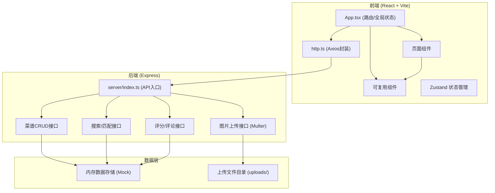
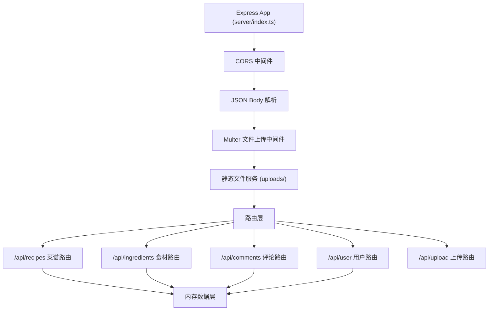
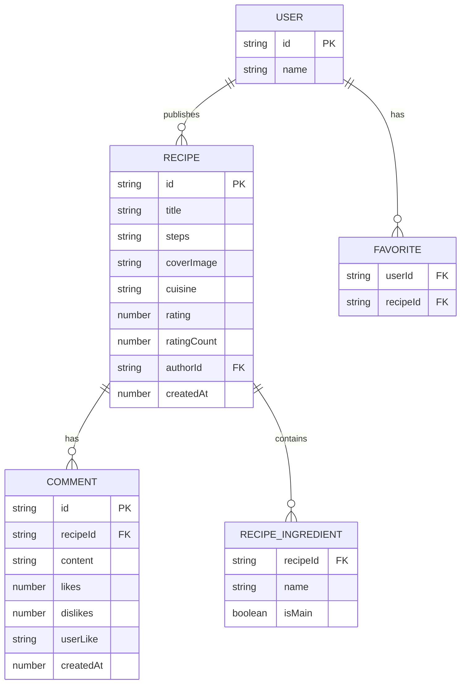

## 1. 架构设计



## 2. 技术描述

- **前端**：React@18 + TypeScript + Vite@5
- **路由**：react-router-dom@6
- **状态管理**：zustand
- **样式**：Tailwind CSS@3
- **HTTP 客户端**：axios（封装于 src/http.ts）
- **图标**：lucide-react
- **后端**：Express@4 + TypeScript
- **文件上传**：multer
- **跨域**：cors
- **ID 生成**：uuid
- **数据存储**：内存 Mock 数据（无需数据库）

## 3. 路由定义

| 路由 | 用途 |
|------|------|
| / | 首页（瀑布流菜谱墙） |
| /publish | 菜谱发布页 |
| /fridge | 冰箱清单页（食材匹配推荐） |
| /recipe/:id | 菜谱详情页 |
| /profile | 个人中心页 |

## 4. API 定义

### 类型定义

```typescript
interface Recipe {
  id: string;
  title: string;
  steps: string;
  coverImage: string;
  cuisine: 'chinese' | 'western' | 'japanese' | 'korean';
  ingredients: { name: string; isMain: boolean }[];
  rating: number;
  ratingCount: number;
  authorId: string;
  createdAt: number;
}

interface Comment {
  id: string;
  recipeId: string;
  content: string;
  likes: number;
  dislikes: number;
  userLike: 'like' | 'dislike' | null;
  createdAt: number;
}

interface Ingredient {
  name: string;
}

type MatchLevel = 'perfect' | 'partial' | 'little';

interface MatchedRecipe extends Recipe {
  matchLevel: MatchLevel;
  matchedIngredients: string[];
}
```

### API 端点

| 方法 | 路径 | 描述 | 请求 | 响应 |
|------|------|------|------|------|
| GET | /api/recipes | 获取菜谱列表（分页） | `?page=1&limit=8` | `{ recipes: Recipe[], hasMore: boolean }` |
| GET | /api/recipes/:id | 获取单个菜谱详情 | - | `Recipe` |
| POST | /api/recipes | 发布新菜谱 | `FormData { title, steps, coverImage, cuisine, ingredients }` | `Recipe` |
| PUT | /api/recipes/:id | 编辑菜谱 | 同上 | `Recipe` |
| DELETE | /api/recipes/:id | 删除菜谱 | - | `{ success: true }` |
| POST | /api/recipes/:id/rate | 评分菜谱 | `{ rating: number }` | `{ rating: number, ratingCount: number }` |
| GET | /api/recipes/:id/comments | 获取评论列表 | - | `Comment[]` |
| POST | /api/recipes/:id/comments | 发表评论 | `{ content: string }` | `Comment` |
| POST | /api/comments/:id/react | 点赞/踩评论 | `{ type: 'like' \| 'dislike' }` | `Comment` |
| GET | /api/ingredients/search | 搜索食材（自动完成） | `?q=鸡蛋` | `Ingredient[]` |
| POST | /api/recipes/match | 按食材匹配菜谱 | `{ ingredients: string[] }` | `MatchedRecipe[]` |
| GET | /api/user/recipes | 获取我发布的菜谱 | - | `Recipe[]` |
| GET | /api/user/favorites | 获取我收藏的菜谱 | - | `Recipe[]` |
| POST | /api/recipes/:id/favorite | 收藏/取消收藏 | - | `{ favorited: boolean }` |
| POST | /api/upload | 上传图片 | `FormData { file }` | `{ url: string }` |

## 5. 服务器架构图



## 6. 数据模型

### 6.1 数据模型定义



### 6.2 初始化数据

启动时预置8-10条示例菜谱数据，包含中/西/日/韩各菜系，每条菜谱包含3-6种食材（区分主要/辅助），以及若干示例评论。
