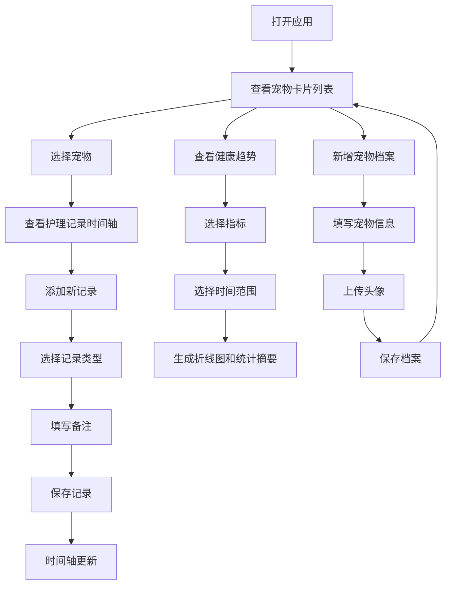

## 1. 产品概述

宠物健康档案管理应用，帮助宠物主人为毛孩子创建个性化健康档案、记录日常护理数据、自动生成健康趋势图。解决宠物健康数据分散、无法跟踪长期变化、就医时无法提供完整日志的痛点。

- **核心目标**：集中化管理宠物健康数据，提供直观的趋势分析，辅助主人科学养宠
- **目标用户**：养宠人士，关注宠物健康管理的宠物主人
- **市场价值**：填补宠物健康数据管理的空白，提供便捷的本地数据存储方案

## 2. 核心 Features

### 2.1 用户角色
| 角色 | 注册方式 | 核心权限 |
|------|----------|----------|
| 宠物主人 | 无需注册，本地存储 | 宠物档案管理、护理记录添加、健康趋势查看 |

### 2.2 Feature Module
1. **首页**：宠物卡片列表、导航栏、添加记录入口
2. **宠物档案管理**：宠物卡片展示、新增/编辑/删除宠物档案、头像上传
3. **护理记录模块**：时间轴展示记录、新增记录、记录类型标签
4. **健康趋势模块**：指标选择、时间范围切换、折线图展示、统计摘要

### 2.3 Page Details
| 页面名称 | 模块名称 | Feature description |
|----------|----------|---------------------|
| 首页 | 宠物卡片列表 | 卡片式展示所有宠物，支持编辑、删除、展开记录操作 |
| 首页 | 导航栏 | 固定顶部，显示当前宠物信息，右侧添加记录按钮 |
| 记录详情页 | 时间轴 | 按时间顺序展示护理记录，支持淡入动画效果 |
| 记录详情页 | 新增记录表单 | 下拉选择记录类型，输入备注，默认当前时间 |
| 趋势分析页 | 趋势图表 | 折线图展示体重或遛弯时长趋势，支持7/30/90天切换 |
| 趋势分析页 | 统计摘要 | 显示平均值、最大值等关键指标 |

## 3. 核心流程

### 3.1 主要用户流程
1. 用户打开应用 → 查看宠物卡片列表 → 点击某只宠物 → 查看该宠物的护理记录时间轴
2. 用户点击"添加记录" → 选择记录类型 → 填写备注 → 保存记录 → 时间轴自动更新
3. 用户进入趋势分析 → 选择指标（体重/遛弯时长） → 选择时间范围 → 查看图表和统计数据
4. 用户点击"新增宠物" → 填写宠物信息 → 上传头像 → 保存 → 首页显示新宠物卡片

### 3.2 流程图

## 4. 用户界面设计

### 4.1 设计风格
- **整体风格**：暖色原木风格，温暖亲切，符合宠物主人的情感需求
- **主色调**：#d4a373（原木色）
- **强调色**：#c65b3e（暖橙色）
- **背景色**：#faf7f2（米白色）
- **卡片背景**：#f5f0eb（浅米色）
- **文字颜色**：#3e2c1b（深棕色）
- **按钮风格**：圆角设计，悬停时有轻微上浮效果（transform: translateY(-2px)），阴影加深
- **字体**：采用优雅的衬线与无衬线字体组合，标题使用有温度的字体
- **布局风格**：卡片式布局，顶部固定导航栏，居中布局，最大宽度960px
- **图标风格**：线性简洁图标，尺寸24x24px，默认颜色#8b7d70，悬停变#c65b3e

### 4.2 页面设计概述
| 页面名称 | 模块名称 | UI Elements |
|----------|----------|-------------|
| 首页 | 宠物卡片 | 宽280px，圆角12px，背景#f5f0eb，阴影0 2px 8px rgba(0,0,0,0.06)，头像圆形64px，底部图标按钮 |
| 记录详情页 | 时间轴 | 左侧灰色竖线，每条记录左侧圆形标记（按类型着色），右侧记录卡片，依次淡入动画 |
| 记录详情页 | 记录标签 | 圆角6px，喂食#e8a87c、遛弯#8bc34a、用药#e57373、洗澡#64b5f6、体重#ffb74d |
| 趋势分析页 | 折线图 | 曲线光滑，渐变填充，颜色#c65b3e，线宽2px，节点直径6px |
| 全局 | 导航栏 | 高56px，背景#d4a373，阴影0 2px 8px rgba(0,0,0,0.08) |

### 4.3 动画与交互
- **卡片悬停**：transform: translateY(-2px)，阴影加深至0 4px 12px rgba(0,0,0,0.1)，过渡0.3s ease
- **记录项加载**：fadeInUp 0.4s ease forwards，延迟从0.1s递增
- **图标按钮悬停**：颜色从#8b7d70变为#c65b3e，过渡0.2s ease

### 4.4 响应式设计
- 桌面优先设计，最大宽度960px居中显示
- 移动端自适应，卡片宽度调整为100%
- 触摸优化，按钮最小点击区域44x44px

## 5. 性能要求

| 指标 | 目标 |
|------|------|
| 首次加载后页面切换响应 | ≤ 200ms |
| 图表渲染时间 | ≤ 100ms |
| 数据存储 | localStorage本地存储，无网络请求延迟 |
