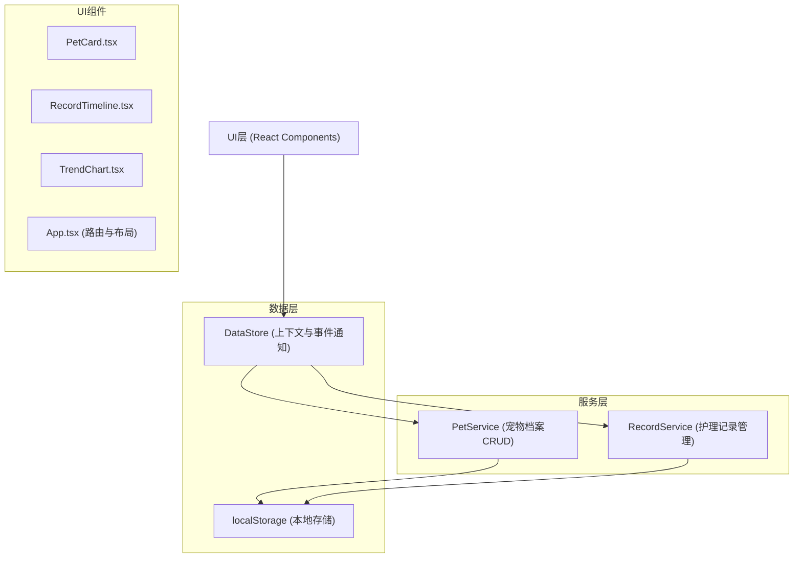
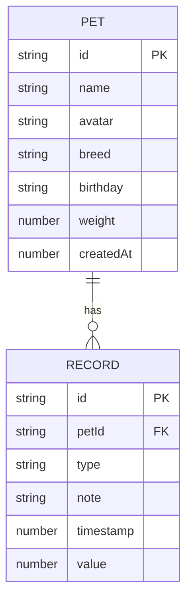

## 1. 架构设计



## 2. 技术描述

- **前端框架**：React@18 + TypeScript@5
- **构建工具**：Vite@5
- **图表库**：recharts@2
- **状态管理**：自定义 DataStore（基于 Context + EventEmitter）
- **数据存储**：localStorage（模拟后端）
- **初始化方式**：手动配置 Vite + React + TypeScript 项目

## 3. 文件结构

```
├── package.json
├── index.html
├── tsconfig.json
├── vite.config.js
└── src/
    ├── main.tsx          # React入口
    ├── App.tsx           # 根组件，路由和布局
    ├── types.ts          # 数据类型定义
    ├── DataStore.ts      # 统一数据管理与事件广播
    ├── PetService.ts     # 宠物档案CRUD服务
    ├── RecordService.ts  # 护理记录管理与趋势聚合
    └── components/
        ├── PetCard.tsx       # 宠物卡片组件
        ├── RecordTimeline.tsx # 时间轴组件
        └── TrendChart.tsx    # 趋势图表组件
```

## 4. 路由定义

| Route | Purpose |
|-------|---------|
| / | 首页 - 宠物卡片列表 |
| /pet/:id | 宠物详情 - 护理记录时间轴 |
| /pet/:id/trend | 趋势分析 - 健康趋势图表 |

## 5. 数据模型

### 5.1 数据模型定义



### 5.2 类型定义（types.ts）

```typescript
export type RecordType = 'feeding' | 'walk' | 'medication' | 'bath' | 'weight';

export interface Pet {
  id: string;
  name: string;
  avatar: string;
  breed: string;
  birthday: string;
  weight: number;
  createdAt: number;
}

export interface Record {
  id: string;
  petId: string;
  type: RecordType;
  note: string;
  timestamp: number;
  value?: number;
}

export interface TrendData {
  date: string;
  value: number;
}

export interface TrendStats {
  average: number;
  max: number;
  min: number;
  total: number;
}

export type TimeRange = 7 | 30 | 90;
export type TrendMetric = 'weight' | 'walkDuration';
```

### 5.3 记录类型配置

```typescript
export const RECORD_TYPE_CONFIG: Record<RecordType, { label: string; color: string }> = {
  feeding: { label: '喂食', color: '#e8a87c' },
  walk: { label: '遛弯', color: '#8bc34a' },
  medication: { label: '用药', color: '#e57373' },
  bath: { label: '洗澡', color: '#64b5f6' },
  weight: { label: '体重', color: '#ffb74d' },
};
```

## 6. 模块职责

### 6.1 DataStore.ts
- 维护全局状态（pets, records）
- 提供事件订阅/发布机制
- 与 localStorage 同步
- 提供 Context Provider

### 6.2 PetService.ts
- `createPet(pet: Omit<Pet, 'id' | 'createdAt'>): Promise<Pet>`
- `updatePet(id: string, updates: Partial<Pet>): Promise<Pet>`
- `deletePet(id: string): Promise<void>`
- `getPet(id: string): Pet | undefined`
- `getAllPets(): Pet[]`

### 6.3 RecordService.ts
- `addRecord(record: Omit<Record, 'id'>): Promise<Record>`
- `getRecordsByPetId(petId: string): Record[]`
- `getTrendData(petId: string, metric: TrendMetric, range: TimeRange): { data: TrendData[]; stats: TrendStats }`
- `deleteRecord(id: string): Promise<void>`

## 7. 性能优化策略

1. **数据缓存**：DataStore 内存缓存，避免重复读取 localStorage
2. **按需加载**：仅渲染当前视图所需组件
3. **图表优化**：recharts 使用 memo 优化，数据聚合在服务层完成
4. **动画优化**：使用 CSS 动画，避免 JS 动画阻塞主线程
5. **状态更新**：批量更新，减少重渲染次数

## 8. package.json 依赖

```json
{
  "name": "pet-health-tracker",
  "private": true,
  "version": "0.0.1",
  "type": "module",
  "scripts": {
    "dev": "vite",
    "build": "tsc && vite build",
    "preview": "vite preview"
  },
  "dependencies": {
    "react": "^18.2.0",
    "react-dom": "^18.2.0",
    "recharts": "^2.10.0"
  },
  "devDependencies": {
    "@types/react": "^18.2.0",
    "@types/react-dom": "^18.2.0",
    "@vitejs/plugin-react": "^4.2.0",
    "typescript": "^5.2.0",
    "vite": "^5.0.0"
  }
}
```
