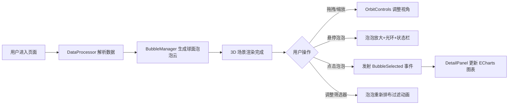

## 1. 产品概述

CarbonBubble 是一款面向数据新闻编辑室的 3D 碳排放与经济关联可视化应用，通过悬浮在三维空间中的国家泡泡云，让读者以交互式旋转与缩放的方式探索全球各国历年碳排放量与经济增长的关联，相比传统折线图或地图提供更直观且更具探索感的数据体验。

- 核心目标：以沉浸式 3D 泡泡云可视化方式呈现全球碳排放与人均 GDP 的关联关系
- 目标用户：数据新闻读者、环境研究人员、政策分析师
- 产品价值：通过新颖交互降低复杂数据理解门槛，提升数据新闻阅读体验

## 2. 核心特性

### 2.1 功能模块

1. **3D 泡泡云场景**：球面上排布的国家泡泡，大小映射年碳排放总量，颜色深浅映射人均 GDP 水平
2. **交互探索**：鼠标拖拽旋转、滚轮缩放、悬停高亮、底部状态栏提示
3. **详情面板**：点击泡泡弹出历年排放趋势折线图和人均 GDP 柱状图
4. **贸易网络连线**：半透明连线展示贸易伙伴关系，悬停时高亮关联网络
5. **数据筛选器**：通过排放量、GDP、年份范围滑块动态过滤泡泡

### 2.2 页面详情

| 页面名称 | 模块名称 | 功能描述 |
|-----------|-------------|---------------------|
| 主页面 | 3D 画布区域 | Three.js 渲染 30 个国家泡泡云，OrbitControls 轨道控制 |
| 主页面 | 详情面板（右侧） | ECharts 双图表展示历年数据，数值千分位格式化 |
| 主页面 | 筛选器浮层（左上） | 三滑块控制：最小排放量、人均 GDP 下限、年份范围 |
| 主页面 | 底部状态栏 | 悬停泡泡时显示国家名称和排放等级 |
| 主页面 | 重置视角按钮（右下） | 一键恢复默认相机视角 |

## 3. 核心流程

用户进入应用 → DataProcessor 解析模拟数据 → BubbleManager 在球面上生成泡泡 → 用户拖拽/缩放探索 → 悬停泡泡显示光环与状态栏 → 点击泡泡触发 BubbleSelected 事件 → DetailPanel 更新 ECharts 图表 → 调整筛选器滑块 → 泡泡重新排布过滤

## 4. 用户界面设计

### 4.1 设计风格

- **主色调**：深色主题，背景 `#0f0f1a`，面板背景 `#1e1e2e`
- **强调色**：人均 GDP 渐变色从 `#2dd4bf`（青绿）到 `#f43f5e`（玫红），6 个色阶
- **辅助色**：连线紫色 `#a78bfa`，高亮连线橙色 `#f59e0b`，滑块橙色 `#f59e0b`
- **文字颜色**：主文字 `#ffffff`，辅助灰 `#94a3b8`
- **字体**：Inter 无衬线字体
- **圆角规范**：面板 12px，按钮 8px，滑块轨道 2px

### 4.2 布局与交互

- **两栏布局**：左侧 70% 3D 画布，右侧 30% 详情面板，高度均为 100vh
- **泡泡悬停**：1.2 倍缩放，白色半透明光环，0.3s cubic-bezier 过渡
- **连线高亮**：关联连线透明度 0.6，颜色渐变橙色；非关联 0.05
- **筛选过渡**：0.5s ease 透明度动画（1→0.3→1）
- **重置按钮**：hover 时上移 2px，背景加深

### 4.3 3D 场景设计

- **球体半径**：8 单位球面分布泡泡
- **泡泡材质**：MeshPhongMaterial
- **光照系统**：环境光 + 平行光，营造 3D 立体感
- **泡泡尺寸**：半径 0.3-2.0 映射排放量
- **相机配置**：zoom 范围 3-25

### 4.4 性能指标

- 帧率目标：稳定 60FPS（30 个泡泡 + 连线）
- 内存占用：≤ 150MB
- 构建体积：< 2MB（不含 Three.js CDN）
