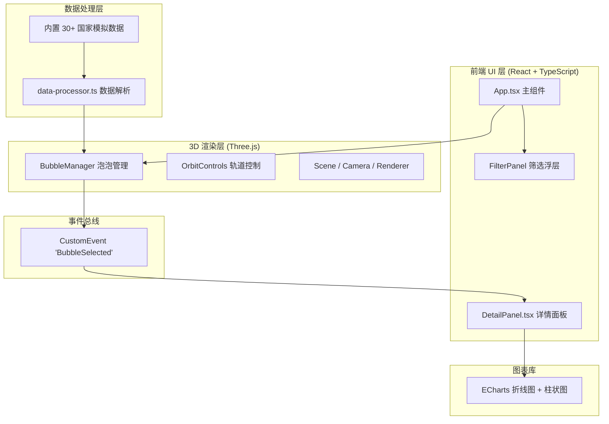

## 1. 架构设计



## 2. 技术选型

- **前端框架**：React 18 + TypeScript 5 + Vite 5
- **3D 渲染**：three.js 0.160 + @types/three
- **图表库**：echarts 5（折线图+柱状图）
- **初始化工具**：Vite（react-ts 模板）
- **数据来源**：内置模拟数据（30 个国家，覆盖六大洲）
- **构建工具**：Vite，target es2020

## 3. 核心文件结构

```
├── package.json              # 依赖与脚本
├── index.html                # 入口页面
├── tsconfig.json             # strict 模式 TypeScript 配置
├── vite.config.js            # Vite 基础配置
└── src/
    ├── main.tsx              # React 入口
    ├── App.tsx               # 主组件（两栏布局 + 3D 画布 + 筛选器）
    ├── DetailPanel.tsx       # 详情面板（ECharts 双图表）
    ├── data-processor.ts     # 数据解析模块（独立）
    ├── bubble-manager.ts     # 泡泡管理模块（独立）
    └── styles.css            # 全局样式
```

## 4. 模块职责定义

### 4.1 data-processor.ts

- **输入**：内置模拟数据（国家代码、全名、经纬度、2000-2023 年排放量、2000-2023 年 GDP、贸易伙伴数组）
- **输出**：国家对象数组 `ProcessedCountry[]`
- **核心函数**：
  - `processRawData()`：解析并格式化原始数据
  - `calculateColor(gdp: number)`：人均 GDP → hex 渐变色（6 色阶）
  - `calculateEmissionRadius(emission: number)`：排放量 → 泡泡半径（0.3-2.0）
  - `getTradePartners(code: string)`：获取指定国家的贸易伙伴数组

### 4.2 bubble-manager.ts

- **输入**：`ProcessedCountry[]` + Three.js Scene
- **职责**：泡泡生成、球面排布、悬停/点击事件、贸易连线管理、筛选过滤
- **核心接口**：
  - `constructor(scene: THREE.Scene, camera: THREE.PerspectiveCamera, renderer: THREE.WebGLRenderer)`
  - `loadCountries(data: ProcessedCountry[])`：加载数据并生成泡泡
  - `arrangeSpherical()`：球面力导向/均匀分布算法（半径 8）
  - `handleHover(intersect: THREE.Intersection)`：泡泡放大 1.2 倍 + 白色光环
  - `handleClick(intersect: THREE.Intersection)`：发射 `BubbleSelected` 事件（CustomEvent）
  - `applyFilters(filters: FilterConfig)`：过滤并重排布（0.5s 过渡）
  - `highlightTradeNetwork(code: string)`：关联连线高亮

### 4.3 DetailPanel.tsx

- **输入**：监听 `BubbleSelected` 自定义事件
- **输出**：国家全名 + 最新数值（千分位）+ 双 ECharts 图表
- **样式**：宽 280px（自适应父容器 30%），圆角 12px，背景 `#1e1e2e`，阴影 `0 0 20px rgba(0,0,0,0.5)`
- **图表配置**：
  - 折线图：2000-2023 排放量，线宽 2，`#f43f5e`，areaStyle opacity 0.1
  - 柱状图：2000-2023 人均 GDP，柱宽 12，`#3b82f6`，opacity 0.7
  - tooltip：显示年份与具体数值

### 4.4 App.tsx

- **两栏布局**：左侧 `flex: 0 0 70%`，右侧 `flex: 0 0 30%`
- **Three.js 初始化**：`useRef` 管理 canvas/scene/camera/renderer，`useEffect` 初始化与销毁
- **OrbitControls**：zoom 范围 3-25，启用阻尼
- **筛选器浮层**：左上绝对定位，三滑块（排放量 0-5000，GDP 0-10万，年份 2000-2023）
- **状态栏**：底部居中，悬停时显示
- **重置视角按钮**：右下角，恢复默认相机位置与目标

## 5. 数据模型

### 5.1 TypeScript 类型定义

```typescript
interface RawCountryData {
  code: string;
  name: string;
  continent: string;
  lat: number;
  lng: number;
  emissions: { year: number; value: number }[];  // 单位：万吨
  gdpPerCapita: { year: number; value: number }[];  // 单位：美元
  tradePartners: string[];  // 国家代码数组，3-5个
}

interface ProcessedCountry {
  code: string;
  name: string;
  continent: string;
  lat: number;
  lng: number;
  position: { x: number; y: number; z: number };
  latestEmission: number;
  latestGdp: number;
  emissionRadius: number;  // 0.3-2.0
  color: string;  // hex
  emissions: { year: number; value: number }[];
  gdpPerCapita: { year: number; value: number }[];
  tradePartners: string[];
}

interface FilterConfig {
  minEmission: number;      // 0-5000，步长100
  minGdpPerCapita: number;  // 0-100000，步长500
  yearStart: number;        // 2000-2023
  yearEnd: number;          // 2000-2023
}
```

### 5.2 渐变色阶（人均 GDP → 颜色）

| GDP 区间（美元） | 颜色 hex |
|-------------------|----------|
| 0-3,000 | `#2dd4bf` |
| 3,000-8,000 | `#22d3ee` |
| 8,000-20,000 | `#a78bfa` |
| 20,000-40,000 | `#e879f9` |
| 40,000-70,000 | `#fb7185` |
| 70,000+ | `#f43f5e` |

## 6. 事件通信机制

- **BubbleSelected**：`new CustomEvent('BubbleSelected', { detail: { code: string } })`，由 BubbleManager 触发，DetailPanel 通过 `window.addEventListener` 监听
- **StatusUpdate**：可选，悬停时通知状态栏更新
