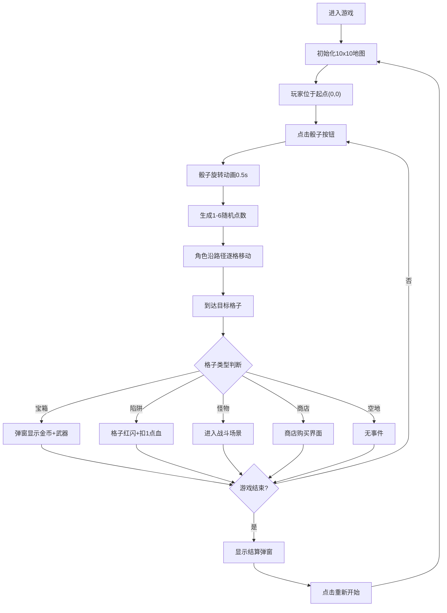

## 1. 产品概述

CrystalCrawl 是一款将桌游掷骰子移动机制与像素风格回合制地牢探险相结合的网页游戏。玩家通过掷骰子决定移动步数，在10x10的格子地图上探索，触发战斗、宝箱、陷阱、商店等随机事件，体验策略与运气交织的紧张感。

- **主要目的**：打造一款轻量化、可直接在浏览器运行的像素风地牢探险游戏
- **目标用户**：休闲游戏爱好者、桌游爱好者、像素风格游戏粉丝
- **产品价值**：将经典桌游机制数字化，通过精美的像素美术和流畅的动画体验，提供即开即玩的趣味冒险

## 2. 核心功能

### 2.1 用户角色

| 角色 | 注册方式 | 核心权限 |
|------|----------|----------|
| 玩家 | 无需注册，直接进入游戏 | 完整游戏体验、查看日志、重开游戏 |

### 2.2 功能模块

1. **主游戏界面**：10x10格子棋盘、玩家角色、骰子按钮、日志面板、生命值显示
2. **骰子系统**：点击骰子产生旋转动画，随机1-6点数，广播移动事件
3. **地图系统**：生成随机格子类型（宝箱30%、陷阱20%、商店10%、怪物30%、空地10%），维护玩家坐标
4. **事件解析系统**：根据格子类型触发对应事件（战斗、获得物品、扣血、商店购买）
5. **战斗系统**：俯视角战斗场景，玩家与怪物轮流攻击，武器选择，攻击动画与屏幕特效
6. **宝箱系统**：模态框展示金币与武器奖励
7. **结算系统**：游戏结束弹窗展示统计数据与重开按钮

### 2.3 页面详情

| 页面名称 | 模块名称 | 功能描述 |
|----------|----------|----------|
| 主游戏界面 | 棋盘模块 | 渲染10x10格子，高亮玩家位置，格子类型图标 |
| 主游戏界面 | 玩家角色 | 32x32像素小人带金色披风，平滑移动动画 |
| 主游戏界面 | 骰子按钮 | 木质纹理按钮，点击旋转动画，显示随机点数 |
| 主游戏界面 | 日志面板 | 实时滚动显示事件描述与骰子点数 |
| 主游戏界面 | HUD界面 | 左上角心形图标显示生命值，金币数量 |
| 战斗场景 | 战斗布局 | 玩家右侧、怪物左侧，武器选择栏 |
| 战斗场景 | 攻击动画 | 角色前冲+白色圆弧光效，怪物攻击屏幕抖动+红闪 |
| 宝箱弹窗 | 奖励展示 | 模态框显示金币数量与随机武器图标 |
| 结算弹窗 | 统计面板 | 金币总数、击杀数、到达层数、重新开始按钮 |

## 3. 核心流程

**主要玩家流程描述**：玩家进入游戏后在起点(0,0)位置，点击骰子按钮掷骰→骰子旋转0.5s后显示点数→角色沿路径逐格移动（每格0.3s平滑过渡）→移动结束后检测当前格子类型→触发对应事件（战斗/宝箱/陷阱/商店/空地）→更新UI与日志→玩家可再次掷骰继续探索→到达终点(9,9)或生命值归0时显示结算。

## 4. 用户界面设计

### 4.1 设计风格

- **主色调**：深色渐变背景 #0f0f23 → #1a1a3e
- **强调色**：金色高亮（玩家位置、选中边框）、红色 #ff4757（生命值、陷阱）、粉色 #e94560（按钮）
- **按钮风格**：骰子按钮木质纹理80x80px圆角8px，结算按钮宽200高50px圆角12px
- **字体**：白色像素风格字体，大标题36px，正文14px行高1.6
- **布局风格**：棋盘居中，日志面板悬浮右侧，HUD元素定位四角
- **特效**：骰子旋转动画、格子闪烁、角色移动过渡、攻击光效、屏幕抖动、模态框淡入

### 4.2 页面设计概述

| 页面名称 | 模块名称 | UI元素 |
|----------|----------|--------|
| 主游戏界面 | 棋盘 | 60x60px格子，1px半透明白边，玩家格金色外发光 |
| 主游戏界面 | 日志面板 | 宽280px，毛玻璃rgba(10,10,30,0.9)，圆角12px，内边距16px |
| 主游戏界面 | 骰子按钮 | 木质纹理，白色36px数字居中，点击旋转0.5s |
| 战斗场景 | 战斗布局 | 背景1s切换动画，格子放大，角色左右对峙 |
| 战斗场景 | 武器图标 | 60x60px圆角8px，选中时金色边框高亮 |
| 宝箱弹窗 | 模态框 | 宽400px，背景#2d2d44，圆角16px，淡入0.3s |
| 结算弹窗 | 遮罩面板 | 半透明黑遮罩，500px面板#1a1a2e，金色边框，渐变入场0.5s |

### 4.3 响应式

- Desktop-first 设计，优先保证桌面端体验
- 棋盘尺寸固定600x600px（10格x60px），适配主流分辨率
- 日志面板悬浮右侧，小屏幕可考虑改为底部浮动

### 4.4 像素美术指导

- 整体像素艺术风格，所有元素使用像素化渲染
- 玩家角色：32x32像素小人，头戴冒险者帽，身披金色披风
- 怪物设计：史莱姆/骷髅/蝙蝠等经典地牢怪物像素图
- 格子图标：宝箱📦、陷阱⚠️、商店🛒、怪物👹、空地⬜
- 武器图标：剑🗡️、斧🪓、弓🏹、法杖🔮
