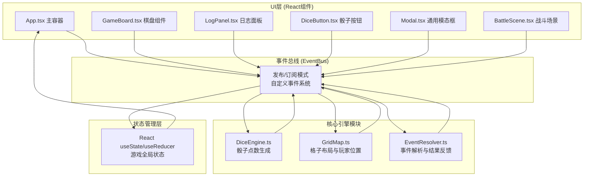

## 1. 架构设计



## 2. 技术说明

- **前端框架**：React@18 + TypeScript@5 + Vite@5
- **构建工具**：Vite 初始化项目（react-ts模板）
- **样式方案**：原生CSS + CSS Modules + CSS动画（keyframes）
- **状态管理**：React Hooks（useState + useEffect + useRef），事件总线解耦模块通信
- **事件总线**：轻量级自定义EventEmitter类实现发布/订阅
- **后端**：无，纯前端单页应用
- **数据库**：无，游戏状态全部内存管理
- **像素渲染**：CSS box-shadow模拟像素、emoji图标、div块级元素绘制

## 3. 核心模块与文件结构

```
├── package.json          # 依赖与脚本
├── index.html            # 入口HTML
├── tsconfig.json         # TS配置（strict模式）
├── vite.config.js        # Vite配置
└── src/
    ├── App.tsx           # 主应用组件，游戏状态管理
    ├── main.tsx          # React入口
    ├── index.css         # 全局样式与主题变量
    ├── DiceEngine.ts     # 骰子引擎：生成1-6随机数，发布roll-result
    ├── GridMap.ts        # 地图引擎：10x10格子生成、类型分布、玩家位置
    ├── EventResolver.ts  # 事件解析器：根据格子类型处理事件
    ├── types/
    │   └── game.ts       # 全局类型定义（格子、武器、怪物、事件）
    ├── utils/
    │   └── EventBus.ts   # 事件总线：自定义EventEmitter
    └── components/
        ├── GameBoard.tsx    # 棋盘渲染 + 玩家移动动画
        ├── LogPanel.tsx     # 右侧悬浮日志面板
        ├── DiceButton.tsx   # 骰子按钮 + 旋转动画
        ├── Modal.tsx        # 通用模态框（宝箱/结算）
        ├── BattleScene.tsx  # 战斗场景 + 攻击动画
        └── HUD.tsx          # 生命值/金币显示
```

## 4. 事件总线定义

### 4.1 事件类型定义

```typescript
// 事件名 -> 事件数据类型映射
interface GameEvents {
  // UI -> 引擎
  'dice:roll': void;                    // 点击骰子，请求掷骰
  'player:attack': { weaponId: string }; // 玩家攻击
  'battle:flee': void;                  // 逃跑
  'game:restart': void;                 // 重新开始
  'modal:close': { modalId: string };   // 关闭模态框

  // 引擎 -> UI
  'dice:rolling': void;                 // 骰子开始旋转
  'dice:result': { value: number };     // 骰子结果
  'player:move-start': { steps: number }; // 开始移动
  'player:position': { x: number; y: number }; // 玩家位置更新
  'player:move-end': { x: number; y: number };  // 移动结束
  'event:trigger': {                    // 格子事件触发
    type: 'chest' | 'trap' | 'monster' | 'shop' | 'empty';
    x: number; y: number;
  };
  'player:hp-change': { hp: number; delta: number }; // 生命值变化
  'player:gold-change': { gold: number; delta: number }; // 金币变化
  'player:weapon-add': { weapon: Weapon }; // 获得武器
  'battle:start': { monster: Monster };  // 战斗开始
  'battle:player-attack': { damage: number; anim: 'slash' }; // 玩家攻击动画
  'battle:monster-attack': { damage: number }; // 怪物攻击
  'battle:end': { victory: boolean };    // 战斗结束
  'log:add': { message: string; type?: 'info'|'warn'|'success'|'danger' }; // 新增日志
  'modal:open': {                        // 打开模态框
    id: 'chest' | 'gameover' | 'shop';
    data: ChestData | GameOverData | ShopData;
  };
  'game:over': {                         // 游戏结束
    victory: boolean;
    stats: { gold: number; kills: number; floors: number };
  };
  'trap:flash': { x: number; y: number }; // 陷阱闪烁
}
```

## 5. 数据模型定义

```typescript
// 格子类型
type CellType = 'start' | 'end' | 'chest' | 'trap' | 'monster' | 'shop' | 'empty';

interface Cell {
  x: number;
  y: number;
  type: CellType;
  visited: boolean;
  monsterId?: string;  // monster格子关联怪物
  chestId?: string;    // chest格子关联宝箱
}

// 武器
interface Weapon {
  id: string;
  name: string;
  icon: string;     // emoji 图标
  damage: number;   // 基础伤害 1-6 随机倍率
  rarity: 'common' | 'rare' | 'epic';
}

// 怪物
interface Monster {
  id: string;
  name: string;
  icon: string;
  hp: number;
  maxHp: number;
  attack: number;
  gold: number;
}

// 玩家
interface Player {
  x: number;
  y: number;
  hp: number;
  maxHp: number;
  gold: number;
  weapons: Weapon[];
  currentWeaponId?: string;
}

// 宝箱数据
interface ChestData {
  gold: number;
  weapon?: Weapon;
}

// 游戏结算数据
interface GameOverData {
  victory: boolean;
  totalGold: number;
  killCount: number;
  reachedFloor: number;
}

// 商店数据
interface ShopData {
  items: {
    type: 'weapon' | 'heal';
    price: number;
    payload: Weapon | number;
  }[];
}
```

## 6. 核心算法说明

### 6.1 格子类型分布算法（GridMap）
```
- 起点(0,0)固定为start，终点(9,9)固定为end
- 剩余98格按权重随机：
  - chest:   30% → ~29格
  - trap:    20% → ~20格
  - monster: 30% → ~29格
  - shop:    10% → ~10格
  - empty:   10% → ~10格
- 使用加权随机算法（weighted random pick）逐格分配
```

### 6.2 移动路径算法
```
玩家从(x,y)移动N步：
1. 蛇形路径规则：偶数行(y%2==0)从左向右→，奇数行从右向左←
2. 当到达行末/行首时，向上移动一行并换向
3. 逐步推进N格，每格间隔300ms，发布player:position事件
4. 最终位置若超过(9,9)则停在终点
```

### 6.3 骰子引擎（DiceEngine）
```
- 接收dice:roll事件
- 先发布dice:rolling，启动旋转动画
- 500ms后生成 Math.floor(Math.random()*6)+1
- 发布dice:result事件，携带value
```

### 6.4 事件解析（EventResolver）
```
订阅player:move-end，根据目标格子type处理：
- chest:   随机金币[10-50] + 概率武器 → 发布modal:open(chest)
- trap:    扣1HP + trap:flash + hp-change
- monster: 随机怪物实例 → 发布battle:start
- shop:    生成商品列表 → 发布modal:open(shop)
- empty:   log:add("一片空地...")
- end:     发布game:over(victory=true)
```

### 6.5 战斗系统
```
战斗回合制：
1. 玩家回合：点击武器图标 → player:attack
   → 计算伤害=武器伤害 * Random(1,2)
   → 播放攻击动画（前冲+白光0.4s）
   → 怪物扣血，若≤0 → battle:end(victory=true)
2. 怪物回合：延迟500ms → monster-attack
   → 屏幕抖动0.2s + 红闪0.1s
   → 玩家扣血，若≤0 → battle:end(victory=false)
                                   → game:over(victory=false)
3. 胜利后获得怪物金币，统计击杀数
```
