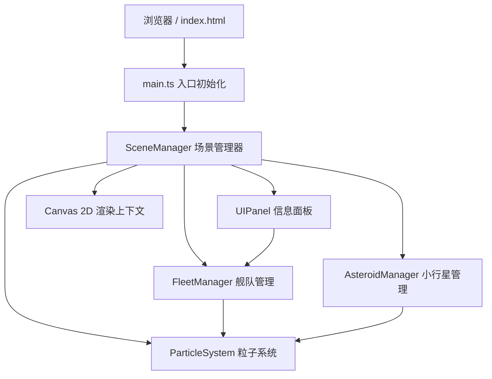

## 1. 架构设计



架构层次说明：
- **入口层**：main.ts 负责创建Canvas、初始化游戏循环、启动SceneManager
- **场景层**：SceneManager 统一调度所有管理器的update/draw，管理星云背景渐变
- **业务层**：FleetManager（战舰/编队/战斗）、AsteroidManager（小行星/物理/碎裂）、UIPanel（DOM面板/交互）
- **效果层**：ParticleSystem 统一管理所有粒子（尾焰/爆炸/星星），对象池复用

## 2. 技术选型

- **前端框架**：无（纯Canvas 2D + TypeScript，不使用任何游戏引擎）
- **构建工具**：Vite@5（极速HMR、原生ESM）
- **语言**：TypeScript@5（严格模式 strict: true）
- **UI面板**：原生DOM + CSS（非Canvas绘制，便于hover动效和响应式）

## 3. 文件结构

```
auto155/
├── package.json
├── vite.config.js
├── tsconfig.json
├── index.html
└── src/
    ├── main.ts              # 入口：创建Canvas、启动游戏循环
    ├── scene-manager.ts     # 场景主循环调度、星云背景、全局状态
    ├── fleet-manager.ts     # 战舰生成、编队移动、瞄准开火、鼠标输入
    ├── asteroid-manager.ts  # 小行星生成、抛物线物理、碎裂、销毁
    ├── particle-system.ts   # 粒子对象池、尾焰/爆炸/星星生命周期
    └── ui-panel.ts          # 左侧DOM面板、状态显示、阵型切换按钮
```

## 4. 核心数据模型与接口定义

```typescript
// 舰种枚举
enum ShipType {
  FRIGATE   = 'frigate',   // 护卫舰 蓝色 #4a9eff
  DESTROYER = 'destroyer', // 驱逐舰 橙色 #ff8c42
  CARRIER   = 'carrier',   // 航母   紫色 #a855f7
}

// 阵型枚举
enum Formation {
  TRIANGLE = 'triangle',
  SQUARE   = 'square',
  LINE     = 'line',
}

// 战舰实体
interface Ship {
  id: number
  type: ShipType
  x: number
  y: number
  angle: number          // 朝向弧度
  targetX: number
  targetY: number
  speed: number          // px/s
  maxSpeed: number
  shield: number
  maxShield: number
  selected: boolean
  formationOffsetX: number  // 相对编队中心的偏移
  formationOffsetY: number
  fireCooldown: number      // 开火冷却计时 ms
  fireRate: number          // 冷却周期 ms
  damage: number
}

// 小行星实体
interface Asteroid {
  id: number
  x: number
  y: number
  vx: number
  vy: number
  ax: number               // 抛物线加速度
  ay: number
  radius: number           // 10-30px
  rotation: number         // 当前旋转弧度
  rotationSpeed: number    // 自旋速度
  hp: number
  vertices: number[]       // 不规则多边形顶点半径偏移
  noise: number[]          // 表面噪点
  isFragment: boolean      // 是否为碎片
  fragmentLife: number     // 碎片存活时间
}

// 弹丸实体
interface Bullet {
  id: number
  x: number
  y: number
  vx: number
  vy: number
  damage: number
  color: string
  ownerShipId: number
  life: number          // 存活时间上限
  age: number           // 已存活时间
}

// 粒子
interface Particle {
  active: boolean
  x: number
  y: number
  vx: number
  vy: number
  life: number       // 总寿命 ms
  age: number        // 已存活 ms
  size: number
  startSize: number
  color: string
  alpha: number
  startAlpha: number
  type: 'thrust' | 'explosion' | 'star' | 'debris'
}
```

## 5. 核心算法

### 5.1 编队移动算法
```
1. 计算选中战舰的中心点 centroidX/Y
2. 根据阵型(Formation)为每艘战舰分配相对偏移 offsetX/Y
3. 目标点 targetX/Y + offsetX/Y = 该舰的 individualTarget
4. 使用指数平滑（lerp）插值 current -> target，速度上限 maxSpeed
5. 朝向 = atan2(target - current)，尾焰持续喷射
```

### 5.2 自动瞄准与开火
```
每帧每艘战舰：
  if fireCooldown > 0: fireCooldown -= dt; continue
  遍历所有小行星，计算欧氏距离，取 minDistance
  if minDistance < 攻击范围(300px):
    发射子弹，方向 = atan2(asteroid - ship)
    fireCooldown = fireRate
```

### 5.3 小行星抛物线
```
生成时：
  边缘随机起点 edgeX/Y
  目标方向指向舰队中心区域 ± 散布
  vx/vy 初速度 = 方向向量 * speed
  ax/ay = 轻微向心加速度模拟抛物线弯曲
```

### 5.4 碰撞检测
```
子弹-小行星：圆形碰撞 (dx^2 + dy^2 < (r_bullet + r_asteroid)^2)
命中后：
  小行星 hp -= damage
  if hp <= 0: 生成 3-5 碎片 + 20 爆炸粒子
```

### 5.5 粒子对象池
```
固定 MAX_PARTICLES = 1000
数组预分配，active 标记复用
发射时遍历数组找第一个 active=false 的粒子填充
避免 GC 压力，保证 60FPS
```

## 6. 性能优化策略

1. **对象池复用**：所有粒子、子弹、小行星碎片使用预分配数组+active标记，零GC
2. **空间分区**：小行星使用简单网格（cell=100px）加速最近距离查询（战舰<300px范围）
3. **离屏裁剪**：draw前判断边界外对象直接跳过渲染
4. **分层Canvas**（可选）：静态星空/星云用离屏Canvas缓存，每N帧重绘一次
5. **dt固定步长**：使用累积器实现固定dt=16.67ms的update逻辑，避免高刷新率下物理不一致

## 7. 启动方式

```bash
npm install
npm run dev
```

访问 `http://localhost:5173` 即可进入游戏。
