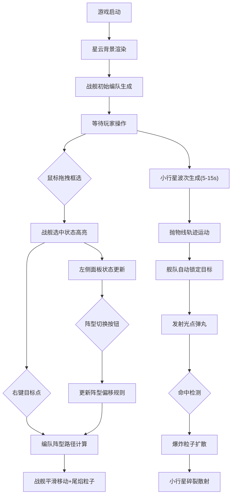

## 1. 产品概述

太空舰队战术模拟游戏，玩家在随机生成的动态星云背景中指挥战舰编队移动并抵御小行星群撞击，解决纯数值策略游戏缺乏视觉震撼和实时操作反馈的问题。

- 目标用户：策略游戏爱好者、科幻题材玩家
- 核心价值：提供沉浸式的视觉体验与即时战术操作反馈

## 2. 核心功能

### 2.1 功能模块

1. **主游戏场景**：动态星云背景渲染、战舰渲染、小行星渲染、粒子特效
2. **舰队操作**：鼠标拖拽框选多舰、右键编队移动、阵型切换
3. **战斗系统**：自动瞄准最近目标、开火机制、爆炸特效、小行星碎裂
4. **信息面板**：舰队状态显示、阵型切换按钮、舰种总览图标

### 2.2 页面详情

| 页面名称 | 模块名称 | 功能描述 |
|---------|---------|---------|
| 游戏主界面 | 星云背景 | 深蓝#0a0a2e与紫罗兰#2a0a3a之间缓慢颜色过渡，粒子星星闪烁效果 |
| 游戏主界面 | 战舰系统 | 三角形战舰（24px长），三种舰种（护卫舰蓝/驱逐舰橙/航母紫），选中时4px绿色外发光闪烁 |
| 游戏主界面 | 编队移动 | 拖拽框选，右键指定目标，按阵型偏移平滑移动，尾焰粒子持续喷射 |
| 游戏主界面 | 小行星系统 | 5-15秒随机生成波次，10-30px不规则多边形，自旋+抛物线轨迹 |
| 游戏主界面 | 战斗系统 | 自动锁定最近目标，3px光点弹丸，20粒子爆炸扩散（15px/0.3s），小行星碎裂3-5块 |
| 左侧面板 | 信息显示 | 220px宽毛玻璃面板，显示选中数量、总护盾值、当前阵型 |
| 左侧面板 | 阵型切换 | 三角形/方形/直线三种阵型，圆角8px按钮，选中时#00d4ff发光 |
| 左侧面板 | 舰种总览 | 30x30px圆形图标，1px边框对应舰种颜色 |

## 3. 核心流程

玩家进入游戏后，星云背景动态渲染，战舰初始编队出现在场景中央。玩家通过鼠标拖拽框选己方战舰，被选中战舰显示绿色外发光闪烁效果。玩家右键点击目标位置，舰队按当前阵型（三角/方形/直线）偏移计算路径，平滑移动至目标点，移动过程中尾焰粒子持续喷射。每隔5-15秒从屏幕边缘生成一波小行星，沿抛物线飞向舰队区域。玩家舰队在移动状态下自动锁定最近小行星并发射与舰种同色的光点弹丸。弹丸命中时产生爆炸粒子扩散动画，小行星碎裂成多块碎片向四周散射。左侧面板实时显示选中舰队数量、总护盾值、当前阵型，并提供阵型切换按钮。

## 4. 用户界面设计

### 4.1 设计风格

- 主色调：#00d4ff（青蓝色高亮）
- 背景色：#0a0a2e（深蓝）→ #2a0a3a（紫罗兰）动态渐变
- 舰种色：护卫舰#4a9eff（蓝）、驱逐舰#ff8c42（橙）、航母#a855f7（紫）
- 选中色：#00ff66（绿色外发光4px，1.5s闪烁频率）
- 按钮：圆角8px，默认#4a4a6a，选中#00d4ff带发光阴影
- 面板：rgba(10,10,30,0.85)毛玻璃，圆角12px，内边距16px
- 动效：按钮hover 0.2s ease背景过渡+上移2px，爆炸0.4s ease-out

### 4.2 页面布局

| 区域 | 模块 | UI元素 |
|------|------|--------|
| 左侧220px | 信息面板 | 舰种图标列表、数量统计、护盾条、阵型切换按钮组 |
| 右侧剩余区域 | 游戏画布 | 全Canvas 2D渲染，星云+星星+战舰+小行星+弹丸+粒子 |

### 4.3 响应式适配

- 桌面端（≥768px）：左侧220px固定面板+主画布区域
- 移动端（<768px）：左侧面板折叠为悬浮图标按钮，点击展开抽屉式面板
- 触摸设备：支持双指缩放、单指框选、长按右键菜单替代

### 4.4 性能指标

- 稳定60FPS游戏循环（requestAnimationFrame）
- 支持50艘战舰+30颗小行星同屏不掉帧
- 粒子总数上限1000（对象池复用）
