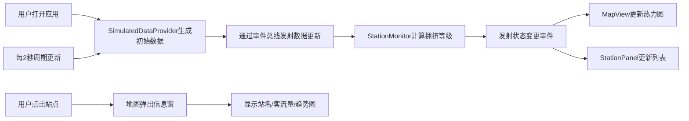

## 1. 产品概述

MetroFlow 是一款轨道交通实时流量热力图与站点监控应用，以可视化方式展示城市地铁全网各站点的实时客流量、站内拥挤程度以及线路运行状态。通过热力图叠加地理线路图的直观呈现，用户可以快速感知全网流量分布，比传统文字列表更高效获取信息。

- 目标用户：城市通勤者、地铁运营管理人员、出行规划者
- 核心价值：实时、直观、高效的地铁流量可视化监控

## 2. 核心功能

### 2.1 功能模块

1. **地图热力图**：以上海市中心为中心，深色底图叠加半透明热力图层，实时展示各站点客流量分布
2. **站点列表面板**：左侧面板按拥挤等级排序展示所有站点状态，支持点击交互
3. **站点信息弹窗**：点击站点弹出信息窗，显示客流量、拥挤等级、流量趋势迷你图
4. **顶部导航栏**：应用标题、模拟时钟、手动刷新按钮
5. **故障告警系统**：故障站点闪烁红色警告图标，面板高亮显示

### 2.3 页面详情

| 页面名称 | 模块名称 | 功能描述 |
|---------|---------|---------|
| 主页面 | 地图热力图模块 | Leaflet 地图渲染 + leaflet.heat 热力图叠加，每2秒更新数据，深色CartoDB底图 |
| 主页面 | 站点列表面板 | 36个站点虚拟滚动列表，按拥挤等级排序，点击高亮并联动地图弹窗 |
| 主页面 | 站点信息弹窗 | 显示站名、客流量、拥挤等级、Canvas 绘制的10秒流量趋势迷你折线图 |
| 主页面 | 顶部导航栏 | 应用名称+🚇图标、模拟时间显示、圆形刷新按钮 |
| 主页面 | 故障告警 | 故障站地图闪烁红色图标，面板红色背景+故障标签 |

## 3. 核心流程

用户打开应用 → SimulatedDataProvider 生成初始36个站点数据 → StationMonitor 计算拥挤等级 → 地图渲染热力图 + 面板渲染站点列表 → 每2秒数据更新 → 热力图重绘 + 列表刷新 → 用户点击站点 → 地图弹出信息窗展示详情

## 4. 用户界面设计

### 4.1 设计风格

- **主色调**：深色科技风，主背景 #0f0f23，面板背景 #1a1a2e
- **拥挤等级色**：绿色 #22c55e（宽松）、黄色 #eab308（适中）、橙色 #f97316（拥挤）、红色 #ef4444（爆满）
- **热力图渐变**：蓝色 #0000ff → 红色 #ff0000
- **字体**：系统无衬线字体，层级分明（标题18px白、正文14px灰300、辅助12px灰500）
- **圆角**：面板12px、按钮/图标50%、信息窗8px
- **动效**：所有交互元素0.2s过渡动画，故障站1s闪烁动画

### 4.2 页面设计概览

| 页面名称 | 模块名称 | UI 元素 |
|---------|---------|--------|
| 主页面 | 顶部导航栏 | 高度48px、#0f0f23背景、左侧标题+🚇图标、右侧时钟+圆形刷新按钮 |
| 主页面 | 左侧站点面板 | 宽320px、#1a1a2e背景、圆角12px、内边距16px、固定左侧、虚拟滚动 |
| 主页面 | 站点行 | 高52px、分割线1px rgba(255,255,255,0.08)、站名白色16px、12px彩色圆点、客流量灰色12px |
| 主页面 | 地图区域 | 占剩余宽度、自适应高度、深色CartoDB底图、半透明热力图 |
| 主页面 | 信息弹窗 | 宽280px、#1e293b背景、圆角8px、白字、Canvas迷你折线图240x40px |
| 主页面 | 故障标识 | 24x24px闪烁红色警告图标、面板行#7f1d1d背景、红底白字故障标签 |

### 4.3 响应式设计

- **桌面端**（>768px）：左侧固定面板 + 右侧地图
- **移动端**（<768px）：面板收起为顶部下拉按钮，地图占满全屏
- 地图自适应窗口大小变化

### 4.4 性能指标

- 热力图每2秒更新时帧率不低于50fps
- 使用 requestAnimationFrame 调度数据更新
- 站点列表虚拟滚动（仅渲染可视区域约12行）
- 事件总线使用结构克隆防止引用泄漏
