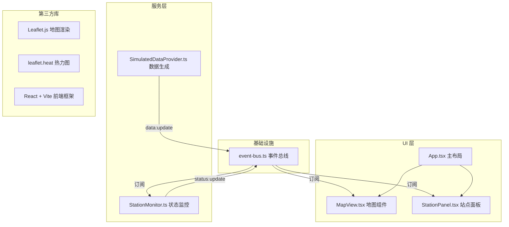

## 1. 架构设计



## 2. 技术说明

- **前端框架**：React 18 + TypeScript + Vite
- **地图引擎**：Leaflet.js + leaflet.heat 插件
- **状态管理**：自定义事件总线（EventBus）
- **样式方案**：内联样式 + CSS 变量
- **图标**：Emoji 🚇
- **数据模拟**：SimulatedDataProvider 每2秒生成随机波动数据

## 3. 路由定义

| 路由 | 用途 |
|------|------|
| / | 主页面（地图 + 站点面板 + 导航栏） |

## 4. 数据模型

### 4.1 站点数据类型

```typescript
interface Station {
  id: string;
  name: string;
  lat: number;
  lng: number;
  flowRate: number; // 50-1000
  status: 'normal' | 'delayed' | 'fault';
}

interface StationStatus extends Station {
  crowdLevel: 'green' | 'yellow' | 'orange' | 'red';
  history: number[]; // 最近10个数据点
}
```

### 4.2 拥挤等级计算规则

| 等级 | 颜色 | flowRate 范围 | 描述 |
|------|------|---------------|------|
| green | #22c55e | 50 - 250 | 宽松 |
| yellow | #eab308 | 251 - 500 | 适中 |
| orange | #f97316 | 501 - 750 | 拥挤 |
| red | #ef4444 | 751 - 1000 | 爆满 |

### 4.3 事件定义

| 事件名 | 数据 | 触发方 | 订阅方 |
|--------|------|--------|--------|
| data:update | Station[] | SimulatedDataProvider | StationMonitor |
| status:update | StationStatus[] | StationMonitor | MapView, StationPanel |
| station:click | stationId | StationPanel | MapView |

## 5. 文件结构

```
.
├── package.json
├── index.html
├── tsconfig.json
├── vite.config.ts
└── src/
    ├── main.tsx              # React 入口
    ├── App.tsx               # 主布局
    ├── event-bus.ts          # 事件总线
    ├── components/
    │   ├── MapView.tsx       # Leaflet 地图组件
    │   └── StationPanel.tsx  # 站点列表面板
    └── services/
        ├── SimulatedDataProvider.ts  # 模拟数据生成
        └── StationMonitor.ts         # 站点状态监控
```

## 6. 性能优化策略

1. **热力图更新**：使用 requestAnimationFrame 调度，避免阻塞主线程
2. **虚拟滚动**：StationPanel 仅渲染可视区域约12行，减少DOM节点
3. **结构克隆**：事件总线分发数据时使用 structuredClone 防止引用泄漏
4. **React 优化**：使用 memo、useMemo、useCallback 避免不必要重渲染
5. **Canvas 绘制**：迷你趋势图使用原生 Canvas，不引入额外图表库
