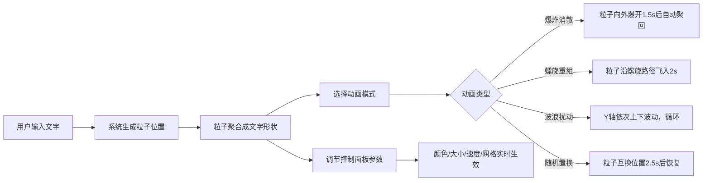

## 1. 产品概述
3D粒子文字动画生成器，将用户输入的英文单词/短语实时转化为由数千个彩色粒子构成的三维文字，支持多种粒子消散与重组动画效果。
- 解决传统文字动画工具缺乏交互性和粒子效果定制能力、难以在浏览器中快速预览的问题
- 面向设计师、创意工作者、前端开发者，提供可配置、可预览的粒子文字视觉效果

## 2. 核心功能

### 2.1 用户角色
| 角色 | 注册方式 | 核心权限 |
|------|----------|----------|
| 普通用户 | 无需注册 | 输入文字、选择动画、调节参数、实时预览 |

### 2.2 功能模块
1. **主场景页**：输入框、3D粒子场景、右侧控制面板

### 2.3 页面详情
| 页面名称 | 模块名称 | 功能描述 |
|----------|----------|----------|
| 主场景页 | 文字输入区 | 实时输入英文单词/短语，3D场景即时更新粒子文字 |
| 主场景页 | 3D粒子场景 | 渲染粒子文字，支持4种动画模式（爆炸消散、螺旋重组、波浪扰动、随机置换） |
| 主场景页 | 控制面板 | 调节粒子颜色、大小、消散速度、背景网格开关 |

## 3. 核心流程
用户在输入框键入文字 → 系统按每字母600-800粒子计算总数 → 粒子聚合成文字形状（随机cyan/magenta/gold/lime色调，Z轴0-3偏移实现立体感）→ 用户切换动画模式或调节参数 → 场景丝滑过渡更新

## 4. 用户界面设计

### 4.1 设计风格
- **主色调**：深色科技感主题，背景#0b0f1a
- **强调色**：cyan、magenta、gold、lime四种预设粒子色盘
- **按钮/交互色**：#2563eb（悬停变亮10%，点击0.1s缩放）、聚焦渐变#4ade80→#3b82f6
- **字体**：深色背景白色文字，16px输入字体
- **布局**：顶部输入框居中，右侧控制面板（宽280px），中间3D场景区
- **视觉增强**：粒子半透明发光效果、0.2-0.3s UI动画

### 4.2 页面设计概述
| 页面名称 | 模块名称 | UI元素 |
|----------|----------|--------|
| 主场景页 | 文字输入区 | 宽360px高48px，背景#1e2433，圆角10px，聚焦渐变边框，白色文字 |
| 主场景页 | 3D粒子场景 | Three.js渲染，粒子发光半透明，Z轴偏移立体感，背景网格可选 |
| 主场景页 | 控制面板 | 距顶80px，背景rgba(18,25,45,0.92)，圆角12px，滑块轨道#334155/滑块#60a5fa |

### 4.3 响应式
- 桌面优先设计，适配1024px及以上
- 768px以下控制面板折叠为底部抽屉

### 4.4 3D场景指引
- **环境**：深色背景#0b0f1a，可选网格辅助线
- **光照**：粒子自发光（半透明发光效果），无需额外光源
- **相机**：PerspectiveCamera，适合观察3D粒子文字
- **构图**：文字居中，粒子占主要视觉区域
- **交互**：四种动画模式切换（0.5s ease-in-out过渡），参数实时调节
- **后期**：粒子AdditiveBlending增强发光效果
- **性能**：BufferGeometry，每字母600-800粒子，上限10000，≥55FPS
