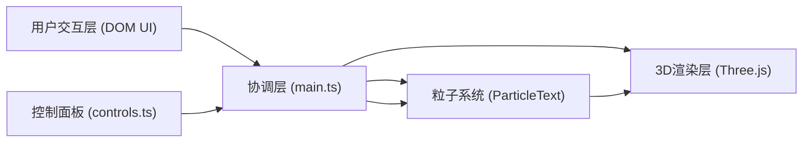

## 1. 架构设计
纯前端客户端应用，无后端服务，所有计算在浏览器端完成。



## 2. 技术说明
- **前端框架**: 原生 TypeScript (无UI框架，轻量高效)
- **3D渲染**: Three.js (BufferGeometry + Points + AdditiveBlending)
- **构建工具**: Vite
- **包管理**: npm
- **无后端服务**: 所有逻辑在客户端运行

## 3. 文件结构
| 文件路径 | 作用 |
|----------|------|
| `/package.json` | 项目依赖与启动脚本 |
| `/vite.config.js` | Vite基础配置 |
| `/tsconfig.json` | TypeScript严格模式配置 |
| `/index.html` | 入口HTML，包含#app根容器 |
| `/src/main.ts` | 主入口：创建场景/相机/渲染器，协调各模块，动画循环 |
| `/src/particleText.ts` | 核心类：粒子位置生成、BufferGeometry管理、4种动画模式、Update逻辑 |
| `/src/controls.ts` | UI组件：右侧控制面板DOM渲染、事件绑定、参数回调 |

## 4. 核心模块定义

### 4.1 ParticleText 类
```typescript
type AnimationMode = 'explode' | 'spiral' | 'wave' | 'shuffle' | 'idle';

interface ParticleTextOptions {
  text: string;
  particlesPerLetter: [number, number]; // [600, 800]
  color: string;
  size: number; // 1-5px
  maxParticles: number; // 10000
  zOffsetRange: [number, number]; // [0, 3]
}

interface ParticleTextCallbacks {
  onParticleCountChange?: (count: number) => void;
}

class ParticleText {
  constructor(scene: THREE.Scene, options: ParticleTextOptions, callbacks?: ParticleTextCallbacks);
  public setText(text: string): void;
  public setAnimation(mode: AnimationMode): void;
  public setColor(color: string): void;
  public setSize(size: number): void;
  public setSpeedMultiplier(multiplier: number): void;
  public update(deltaTime: number): void;
  public dispose(): void;
}
```

### 4.2 Controls 模块
```typescript
interface ControlValues {
  colorPreset: string; // 'cyan' | 'magenta' | 'gold' | 'lime' | 'custom'
  customColor: string;
  particleSize: number;
  speedMultiplier: number;
  animationMode: AnimationMode;
  showGrid: boolean;
}

interface ControlsCallbacks {
  onColorChange: (color: string) => void;
  onSizeChange: (size: number) => void;
  onSpeedChange: (multiplier: number) => void;
  onAnimationChange: (mode: AnimationMode) => void;
  onGridToggle: (show: boolean) => void;
}

class ControlsPanel {
  constructor(container: HTMLElement, initialValues: ControlValues, callbacks: ControlsCallbacks);
  public updateValues(values: Partial<ControlValues>): void;
}
```

## 5. 动画模式实现策略
| 模式 | 算法 | 时长 |
|------|------|------|
| idle | 粒子保持目标位置 + 微小呼吸抖动 | 持续 |
| explode | 以中心为原点沿法线方向外推1.5s，然后lerp回目标位置1.5s | 3s |
| spiral | 从球壳随机位置沿螺旋线(θ随时间增, r递减)lerp到目标 | 2s |
| wave | 基于粒子X坐标计算相位，Y轴sin位移，持续循环 | 循环 |
| shuffle | 随机置换粒子索引，每0.1s重排目标，2.5s后恢复 | 2.5s |

所有模式间切换采用0.5s ease-in-out lerp过渡当前位置→新目标。

## 6. 性能优化策略
- 使用THREE.BufferGeometry + Float32Array直接操作顶点数据，避免每帧创建对象
- 粒子位置更新仅修改position attribute并标记needsUpdate = true
- 使用AdditiveBlending + 透明圆形贴图增强发光感而无需后期处理
- 粒子总数硬上限10000，超出时截断
- 动画状态机避免不必要的计算分支
- requestAnimationFrame + Clock.getDelta() 确保帧率稳定≥55FPS
