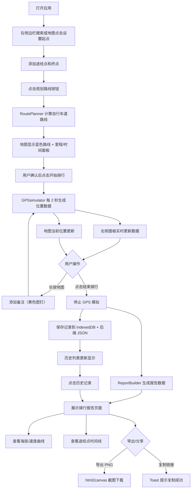

## 1. 产品概述

RideTrack Pro 是一款面向户外骑行爱好者的全栈 Web 应用，提供从路线规划、实时数据追踪到可视化报告生成的一站式骑行体验管理。解决骑行者使用手机导航时难以专注、以及骑行数据分散在手表和不同 App 中难以统一回顾分享的核心痛点。

- 核心用户：城市通勤骑行者、周末户外骑行爱好者、长途骑行挑战者
- 产品价值：提供流畅的骑行规划体验、精准的实时数据追踪、精美的可分享骑行报告

---

## 2. 核心功能

### 2.1 功能模块

1. **主页面（路线规划）**：左侧边栏搜索/地图点击设置点，Leaflet.js 地图渲染，自动规划自行车道路线
2. **骑行进行中页面**：GPS 模拟实时追踪，右侧浮动数据面板，地图标注备注功能
3. **骑行报告页面**：汇总统计卡片、海拔/速度曲线图、途经点时间线、导出/分享功能
4. **历史记录面板**：IndexedDB + 后端存储，按时间倒序展示最近 50 条记录

### 2.2 页面详情

| 页面名称 | 模块名称 | 功能描述 |
|---------|---------|---------|
| 主页面 | 左侧边栏 | 搜索地点、设置起点/途经点/终点（宽 320px，圆角 0 12px 12px 0，白色背景，阴影） |
| 主页面 | 地图区域 | Leaflet.js + OpenStreetMap 渲染，蓝色实线显示路线，显示里程/预估时间面板 |
| 主页面 | 右侧历史列表 | 纵向滚动展示骑行记录摘要（日期、里程、时长、起终点），点击进入详情 |
| 骑行中 | 右侧浮动面板 | 毛玻璃效果，顶部显示当前时间、里程、平均速度、海拔（28px 加粗数字） |
| 骑行中 | 地图交互 | 当前位置蓝色圆点（外发光），已骑路径绿色实线，未骑路径蓝色虚线 |
| 骑行中 | 长按标注 | 长按地图弹出气泡添加文字备注（最多 50 字），黄色图钉图标保存 |
| 报告页 | 汇总卡片 | 宽 800px 居中，蓝紫渐变，展示总里程/时长/均速/极速/爬升（32px 数字） |
| 报告页 | 海拔曲线图 | ECharts 渲染，面积填充 #3b82f6 透明度 0.2，网格浅灰虚线 |
| 报告页 | 速度曲线图 | ECharts 渲染，曲线 #22c55e，面积填充同色透明度 0.2 |
| 报告页 | 途经点时间线 | 左侧灰色竖线 2px，圆点 8px，点击在地图定位 |
| 报告页 | 导出分享 | html2canvas 导出 PNG，复制 URL 到剪贴板，Toast 提示 |

---

## 3. 核心流程

用户主流程：规划路线 → 开始骑行 → 实时追踪/添加备注 → 结束骑行 → 生成报告 → 导出/分享/查看历史

---

## 4. 用户界面设计

### 4.1 设计风格

**色彩体系**
- 主色调：骑行蓝 `#3b82f6` + 活力绿 `#22c55e`
- 辅助色：琥珀黄 `#f59e0b`（警告/强调/图钉）
- 危险色：警示红 `#ef4444`（结束按钮）
- 背景色：浅灰 `#f0f2f5`
- 卡片色：纯白 `#ffffff`
- 深色文字：`#1e293b`，次级文字：`#64748b`

**设计语言**
- 圆角：卡片/面板 12px 或 16px，按钮 8px
- 阴影：柔和多层阴影（如 `4px 0 12px rgba(0,0,0,0.06)`）
- 毛玻璃：`backdrop-filter: blur(8px)` + `rgba(255,255,255,0.95)`
- 按钮交互：`hover` 时 `transform: scale(1.03)` + `transition: all 0.2s ease`
- 输入框聚焦：边框变主蓝 + `box-shadow` 外发光

**字体与排版**
- 大号指标数字：28px/32px 加粗 `#1e293b`
- 标签文字：12px `#64748b`
- 正文：14px，行高 1.5，`#1e293b`

### 4.2 页面设计概览

| 页面名称 | 模块名称 | UI 元素 |
|---------|---------|---------|
| 主页面 | 左侧边栏 | 320px 宽，白底，圆角 0 12px 12px 0，阴影，搜索框、点列表、规划按钮 |
| 主页面 | 信息面板 | 16px 内边距，14px 深色文字，路线里程和预估时间 |
| 骑行中 | 浮动面板 | 280px 宽，毛玻璃，圆角 16px，四项数据（28px 粗数字 + 12px 标签） |
| 骑行中 | 地图标注 | 蓝色圆点 8px + 2px 外发光，黄色图钉 16x16px，气泡圆角 8px |
| 报告页 | 汇总卡片 | 宽 100%/最大 800px 居中，圆角 16px，蓝紫渐变 `#3b82f6 → #a855f7`，白色文字，24px 内边距 |
| 报告页 | 图表区域 | ECharts 双曲线图，网格浅灰虚线，面积半透明填充 |
| 报告页 | 时间线 | 左侧灰色竖线 2px，圆点 8px，卡片内显示时间/备注/经纬度 |
| 报告页 | Toast | 圆角 8px，12px 24px 内边距，黑底白字，2 秒自动消失 |
| 通用 | 加载动画 | 旋转自行车 SVG 图标，36x36px，2s/圈匀速旋转 |

### 4.3 响应式布局

**桌面端（≥1024px）**
- 地图区域占左侧 70%，面板/侧边栏占右侧 30%
- 左侧边栏固定 320px 宽

**平板端（640px – 1023px）**
- 上下堆叠布局：地图占上方 60%，面板占下方 40%
- 左侧边栏可折叠为抽屉

**手机端（<640px）**
- 地图全屏显示
- 面板以底部抽屉形式收起，点击浮动按钮展开
- 触摸优化：增大点击热区，支持手势操作

### 4.4 性能指标

- 地图交互（拖拽、缩放）帧率 ≥ 50fps
- 位置数据更新延迟 ≤ 500ms
- 首次加载 LCP < 2.5s
- 报告页面渲染 < 1s
