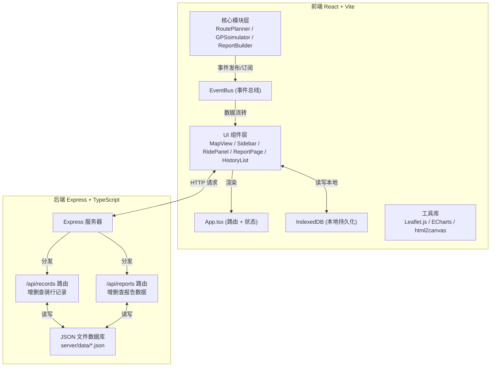
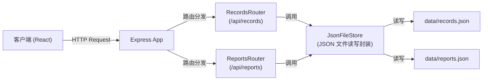
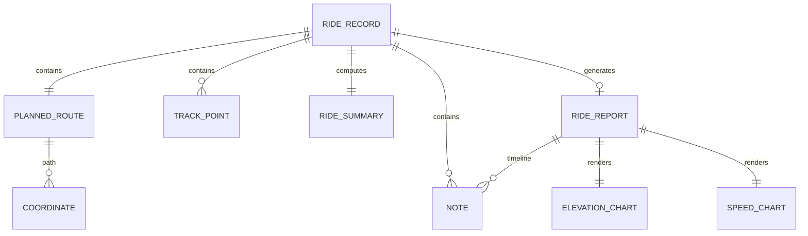

## 1. 架构设计



---

## 2. 技术选型说明

| 层级 | 技术 | 版本/说明 |
|------|------|----------|
| 前端框架 | React 18 + TypeScript | 严格模式，类型安全 |
| 构建工具 | Vite 5 | 快速 HMR，代理 `/api` 到后端 |
| 状态管理 | Zustand + 自定义 EventBus | 全局状态轻量管理 + 模块间解耦通信 |
| 路由 | React Router v6 | 单页面应用路由管理 |
| 地图渲染 | Leaflet.js 1.9 + OpenStreetMap | 免费开源地图图块 |
| 图表可视化 | ECharts 5 + echarts-for-react | 高性能曲线图渲染 |
| 图片导出 | html2canvas | DOM 截图导出 PNG |
| 本地存储 | IndexedDB (idb 封装) | 大容量结构化数据持久化 |
| UI 样式 | 原生 CSS + CSS 变量 | 无第三方 UI 库，精准控制样式 |
| 后端框架 | Express 4 + TypeScript | 轻量 RESTful API 服务 |
| 后端启动 | ts-node | 直接运行 TS 源码 |
| 数据库 | JSON 文件 (模拟) | `server/data/records.json` |
| 并发启动 | concurrently | 同时运行 Vite + Express |
| 图标 | lucide-react | 高质量矢量图标库 |

---

## 3. 路由定义

### 3.1 前端路由

| 路由路径 | 页面组件 | 功能说明 |
|---------|---------|---------|
| `/` | `HomePage` | 主页面：路线规划 + 地图 + 历史列表 |
| `/ride/:id` | `RidePage` | 骑行中页面：实时追踪 + 数据面板 |
| `/report/:id` | `ReportPage` | 报告页面：数据图表 + 导出分享 |
| `/history` | `HistoryPage` | 历史记录详情列表页（可选） |

### 3.2 后端 API 路由

| 方法 | 路径 | 功能 |
|------|------|------|
| `GET` | `/api/records` | 获取全部骑行记录列表（按时间倒序，最多 50 条） |
| `GET` | `/api/records/:id` | 获取单条骑行记录详情 |
| `POST` | `/api/records` | 创建新的骑行记录 |
| `DELETE` | `/api/records/:id` | 删除指定骑行记录 |
| `GET` | `/api/reports/:id` | 获取指定骑行的报告数据 |
| `POST` | `/api/reports` | 创建/保存骑行报告数据 |

---

## 4. API 数据结构定义

### 4.1 核心 TypeScript 类型

```typescript
// 坐标点
interface Coordinate {
  lat: number;      // 纬度
  lng: number;      // 经度
  altitude: number; // 海拔 (米)
}

// 轨迹点（含时间戳和速度）
interface TrackPoint extends Coordinate {
  timestamp: number; // Unix 毫秒时间戳
  speed: number;     // 瞬时速度 (km/h)
}

// 路线备注
interface Note {
  id: string;
  lat: number;
  lng: number;
  text: string;           // 最多 50 字
  timestamp: number;
}

// 规划路线
interface PlannedRoute {
  coordinates: Coordinate[];  // 路线坐标数组
  totalDistance: number;      // 总里程 (km，保留1位小数)
  estimatedTime: number;      // 预估时间 (分钟)
  waypoints: {                // 起点/途经点/终点
    start: Coordinate;
    vias: Coordinate[];
    end: Coordinate;
  };
}

// 骑行记录
interface RideRecord {
  id: string;                 // uuid
  title: string;              // 自动生成的标题
  createdAt: number;          // 创建时间戳
  startAt: number;            // 开始时间
  endAt: number;              // 结束时间
  plannedRoute: PlannedRoute; // 原始规划路线
  trackPoints: TrackPoint[];  // 实际骑行轨迹
  notes: Note[];              // 备注列表
  summary: RideSummary;       // 统计摘要
}

// 骑行统计摘要
interface RideSummary {
  totalDistance: number;      // 总里程 (km)
  totalDuration: number;      // 总时长 (秒)
  avgSpeed: number;           // 平均速度 (km/h)
  maxSpeed: number;           // 最高速度 (km/h)
  totalElevation: number;     // 累计爬升 (米)
  startPointName: string;     // 起点名称
  endPointName: string;       // 终点名称
}

// 骑行报告
interface RideReport {
  id: string;
  rideId: string;
  generatedAt: number;
  summary: RideSummary;
  elevationChart: ChartSeries;   // 海拔曲线数据
  speedChart: ChartSeries;       // 速度曲线数据
  notesTimeline: Note[];         // 时间线排序的备注
}

// 图表数据系列
interface ChartSeries {
  xAxis: (string | number)[];  // 时间轴标签
  data: number[];              // 数据点
}
```

### 4.2 API 请求/响应示例

**创建骑行记录 POST `/api/records`**
```json
// Request Body
{
  "plannedRoute": { "coordinates": [...], "totalDistance": 15.2, ... },
  "trackPoints": [ { "lat": 39.9, "lng": 116.4, ... } ],
  "notes": []
}

// Response (201)
{
  "success": true,
  "data": { "id": "uuid-xxx", "createdAt": 1718xxx, "summary": {...} }
}
```

**获取记录列表 GET `/api/records`**
```json
// Response (200)
{
  "success": true,
  "data": [
    {
      "id": "uuid-xxx",
      "createdAt": 1718xxx,
      "summary": {
        "totalDistance": 15.2,
        "totalDuration": 3600,
        "startPointName": "天安门",
        "endPointName": "奥林匹克公园"
      }
    }
  ],
  "total": 1
}
```

---

## 5. 服务器架构图



**核心层次**
- **路由层 (Router)**：处理 HTTP 方法 + 路径，参数校验，返回统一格式响应
- **存储层 (Store)**：抽象 CRUD 接口，基于 JSON 文件 fs 读写，提供内存缓存层
- **数据层 (Data)**：JSON 文件作为持久化存储，启动时加载到内存

**统一响应格式**
```typescript
interface ApiResponse<T> {
  success: boolean;
  data?: T;
  error?: string;
  message?: string;
}
```

---

## 6. 数据模型

### 6.1 实体关系图



### 6.2 JSON 文件存储结构

**server/data/records.json**
```json
{
  "records": [
    {
      "id": "uuid-xxx",
      "title": "骑行 - 2024-06-14 10:30",
      "createdAt": 1718332200000,
      "startAt": 1718332200000,
      "endAt": 1718335800000,
      "plannedRoute": { ... },
      "trackPoints": [ ... ],
      "notes": [ ... ],
      "summary": { ... }
    }
  ],
  "lastUpdated": 1718335800000
}
```

**server/data/reports.json**
```json
{
  "reports": [
    {
      "id": "report-uuid",
      "rideId": "uuid-xxx",
      "generatedAt": 1718335805000,
      "summary": { ... },
      "elevationChart": { "xAxis": [...], "data": [...] },
      "speedChart": { "xAxis": [...], "data": [...] },
      "notesTimeline": [ ... ]
    }
  ]
}
```

---

## 7. 项目文件结构

```
auto161/
├── .trae/documents/
│   ├── PRD.md                  # 产品需求文档
│   └── 技术架构.md              # 技术架构文档
├── server/
│   ├── index.ts                # Express 服务器入口
│   ├── store.ts                # JSON 文件存储封装
│   ├── types.ts                # 后端类型定义
│   ├── data/
│   │   ├── records.json        # 骑行记录存储
│   │   └── reports.json        # 报告数据存储
│   └── routes/
│       ├── records.ts          # /api/records 路由
│       └── reports.ts          # /api/reports 路由
├── src/
│   ├── main.tsx                # React 入口
│   ├── App.tsx                 # 主应用（路由 + 全局状态）
│   ├── eventBus.ts             # 自定义 EventBus
│   ├── types.ts                # 全局类型定义
│   ├── index.css               # 全局样式
│   ├── modules/
│   │   ├── RoutePlanner.ts     # 路径规划模块
│   │   ├── GPSsimulator.ts     # GPS 模拟模块
│   │   └── ReportBuilder.ts    # 报告生成模块
│   ├── pages/
│   │   ├── HomePage.tsx        # 主页（路线规划）
│   │   ├── RidePage.tsx        # 骑行中页面
│   │   └── ReportPage.tsx      # 报告页面
│   ├── components/
│   │   ├── MapView.tsx         # Leaflet 地图组件
│   │   ├── Sidebar.tsx         # 左侧路线规划栏
│   │   ├── RidePanel.tsx       # 骑行中浮动面板
│   │   ├── HistoryList.tsx     # 历史记录列表
│   │   ├── NoteBubble.tsx      # 备注添加气泡
│   │   ├── SummaryCard.tsx     # 报告汇总卡片
│   │   ├── ElevationChart.tsx  # 海拔曲线图
│   │   ├── SpeedChart.tsx      # 速度曲线图
│   │   ├── Timeline.tsx        # 途经点时间线
│   │   ├── Loader.tsx          # 加载动画组件
│   │   └── Toast.tsx           # Toast 提示组件
│   ├── hooks/
│   │   ├── useMap.ts           # 地图状态 Hook
│   │   ├── useRide.ts          # 骑行状态 Hook
│   │   └── useIndexedDB.ts     # IndexedDB 操作 Hook
│   └── utils/
│       ├── api.ts              # API 请求封装
│       └── helpers.ts          # 工具函数（时间/距离格式化等）
├── index.html                  # Vite 入口 HTML
├── vite.config.js              # Vite 构建配置
├── tsconfig.json               # 前端 TS 配置（严格模式）
├── tsconfig.server.json        # 后端 TS 配置
└── package.json                # 项目依赖和脚本
```

---

## 8. 核心模块通信机制

**EventBus 事件列表**

| 事件名 | 触发者 | 订阅者 | 数据 Payload |
|-------|-------|-------|-------------|
| `route:planning` | Sidebar | RoutePlanner | 起点/途经点/终点坐标 |
| `route:planned` | RoutePlanner | MapView, HomePage | PlannedRoute 对象 |
| `ride:start` | HomePage | GPSsimulator, RidePage | PlannedRoute, recordId |
| `gps:update` | GPSsimulator | RidePanel, MapView, RidePage | TrackPoint |
| `ride:pause` | HomePage | GPSsimulator | - |
| `ride:end` | RidePage | GPSsimulator, ReportBuilder | trackPoints, notes |
| `report:generated` | ReportBuilder | ReportPage, Store | RideReport 对象 |
| `note:add` | MapView | RidePage | Note 对象 |
| `record:saved` | Store / API | HistoryList | RideRecord 摘要 |
