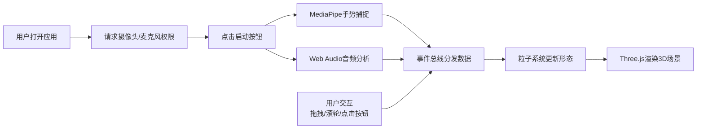

## 1. 产品概述

GestureNebula 是一款为新媒体艺术展设计的实时手势控制粒子星系交互装置，通过手部手势和音乐节奏驱动20000个三维粒子形成不断变幻的星云形态，为观众提供沉浸式的互动艺术体验。

- 核心目标：让观众通过自然的手势互动，创造独一无二的粒子星云视觉效果
- 目标用户：新媒体艺术展观众、互动艺术爱好者
- 市场价值：突破传统静态雕塑和预录制视频的局限性，提供实时、个性化的互动艺术体验

## 2. 核心功能

### 2.1 用户角色
| 角色 | 注册方式 | 核心权限 |
|------|----------|----------|
| 观众 | 无需注册，浏览器访问即可 | 体验手势交互、切换粒子形态、视角控制 |

### 2.2 功能模块
1. **主场景页面**：3D粒子星云渲染、手势交互、音乐反应、视角控制
2. **UI控制层**：启动/暂停按钮、形态切换按钮、FPS监控、性能警告

### 2.3 页面详情
| 页面名称 | 模块名称 | 功能描述 |
|-----------|-------------|---------------------|
| 主场景 | 3D粒子系统 | 20000个粒子实时渲染，支持球体、云雾、星系三种形态 |
| 主场景 | 手势捕获 | 通过MediaPipe捕捉手部21个关键点，识别握拳、张开、V字手势 |
| 主场景 | 音乐反应 | Web Audio API分析麦克风输入，低频控制粒子大小，高频控制运动速度 |
| 主场景 | 视角控制 | 鼠标拖拽旋转、滚轮缩放，Y轴限制-30°到60° |
| UI层 | 启动控制 | 左上角圆形启动/暂停按钮，控制整体交互 |
| UI层 | 形态切换 | 底部状态栏三个圆形按钮，手动切换粒子形态 |
| UI层 | 性能监控 | 右上角FPS计数器，低于30FPS时左下角显示警告 |

## 3. 核心流程

用户打开应用 → 请求摄像头和麦克风权限 → 点击启动按钮 → 手势识别和音频分析开始 → 粒子系统根据手势和音乐实时变化 → 用户可拖拽旋转视角/滚轮缩放 → 点击底部按钮切换形态 → 点击暂停按钮停止交互

## 4. 用户界面设计

### 4.1 设计风格
- **主色调**：深空色 `#0a0a1a`，次深色 `#1a1a3a`
- **霓虹点缀**：粉色 `#f72585`、紫色 `#7c3aed`、青色 `#06b6d4`、黄色 `#fbbf24`
- **按钮风格**：圆形按钮，选中状态带外发光阴影，圆角50%
- **字体**：monospace 等宽字体家族，赛博朋克风格
- **布局风格**：沉浸式全屏3D场景，UI控件悬浮于场景之上
- **动画效果**：所有交互包含0.2秒过渡动画（transform和opacity）

### 4.2 页面设计概述
| 页面名称 | 模块名称 | UI元素 |
|-----------|-------------|-------------|
| 主场景 | 3D渲染区 | 全屏Canvas，深空背景，粒子颜色从紫色→青色→粉色渐变 |
| 主场景 | 启动按钮 | 左上角圆形按钮（直径56px），粉紫渐变背景，白色播放/暂停图标，悬停放大1.1倍+外发光 |
| 主场景 | 底部状态栏 | 宽100%高60px，毛玻璃效果 `rgba(10,10,30,0.8)` + `backdrop-filter: blur(12px)`，居中三个形态按钮 |
| 主场景 | 形态按钮 | 每个直径48px，未选中 `#4a4a6a`，选中 `#f72585` + 外发光，图标分别为圆点、云朵emoji、螺旋 |
| 主场景 | FPS计数器 | 右上角白色16px字体，半透明黑色背景圆角8px，内边距6px 10px |
| 主场景 | 性能警告 | 左下角黄色文字 `#fbbf24`，半透明黑色背景，3秒后自动消失 |

### 4.3 响应式设计
- **桌面端**：默认布局，按钮直径48px/56px，FPS在右上角
- **移动端**（<768px）：按钮缩小至40px，FPS计数器移至左上角，优化触摸交互
- **触摸优化**：按钮最小触摸区域40px，手势识别区域全屏

### 4.4 3D场景设计
- **环境**：深空背景 `#0a0a1a`，无额外光源，粒子自发光
- **粒子系统**：20000个 `Points`，使用 `BufferGeometry` 优化性能，粒子大小0.05-0.3随机
- **相机设置**：PerspectiveCamera，初始距离15单位，距离范围5-50单位
- **轨道控制**：OrbitControls，Y轴旋转限制-30°到60°，X轴无限制，启用阻尼效果
- **形态动画**：切换动画1.5秒，使用贝塞尔曲线插值粒子位置
- **特效**：高频能量触发粒子爆裂特效（0.3秒向外扩散后回缩）
- **性能预算**：桌面端i5+集成显卡最低25FPS，手势延迟<100ms
