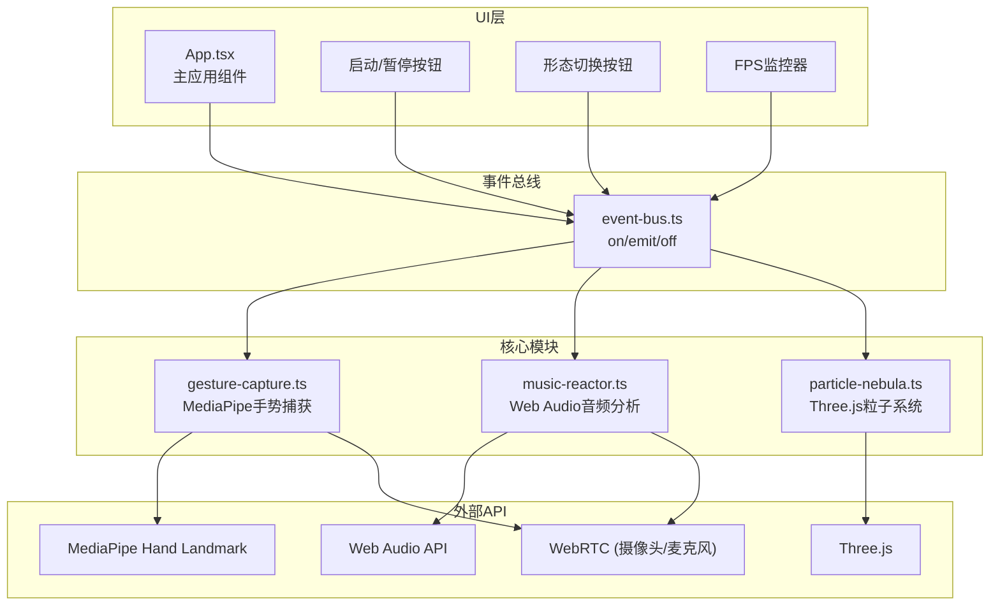

## 1. 架构设计

本项目采用模块化松耦合架构，通过事件总线实现各模块间的通信，确保各功能模块独立开发、独立测试。



## 2. 技术描述

- **前端框架**：React 18 + TypeScript 5
- **构建工具**：Vite 5
- **3D渲染**：Three.js 0.160 + OrbitControls
- **手势识别**：@mediapipe/hands + @mediapipe/camera_utils
- **音频分析**：Web Audio API (原生)
- **状态通信**：自定义事件总线 (发布-订阅模式)
- **样式方案**：内联CSS + CSS变量 (无额外UI库)
- **初始化工具**：vite-init (react-ts模板)

## 3. 目录结构

```
GestureNebula/
├── public/                     # 静态资源目录
├── src/
│   ├── App.tsx                # 主应用组件
│   ├── types.ts               # 全局类型定义
│   ├── event-bus.ts           # 事件总线
│   ├── gesture-capture.ts     # 手势捕获模块
│   ├── music-reactor.ts       # 音频分析模块
│   ├── particle-nebula.ts     # 粒子系统模块
│   └── main.tsx               # 应用入口
├── index.html                 # HTML入口
├── package.json               # 项目依赖
├── vite.config.js             # Vite配置
└── tsconfig.json              # TypeScript配置
```

## 4. 事件定义

| 事件名称 | 参数类型 | 触发源 | 订阅者 | 描述 |
|----------|----------|--------|--------|------|
| `gestureData` | `GestureData` | GestureCapture | ParticleNebula | 每帧手势数据 |
| `audioEnergy` | `AudioEnergy` | MusicReactor | ParticleNebula | 每帧音频能量 |
| `togglePlay` | `boolean` | App | 所有模块 | 启动/暂停 |
| `switchShape` | `ParticleShape` | App/UI按钮 | ParticleNebula | 切换粒子形态 |
| `fpsUpdate` | `number` | App | FPS监控器 | FPS更新 |

## 5. 类型定义

```typescript
// types.ts
export enum GestureType {
  FIST = 'fist',
  OPEN = 'open',
  VICTORY = 'victory',
  NONE = 'none'
}

export enum ParticleShape {
  SPHERE = 'sphere',
  CLOUD = 'cloud',
  GALAXY = 'galaxy'
}

export interface FingerTip {
  x: number;
  y: number;
  z: number;
}

export interface GestureData {
  fingerTips: FingerTip[];
  gestureType: GestureType;
  timestamp: number;
}

export interface AudioEnergy {
  lowFreq: number;
  highFreq: number;
  timestamp: number;
}
```

## 6. 模块接口设计

### 6.1 事件总线 (EventBus)
```typescript
class EventBus {
  on(event: string, callback: Function): void;
  emit(event: string, data?: any): void;
  off(event: string, callback: Function): void;
  once(event: string, callback: Function): void;
}
```

### 6.2 手势捕获 (GestureCapture)
```typescript
class GestureCapture {
  constructor(eventBus: EventBus, videoElement: HTMLVideoElement);
  async start(): Promise<void>;
  stop(): void;
  destroy(): void;
  private detectGesture(landmarks: any[]): GestureType;
}
```

### 6.3 音乐反应 (MusicReactor)
```typescript
class MusicReactor {
  constructor(eventBus: EventBus);
  async start(): Promise<void>;
  stop(): void;
  destroy(): void;
  private analyze(): void;
}
```

### 6.4 粒子星云 (ParticleNebula)
```typescript
class ParticleNebula {
  constructor(container: HTMLElement, eventBus: EventBus);
  start(): void;
  stop(): void;
  destroy(): void;
  setShape(shape: ParticleShape): void;
  private updateParticles(delta: number): void;
  private bezierInterpolate(p0: Vector3, p1: Vector3, t: number): Vector3;
}
```

## 7. 性能优化策略

### 7.1 粒子系统优化
- 使用 `BufferGeometry` 而非 `Geometry`，减少内存占用
- 粒子位置、颜色、大小数据存储在 `Float32Array` 缓冲区
- 每帧仅更新 `needsUpdate = true` 避免全量重绘
- 使用 `PointsMaterial` 开启 `transparent` 和 `depthWrite: false`

### 7.2 手势识别优化
- MediaPipe 运行在 WebAssembly Worker 线程
- 手势识别帧率限制为30FPS，不与渲染竞争
- 关键点数据仅传输指尖坐标(5个)而非全部21个

### 7.3 音频分析优化
- FFT大小设为1024点，平衡精度与性能
- 能量计算仅遍历低频(20-250Hz)和高频(2000-8000Hz)区间
- 使用 `requestAnimationFrame` 同步渲染帧

### 7.4 渲染优化
- 开启 Three.js 对数深度缓冲 `logarithmicDepthBuffer`
- 粒子材质禁用 `depthWrite`，减少绘制排序开销
- 使用 `setAnimationLoop` 而非独立的 `requestAnimationFrame`
- 轨道控制启用 `damping` 平滑相机运动

## 8. 性能指标

| 指标 | 目标值 | 测量方法 |
|------|--------|----------|
| 桌面端FPS | ≥25 | Chrome DevTools Performance |
| 手势延迟 | <100ms | 摄像头帧时间戳 vs 事件发送时间戳 |
| 内存占用 | <500MB | Chrome Task Manager |
| 粒子数量 | 20000 | 常量配置 |
| 形态切换动画 | 1.5s | 贝塞尔曲线插值 |
| 爆裂特效时长 | 0.3s | 高频能量阈值触发 |
