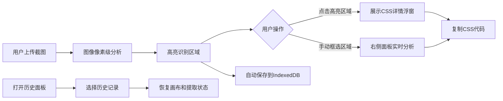

## 1. 产品概述

CSSnapper 是一款面向前端开发者的设计稿CSS样式提取工具，帮助用户从PNG/JPG设计稿截图中快速识别并提取渐变、阴影、圆角等视觉样式，生成可直接复制使用的CSS代码片段。解决手动查看设计稿时反复取色、量尺寸、记参数的低效问题。

## 2. 核心功能

### 2.1 功能模块
1. **主画布区**：图像上传显示、自动高亮识别区域、手动框选区域、缩放平移、详情浮窗
2. **信息面板**：右侧CSS代码展示区、代码编辑、一键复制、缩略色块展示
3. **历史记录**：IndexedDB存储、历史列表、恢复快照状态

### 2.2 页面详情
| 页面名称 | 模块名称 | 功能描述 |
|---------|---------|---------|
| 主应用 | 顶部导航栏 | Logo展示、导入截图按钮、历史记录按钮 |
| 主应用 | 画布区 | 上传设计稿、自动高亮识别区域、手动拖拽框选、缩放平移 |
| 主应用 | 详情浮窗 | 点击高亮区域展示完整CSS代码块、语法高亮、一键复制 |
| 主应用 | 信息面板 | 实时显示框选区域分析结果、CSS代码编辑、缩略色块 |
| 主应用 | 历史面板 | 历史记录列表展示、点击恢复、时间戳与缩略图 |

## 3. 核心流程

用户上传设计稿截图 → 应用自动像素级分析识别渐变/阴影/圆角区域 → 高亮显示所有识别区域 → 用户点击高亮区域查看CSS代码并复制 或 手动拖拽框选任意区域 → 实时分析结果显示在右侧面板 → 每次提取自动保存历史记录 → 用户可随时从历史面板恢复之前的状态。

## 4. 用户界面设计

### 4.1 设计风格
- **主色调**：深灰背景 #0f172a，主文字 #f1f5f9，次要文字 #94a3b8，主按钮色 #3b82f6
- **卡片面板**：圆角16px，阴影 0 4px 12px rgba(0,0,0,0.3)，背景 #1e293b
- **按钮样式**：圆角按钮，hover缩放1.02，过渡0.2s ease-out
- **字体**：代码区 Consolas 14px行高1.6，UI文字系统字体
- **布局**：顶部固定导航栏64px，主区域flex布局（画布flex:1，信息面板固定280px）

### 4.2 页面设计概述
| 页面名称 | 模块名称 | UI元素 |
|---------|---------|---------|
| 主应用 | 导航栏 | Logo "CSSnapper" 20px/600，右侧两个按钮 |
| 主应用 | 画布 | 4px虚线框 #3b82f6 标记高亮区域，框角8px圆角 |
| 主应用 | 详情浮窗 | 宽320px，背景#1e293b，圆角16px，阴影0 8px 24px rgba(0,0,0,0.5) |
| 主应用 | 信息面板 | 固定280px宽，内边距16px，36x36px缩略色块圆角8px |
| 主应用 | 历史列表 | 每条高60px，背景#334155，圆角8px，hover#475569 |

### 4.3 动画效果
- 浮窗淡入+上移20px（0.3s ease-out）
- hover/active缩放1.02+颜色过渡（0.2s ease-out）
- 画布缩放平滑过渡（0.1s）
- 复制按钮反馈变绿0.3秒后恢复

### 4.4 响应式
桌面端优先，信息面板固定宽度，画布区自适应剩余空间。
