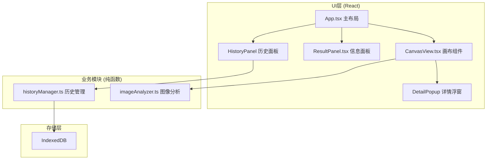

## 1. 架构设计



## 2. 技术描述
- **前端框架**：React 18 + TypeScript + Vite
- **构建工具**：Vite 5（端口3000）
- **样式方案**：原生CSS + CSS变量（暗色主题）
- **状态管理**：React useState/useRef 组件级状态
- **存储方案**：IndexedDB（浏览器原生）
- **图像处理**：Canvas API + 像素级分析（纯函数）

## 3. 路由定义
| 路由 | 用途 |
|-----|------|
| / | 主应用（单页应用，无路由切换） |

## 4. 数据模型

### 4.1 CSS属性对象
```typescript
interface CSSRegion {
  id: string;
  x: number;
  y: number;
  width: number;
  height: number;
  type: 'gradient' | 'shadow' | 'border-radius' | 'mixed';
  properties: {
    background?: string;
    boxShadow?: string;
    borderRadius?: string;
    primaryColor?: string;
  };
}
```

### 4.2 历史记录
```typescript
interface HistoryRecord {
  id: string;
  timestamp: number;
  thumbnail: string;
  imageDataUrl: string;
  regions: CSSRegion[];
  regionCount: number;
}
```

### 4.3 IndexedDB Schema
- **数据库名**：cssnapper_db
- **存储对象**：history_records（keyPath: id，索引: timestamp）

## 5. 模块职责

### 5.1 imageAnalyzer.ts
纯函数模块，接收ImageData进行像素级分析：
- `detectRegions(imageData: ImageData): CSSRegion[]` - 检测所有视觉区域
- `analyzeGradient(imageData: ImageData, x, y, w, h): string` - 提取渐变CSS
- `analyzeShadow(imageData: ImageData, x, y, w, h): string` - 提取阴影CSS
- `analyzeBorderRadius(imageData: ImageData, x, y, w, h): string` - 提取圆角CSS
- `getAverageColor(imageData: ImageData, x, y, w, h): string` - 获取平均主色

### 5.2 historyManager.ts
封装IndexedDB操作：
- `saveRecord(record: HistoryRecord): Promise<string>` - 保存记录
- `loadRecords(): Promise<HistoryRecord[]>` - 加载所有记录（倒序）
- `deleteRecord(id: string): Promise<void>` - 删除记录
- `restoreRecord(id: string): Promise<HistoryRecord | null>` - 恢复单条记录

### 5.3 CanvasView.tsx
画布交互组件：
- 渲染上传图像
- 绘制高亮识别区域（4px虚线#3b82f6，8px圆角）
- 鼠标滚轮缩放（0.5x-3x）和平移拖拽
- 手动矩形框选（半透明#3b82f680填充，2px虚线边框）
- 点击高亮区域触发详情浮窗

### 5.4 ResultPanel.tsx
信息面板组件：
- 右侧固定280px宽
- 展示分析结果（缩略色块36x36px圆角8px）
- CSS代码块展示与编辑（编辑模式边框#eab308）
- 一键复制按钮（反馈变绿"已复制"）
- 语法高亮（关键字#60a5fa，值#34d399，注释#9ca3af）

## 6. 性能要求
- Canvas帧率 ≥ 30fps
- 2MB图像首屏处理 ≤ 3秒
- 单区域响应时间 ≤ 0.5秒
