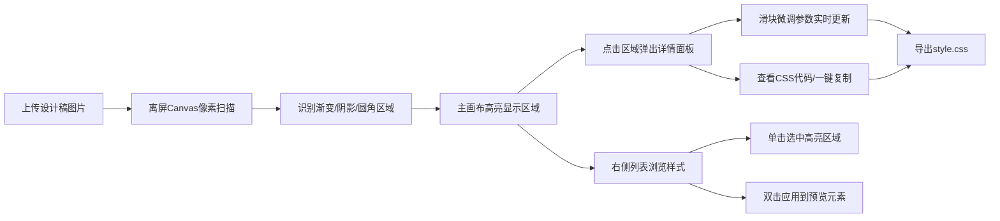

## 1. 产品概述

CSS视觉样式提取工具是一款面向前端开发者的效率工具，旨在快速从设计稿截图中提取渐变、阴影、圆角等CSS视觉样式属性，自动生成可直接复制使用的代码片段，解决手动取色、量尺寸、记参数的低效问题。

- 目标用户：前端开发者、UI设计师
- 核心价值：将视觉样式提取时间从数分钟缩短至数秒，提高开发效率

## 2. 核心功能

### 2.1 用户角色
| 角色 | 注册方式 | 核心权限 |
|------|---------|---------|
| 前端开发者 | 无需注册，直接使用 | 上传图片、提取样式、微调参数、导出代码 |

### 2.2 功能模块
1. **主画布区**：图片上传、元素高亮显示、点击查看详情
2. **样式管理面板**：已识别样式列表、缩略图预览、双击应用到预览区
3. **样式详情面板**：CSS代码展示、一键复制、渐变/阴影参数微调滑块
4. **预览元素区**：实时预览选中样式、支持动态调整
5. **格式导出功能**：项目级CSS文件整理、一键复制、下载style.css

### 2.3 页面详情
| 页面名称 | 模块名称 | 功能描述 |
|---------|---------|---------|
| 主页面 | 上传按钮 | 支持PNG/JPG上传（最大2MB），左上角蓝色按钮 |
| 主页面 | 主画布区 | 70%宽度，浅灰背景#f8fafc，高亮识别的元素区域 |
| 主页面 | 元素高亮区 | 4px虚线框#3b82f6标记，框角8px圆角，点击弹出详情面板 |
| 主页面 | 浮动详情面板 | 320px宽，深色背景#1e293b，16px圆角，展示完整CSS代码和复制按钮 |
| 主页面 | 右侧样式管理面板 | 280px宽，深色#0f172a，12px圆角，列表展示样式片段 |
| 主页面 | 预览元素区 | 320px灰色占位框#334155，双击应用样式实时渲染 |
| 主页面 | 参数微调滑块 | 渐变角度0-360°、内阴影偏移X/Y -20~20px、模糊0-30px |
| 主页面 | 格式导出面板 | 项目级CSS分组格式、复制全部、下载style.css |

## 3. 核心流程

用户上传设计稿图片 → 应用离屏Canvas像素扫描识别 → 高亮显示所有样式区域 → 用户点击区域查看CSS代码 → 可在右侧列表选中高亮或双击应用到预览 → 通过滑块微调渐变和阴影参数 → 导出CSS文件或复制代码

## 4. 用户界面设计

### 4.1 设计风格
- **主色调**：浅灰#f8fafc（主画布）、深蓝#0f172a（右侧面板）、亮蓝#3b82f6（高亮/按钮）
- **辅助色**：成功绿#22c55e（复制反馈）、警示橙#f97316/#eab308（渐变预设）
- **按钮样式**：8px圆角、平滑hover过渡、2px柔化阴影
- **字体**：现代无衬线字体，清晰层级，代码区等宽字体
- **布局风格**：左右两栏（70%/30%），卡片式容器，柔和阴影
- **视觉元素**：虚线框高亮、浮动面板、滑块控件、彩色渐变条

### 4.2 页面设计概览
| 页面名称 | 模块名称 | UI元素 |
|---------|---------|--------|
| 主页面 | 上传按钮 | 8px圆角、#3b82f6背景、白色文字、hover变#2563eb |
| 主页面 | 元素高亮 | 4px#3b82f6虚线框、8px圆角、淡入0.3s动画 |
| 主页面 | 详情面板 | 320px宽、#1e293b背景、16px圆角、阴影0 8px 24px、缩放+淡入过渡 |
| 主页面 | 复制按钮 | 常态蓝色、点击变绿1秒后恢复、平滑过渡 |
| 主页面 | 右侧面板 | 280px宽、#0f172a、圆角12px 0 0 12px、内边距20px |
| 主页面 | 预览元素 | 320px宽、#334155背景、实时应用样式 |
| 主页面 | 滑块控件 | 自定义样式、颜色主题统一、响应式拖动 |

### 4.3 响应式设计
- **桌面端（>1024px）**：标准左右两栏布局，主画布70% + 右侧面板280px
- **笔记本（768-1024px）**：右侧面板自动折叠为底部抽屉，点击展开
- **触控优化**：增大点击热区，高亮区域至少40px可点击范围
