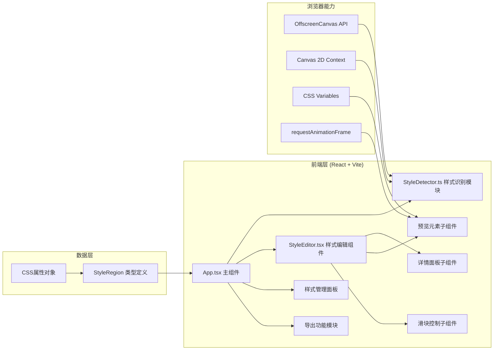

## 1. 架构设计



## 2. 技术栈说明
- **前端框架**：React@18 + TypeScript@5
- **构建工具**：Vite@5 + @vitejs/plugin-react
- **样式方案**：原生CSS + CSS变量，无需Tailwind（按用户需求精确控制）
- **状态管理**：React Hooks（useState/useRef/useCallback）
- **图像处理**：离屏Canvas（OffscreenCanvas）+ ImageData像素扫描
- **性能优化**：requestAnimationFrame节流、CSS变量实时渲染

## 3. 核心类型定义

```typescript
interface GradientStop {
  color: string;
  position: number;
}

interface GradientStyle {
  type: 'linear' | 'radial';
  angle: number;
  stops: GradientStop[];
}

interface ShadowStyle {
  offsetX: number;
  offsetY: number;
  blur: number;
  spread: number;
  color: string;
  inset: boolean;
}

interface StyleRegion {
  id: string;
  x: number;
  y: number;
  width: number;
  height: number;
  borderRadius: number;
  gradient?: GradientStyle;
  boxShadow?: ShadowStyle[];
  innerShadow?: ShadowStyle[];
  backgroundColor?: string;
  thumbnail: string;
  cssText: string;
}
```

## 4. 文件组织结构

```
├── package.json
├── index.html
├── vite.config.ts
├── tsconfig.json
└── src/
    ├── main.tsx          (React渲染入口)
    ├── App.tsx           (主组件：布局、上传、状态管理)
    ├── StyleDetector.ts  (核心识别：离屏Canvas像素扫描)
    └── StyleEditor.tsx   (编辑组件：详情面板、预览、滑块)
```

## 5. 性能关键实现

### 5.1 快速识别（<2秒）
- 使用 OffscreenCanvas + Web Worker 友好模式
- 像素扫描步长优化（4px步长初扫 → 1px步长精扫）
- 颜色直方图快速定位渐变区域
- 边缘检测算法定位圆角边界

### 5.2 实时预览（<50ms响应）
- CSS变量驱动预览元素样式
- requestAnimationFrame 节流滑块回调
- 批量DOM更新，避免重排重绘
- 内联样式直接应用，无需样式表切换

### 5.3 内存管理
- 离屏Canvas使用后立即释放
- 缩略图使用Canvas截取而非全图引用
- 图片上传后压缩处理（最大2MB限制）
