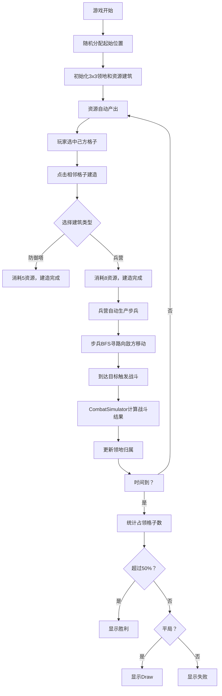

## 1. 产品概述

RealmForge是一款多人实时领地争夺策略游戏，玩家在10x10的网格地图上通过建造建筑、部署单位来占领领地，在限定时间内占领超过50%网格的玩家获胜。游戏融合了即时战略和资源管理元素，提供紧张刺激的对战体验。

- **核心玩法**：资源采集→建筑建造→单位生产→领地争夺→胜利判定
- **目标用户**：策略游戏爱好者、休闲竞技玩家
- **市场价值**：轻量化网页策略游戏，无需安装即可体验多人对战乐趣

## 2. 核心特性

### 2.1 用户角色

| 角色 | 注册方式 | 核心权限 |
|------|----------|----------|
| 玩家 | 直接进入游戏 | 控制己方单位、建造建筑、参与对战 |

### 2.2 功能模块

1. **主游戏界面**：10x10网格地图、单位与建筑显示、领地可视化
2. **资源管理系统**：资源面板、资源产出、建筑消耗
3. **建筑系统**：防御塔建造、兵营建造与升级
4. **单位系统**：步兵自动生产、BFS寻路移动、战斗系统
5. **战斗系统**：单位攻击、建筑防守、领地变更
6. **游戏流程**：倒计时器、胜负判定、操作日志

### 2.3 页面详情

| 页面名称 | 模块名称 | 功能描述 |
|----------|----------|----------|
| 主游戏页面 | 网格地图 | 10x10格子，显示领地归属、建筑、单位 |
| 主游戏页面 | 资源面板 | 显示当前资源数量，实时更新 |
| 主游戏页面 | 领地计数器 | 显示当前占领格子数/总格子数 |
| 主游戏页面 | 操作日志 | 记录战斗、建造、占领等游戏事件 |
| 主游戏页面 | 计时器 | 显示剩余游戏时间 |
| 主游戏页面 | 建造菜单 | 选择建造防御塔或兵营 |

## 3. 核心流程

玩家进入游戏后随机分配到地图四个角落之一，拥有初始3x3领地和一个基础资源建筑。玩家通过点击己方领地格子选中，再点击相邻格子进行建筑建造。兵营自动生产步兵单位，单位自动向敌方领地移动并发起进攻。战斗结果决定领地归属，时间结束时统计占领格子数判定胜负。

## 4. 用户界面设计

### 4.1 设计风格

- **主色调**：深空蓝#0b0f19 → 深紫#1a0a2e径向渐变背景
- **阵营色**：己方#3b82f6（半透明蓝）、敌方#ef4444（红色）、中立金色
- **字体**：使用独特的展示字体搭配精致的正文字体，避免使用Inter等通用字体
- **按钮样式**：圆角设计，hover缩放1.05，点击缩放0.95，平滑过渡
- **视觉效果**：中立资源点金色外发光动画、单位移动拖尾粒子效果

### 4.2 页面设计概述

| 页面名称 | 模块名称 | UI元素 |
|----------|----------|--------|
| 主游戏页面 | 网格地图 | 60x60px格子（移动端40x40px），1px半透明白色边框，领地填充对应阵营色 |
| 主游戏页面 | 资源面板 | 右上角，资源图标+数量，18px白色字体 |
| 主游戏页面 | 领地计数器 | 右上角，"当前领地数/100"格式 |
| 主游戏页面 | 操作日志 | 左下角，240x300px，深色半透明背景，圆角12px，内边距12px |
| 主游戏页面 | 建筑菜单 | 点击格子后弹出，防御塔/兵营选项 |
| 主游戏页面 | 单位 | 16px白色圆点，带移动拖尾粒子效果 |

### 4.3 响应式设计

- **桌面端**：网格60x60px，操作日志悬浮左下角
- **移动端（<768px）**：网格缩小至40x40px，操作日志变为底部固定半透明条
- **触摸优化**：增大点击区域，适配触摸操作

## 5. 技术约束

- **性能要求**：游戏循环60FPS，每帧网格更新和BFS寻路耗时≤5ms
- **技术栈**：React + TypeScript + Vite
- **架构**：MapEngine、CombatSimulator独立模块，通过事件总线与UI通信
