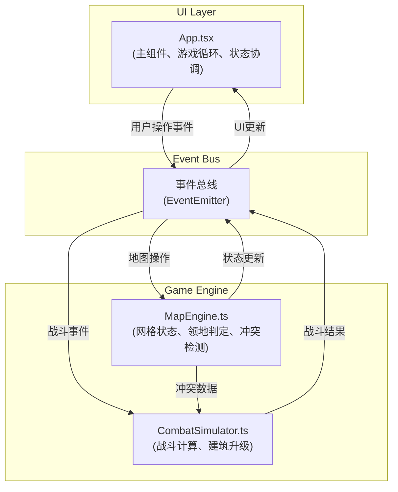

## 1. 架构设计



## 2. 技术描述

- **前端框架**：React@18 + TypeScript + Vite
- **状态管理**：React useState/useRef + 事件总线
- **构建工具**：Vite
- **样式方案**：原生CSS + CSS变量 + 响应式媒体查询
- **图标**：lucide-react
- **外部服务**：无（纯前端游戏）

## 3. 项目结构

```
d:\VersionFastPro\tasks\auto169\
├── package.json
├── vite.config.js
├── tsconfig.json
├── index.html
└── src\
    ├── App.tsx              # 主组件：游戏循环、UI渲染、状态协调
    ├── MapEngine.ts         # 网格地图引擎：状态管理、领地判定、冲突检测
    ├── CombatSimulator.ts   # 战斗模拟器：战斗计算、建筑升级
    ├── types.ts             # TypeScript类型定义
    ├── eventBus.ts          # 事件总线实现
    └── utils\
        └── bfs.ts           # BFS寻路算法
```

## 4. 核心数据模型

### 4.1 类型定义

```typescript
// 玩家ID
type PlayerId = 'player1' | 'player2' | 'player3' | 'player4' | 'neutral';

// 建筑类型
type BuildingType = 'resource' | 'tower' | 'barracks';

// 网格格子
interface Cell {
  x: number;
  y: number;
  owner: PlayerId;
  building: Building | null;
  unit: Unit | null;
  isResourcePoint: boolean;
}

// 建筑
interface Building {
  id: string;
  type: BuildingType;
  owner: PlayerId;
  level: number;
  hp: number;
  maxHp: number;
  lastProductionTime: number;
  productionInterval: number;
}

// 单位
interface Unit {
  id: string;
  owner: PlayerId;
  type: 'infantry';
  x: number;
  y: number;
  targetX: number;
  targetY: number;
  hp: number;
  maxHp: number;
  attack: number;
  defense: number;
  lastMoveTime: number;
  moveInterval: number;
  path: { x: number; y: number }[];
  trail: { x: number; y: number; alpha: number }[];
}

// 游戏状态
interface GameState {
  grid: Cell[][];
  players: Record<PlayerId, PlayerState>;
  units: Unit[];
  timeRemaining: number;
  isGameOver: boolean;
  winner: PlayerId | 'draw' | null;
  selectedCell: { x: number; y: number } | null;
  logs: LogEntry[];
}

// 玩家状态
interface PlayerState {
  id: PlayerId;
  resources: number;
  territoryCount: number;
  color: string;
  isAI: boolean;
}

// 日志条目
interface LogEntry {
  id: string;
  time: number;
  message: string;
  type: 'info' | 'battle' | 'build' | 'capture';
}

// 战斗事件
interface CombatEvent {
  attacker: Unit | Building;
  defender: Unit | Building;
  x: number;
  y: number;
}

// 战斗结果
interface CombatResult {
  attackerHp: number;
  defenderHp: number;
  attackerDestroyed: boolean;
  defenderDestroyed: boolean;
  territoryChanged: boolean;
  newOwner: PlayerId | null;
}
```

## 5. 模块接口

### 5.1 MapEngine接口

```typescript
class MapEngine {
  getGrid(): Cell[][];
  getCell(x: number, y: number): Cell | null;
  setCellOwner(x: number, y: number, owner: PlayerId): boolean;
  placeBuilding(x: number, y: number, building: Building): boolean;
  removeBuilding(x: number, y: number): boolean;
  placeUnit(unit: Unit): boolean;
  removeUnit(unitId: string): boolean;
  moveUnit(unitId: string, newX: number, newY: number): boolean;
  checkConflict(x: number, y: number): CombatEvent | null;
  getTerritoryCount(playerId: PlayerId): number;
  findPath(startX: number, startY: number, endX: number, endY: number, passable: (cell: Cell) => boolean): { x: number; y: number }[];
  getAdjacentCells(x: number, y: number): Cell[];
  findNearestEnemy(unit: Unit): { x: number; y: number } | null;
}
```

### 5.2 CombatSimulator接口

```typescript
class CombatSimulator {
  resolveCombat(event: CombatEvent): CombatResult;
  calculateDamage(attacker: Unit | Building, defender: Unit | Building): number;
  upgradeBuilding(building: Building, resources: number): { success: boolean; building: Building; cost: number };
  canUpgrade(building: Building): boolean;
  getUpgradeCost(building: Building): number;
}
```

### 5.3 事件总线事件

| 事件名称 | 数据类型 | 触发时机 |
|----------|----------|----------|
| `cell:click` | { x: number; y: number } | 点击格子 |
| `building:place` | { x: number; y: number; type: BuildingType } | 建造建筑 |
| `building:upgrade` | { x: number; y: number } | 升级建筑 |
| `combat:resolve` | CombatEvent | 解决战斗 |
| `combat:result` | CombatResult & { x: number; y: number } | 战斗结果 |
| `unit:move` | { unitId: string; x: number; y: number } | 单位移动 |
| `territory:change` | { x: number; y: number; oldOwner: PlayerId; newOwner: PlayerId } | 领地变更 |
| `resource:update` | { playerId: PlayerId; amount: number } | 资源更新 |
| `log:add` | LogEntry | 添加日志 |
| `game:tick` | number | 每帧更新 |
| `game:end` | { winner: PlayerId | 'draw' } | 游戏结束 |

## 6. 性能优化策略

1. **BFS寻路优化**：
   - 使用队列优化的BFS算法
   - 缓存已计算路径，仅当目标变化时重新计算
   - 限制同时进行寻路的单位数量

2. **游戏循环优化**：
   - 使用`requestAnimationFrame`实现60FPS循环
   - 状态更新与渲染分离，仅在必要时重渲染
   - 使用`useRef`存储频繁更新的状态，避免React重渲染开销

3. **渲染优化**：
   - 网格使用CSS transform而非top/left定位
   - 单位粒子效果使用CSS动画而非JS计算
   - 日志面板虚拟滚动（实际量小可简化为滚动到底部）

4. **内存优化**：
   - 对象池复用单位和建筑对象
   - 及时清理已销毁单位的引用
   - 限制日志条目最大数量（如100条）
