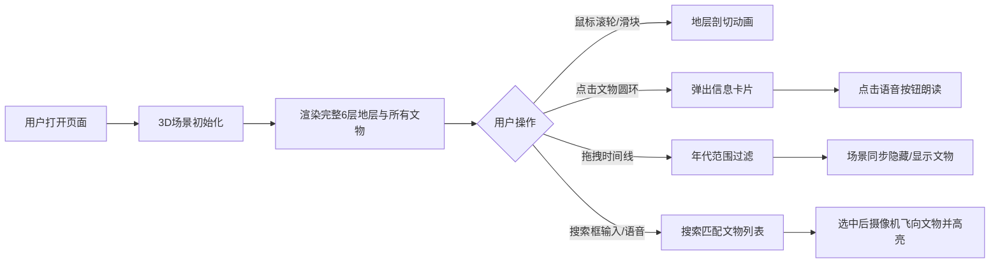

## 1. 产品概述

DeepStratify 是一款面向考古学家和公众的3D考古遗址地层可视化应用，将遗址3D扫描数据转化为可交互的虚拟展览，让观众在网页上自由探索不同地层和文物，查看每件文物的详细信息与时间线。

## 2. 核心功能

### 2.1 用户角色
| 角色 | 访问方式 | 核心权限 |
|------|----------|----------|
| 普通用户 | 浏览器直接访问 | 浏览3D地层、查看文物详情、时间线过滤、语音搜索 |
| 考古学家 | 浏览器直接访问 | 同普通用户，可导出数据（预留接口） |

### 2.2 功能模块
1. **3D场景主界面**：地层剖切、文物渲染、摄像机控制
2. **文物信息卡片**：文物详情展示、语音朗读
3. **时间线过滤面板**：年代分布可视化、范围拖拽筛选
4. **语音/文本搜索模块**：关键词搜索、语音识别、自动聚焦
5. **左侧控制面板**：地层切换滑块、文物筛选下拉框

### 2.3 页面详情
| 页面名称 | 模块名称 | 功能描述 |
|----------|----------|----------|
| 主场景页 | 3D地层渲染 | 6层半透明地层，支持鼠标滚轮/滑块连续剖切，非线性层厚衰减，0.6s ease-out动画 |
| 主场景页 | 文物标签与细节 | 发光圆环标记文物，点击弹出320px信息卡片，含名称/年代/材质/描述，语音播放按钮 |
| 主场景页 | 时间线过滤 | 底部120px高时间线面板，2000年跨度带状图，拖拽范围筛选，0.4s过渡 |
| 主场景页 | 语音搜索 | 右上角240px搜索框，支持键盘/语音输入，下拉列表最多8条结果，选中后摄像机飞向文物 |
| 主场景页 | 左侧控制面板 | 280px宽磨砂玻璃面板，垂直地层滑块，文物筛选下拉框 |

## 3. 核心流程

用户打开应用 → 3D场景加载完成，展示完整地层与所有文物 → 用户可通过：
- 鼠标滚轮/滑块剖切地层，逐层查看地下结构
- 点击发光圆环查看文物详情，点击语音按钮朗读描述
- 拖拽底部时间线选择年代范围，场景同步过滤文物
- 使用搜索框输入或语音搜索文物名称，选中后自动聚焦

## 4. 用户界面设计

### 4.1 设计风格
- **主色调**：沙地浅棕色渐变（#f5e6d3 → #d6c0a0）作为天空盒，深暗色UI面板（#0f172a / #1e293b / #334155）
- **强调色**：橙色系（#f59e0b / #fbbf24）用于文物高亮与滑块，蓝色（#3b82f6）用于控制按钮
- **地层渐变色**：#d2b48c、#cd853f、#deb887、#d2691e、#8b4513、#4a2c2a（从地表至基岩）
- **时间线渐变色**：#b91c1c → #facc15（年代由古至今）
- **按钮风格**：圆形圆角按钮，hover缩放过渡0.2s
- **字体**：现代无衬线字体，清晰可读
- **布局**：全屏3D场景 + 悬浮面板式UI，磨砂玻璃backdrop-filter: blur(8px)
- **动效**：所有过渡动画平滑流畅，ease-out缓动

### 4.2 页面设计概述
| 页面名称 | 模块名称 | UI元素 |
|----------|----------|--------|
| 主场景页 | 天空盒/环境 | 浅棕色垂直渐变，模拟沙地环境光 |
| 主场景页 | 左侧控制面板 | 宽280px，rgba(15,23,42,0.85)背景，磨砂玻璃，垂直地层滑块（轨道6px，滑块18px#f59e0b），文物筛选下拉框 |
| 主场景页 | 底部时间线 | 高120px，#0f172a背景，D3带状图，缩放控制圆形按钮#3b82f6（直径32px→hover 36px） |
| 主场景页 | 搜索框 | 右上角，宽240px，#334155背景，圆角8px，placeholder="输入或说出文物名称"，麦克风图标 |
| 主场景页 | 文物信息卡 | 宽320px，#1e293b背景，圆角12px，名称/年代/材质/描述文本，语音播放按钮 |
| 主场景页 | 搜索下拉列表 | 最多8条，每条高40px，悬停#475569背景 |

### 4.3 响应式
- Desktop-first 设计，屏幕宽度 < 768px 时：
  - 所有UI元素自动折叠至顶部汉堡菜单
  - 触控手势：单指旋转视角，双指缩放
  - 面板自适应全屏宽度

### 4.4 3D场景指引
- **环境**：浅棕色渐变天空盒，模拟沙漠/考古现场环境光
- **光照**：环境光 + 方向光模拟日光，文物点光源发光效果
- **摄像机**：PerspectiveCamera，OrbitControls支持旋转/缩放/平移，自动聚焦飞行动画
- **交互**：鼠标滚轮剖切地层，点击文物Raycaster拾取
- **后处理**：文物发光圆环Bloom效果，地层半透明渲染
- **性能**：≤400件文物时50+ FPS，实例化渲染优化
