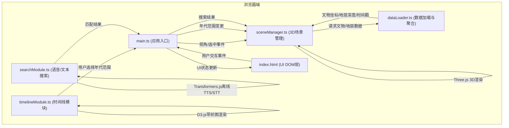
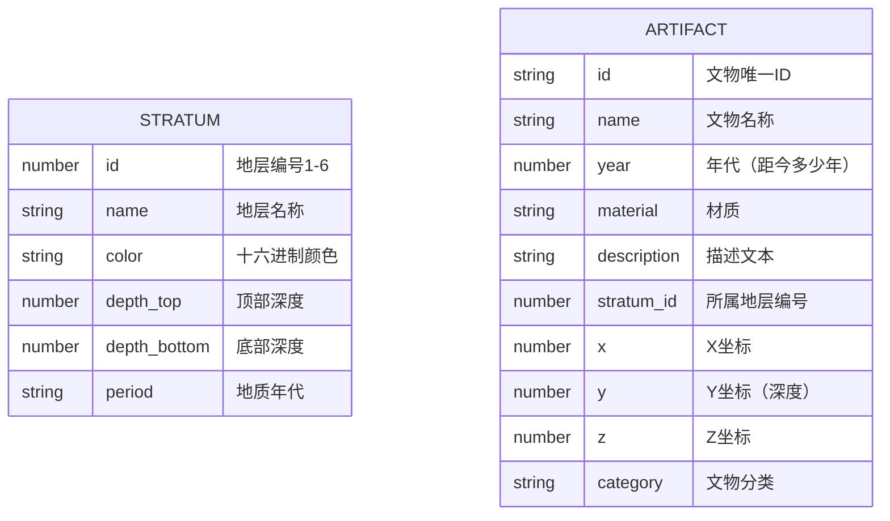

## 1. 架构设计



**数据流向说明：**
1. `main.ts` 作为事件中枢，接收所有DOM交互事件
2. `dataLoader.ts` 单向提供数据，被 `sceneManager.ts` 调用
3. `timelineModule.ts` 和 `searchModule.ts` 向上通知 `main.ts`，由其协调 `sceneManager.ts`
4. UI DOM层（index.html内联样式）通过 `main.ts` 中介与各模块通信

## 2. 技术描述
- **前端框架**：原生 TypeScript（无React/Vue，按用户指定文件结构）
- **3D渲染**：Three.js @latest + @types/three
- **数据可视化**：D3.js @latest（时间线带状图、热力映射）
- **浏览器端AI**：@xenova/transformers @latest（离线语音识别、文本转语音）
- **构建工具**：Vite @latest（devServer端口3000）
- **语言**：TypeScript 严格模式，target ES2020

## 3. 路由定义
| 路由 | 用途 |
|------|------|
| / | 主应用页面，单页应用无路由跳转 |

## 4. 文件结构与职责

```
auto17/
├── package.json              # 依赖与脚本配置
├── vite.config.js            # Vite构建配置（端口3000）
├── tsconfig.json             # TypeScript严格模式配置
├── index.html                # 入口页面，DOM结构与UI容器
└── src/
    ├── main.ts               # 应用入口，事件中枢，场景初始化
    ├── sceneManager.ts       # 3D场景管理：地层切片、文物模型、颗粒效应
    ├── dataLoader.ts         # 数据加载：JSON元数据、D3层次结构转换
    ├── timelineModule.ts     # 时间线：D3可缩放时间线、拖拽过滤
    ├── searchModule.ts       # 搜索：Transformers.js语音识别、文本匹配
    └── data/
        └── mockData.json     # 模拟文物与地层数据
```

**模块调用关系：**
- `main.ts` → 导入并实例化 `sceneManager`、`dataLoader`、`timelineModule`、`searchModule`
- `sceneManager.ts` → 导入 `dataLoader` 获取数据
- `timelineModule.ts`、`searchModule.ts` → 通过回调函数向 `main.ts` 发布事件

## 5. 数据模型

### 5.1 数据模型定义



### 5.2 TypeScript 类型定义

```typescript
interface Stratum {
  id: number;
  name: string;
  color: string;
  depthTop: number;
  depthBottom: number;
  period: string;
}

interface Artifact {
  id: string;
  name: string;
  year: number;
  material: string;
  description: string;
  stratumId: number;
  position: { x: number; y: number; z: number };
  category: string;
}

interface SiteData {
  strata: Stratum[];
  artifacts: Artifact[];
}
```

## 6. 性能约束实现方案

| 约束 | 实现方案 |
|------|----------|
| 3D场景 ≥ 50 FPS | Three.js InstancedMesh 批量渲染文物，LOD层级细节，Frustum Culling |
| 文物模型 ≤ 400 不掉帧 | 简化文物几何体（Box/Sphere替代），共享材质，合并几何体 |
| 语音识别 ≤ 300ms | Transformers.js WebNN/WebGPU加速，预加载小型模型（Xenova/whisper-tiny） |
| 动画流畅 | CSS transition + Three.js TWEEN动画库，requestAnimationFrame统一调度 |
