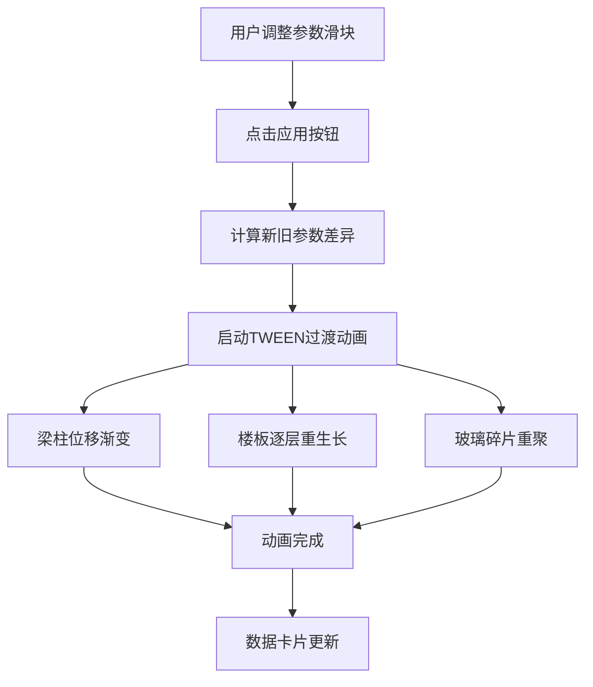

## 1. 产品概述

Atrium 是一个基于浏览器的三维建筑中庭生长模拟工具，用户通过实时参数控制中庭的层数、挑高、柱子间距和立面开窗率，程序动态构建包含结构框架、楼层板、玻璃幕墙和内部廊桥的完整中庭模型，并支持自由旋转缩放观察。

- 目标用户：建筑设计从业者、建筑学学生、参数化设计爱好者
- 核心价值：以直观的3D可视化方式，让用户在秒级内探索不同中庭设计方案的空间效果

## 2. 核心功能

### 2.1 功能模块

1. **控制面板**：参数滑块（层数/挑高/柱间距/开窗率）、应用按钮、重置按钮
2. **3D视口**：Three.js渲染的中庭模型、轨道控制器旋转缩放、数据卡片悬浮显示
3. **过渡动画**：参数变更后1秒内平滑过渡（梁柱位移、楼板逐层重生长、玻璃碎片重聚）

### 2.2 页面详情

| 页面名称 | 模块名称 | 功能描述 |
|----------|----------|----------|
| 主页面 | 左侧控制面板 | 4组带标签数字滑块，实时显示数值；橙色应用按钮触发模型更新；灰色重置按钮恢复默认值 |
| 主页面 | 右侧3D视口 | 渲染中庭3D模型，轨道控制器支持旋转/缩放/平移；右下角3张毛玻璃数据卡片显示当前层数、总面积、开窗率 |
| 主页面 | 过渡动画系统 | 点击应用后，梁柱从旧位置缓动到新位置，楼板逐层淡出再生长，玻璃碎片化重聚为完整幕墙 |

## 3. 核心流程

用户调整参数滑块 → 点击应用按钮 → 触发过渡动画 → 中庭模型平滑更新至新形态 → 数据卡片实时刷新

## 4. 用户界面设计

### 4.1 设计风格

- 主色调：深蓝灰(#1e293b) + 天蓝(#3b82f6) + 橙色(#f97316)强调
- 按钮风格：圆角按钮，应用按钮橙色带悬浮变深和点击缩放弹性动效
- 字体：系统无衬线字体栈，滑块数值使用等宽数字
- 布局风格：左右分栏，左控制面板固定320px宽，右3D视口填充剩余空间

### 4.2 页面设计概览

| 页面名称 | 模块名称 | UI元素 |
|----------|----------|--------|
| 主页面 | 控制面板 | 深色背景(#1e293b)，圆角0 12px 12px 0，阴影4px 0 16px rgba(0,0,0,0.3)；4组滑块(轨道#334155，圆形24px #3b82f6)；橙色应用按钮(#f97316)；灰色重置按钮(#6b7280) |
| 主页面 | 3D视口 | 背景渐变#0a0a2e→#1a1a3e；右下角3张毛玻璃卡片(rgba(255,255,255,0.08)，border rgba(255,255,255,0.12)，圆角12px) |
| 主页面 | 地面与环境 | 反射地面(#1e293b, roughness 0.4, metalness 0.2)；低多边形城市轮廓；渐变天空盒(#0f172a→#e2e8f0) |

### 4.3 响应式

- 桌面优先设计，最小支持1280px宽度
- 控制面板固定宽度，3D视口自适应

### 4.4 3D场景指引

- 环境：深色渐变天空盒，低多边形城市剪影环绕
- 灯光：环境光 + 方向光 + 半球光，确保中庭内部均匀照明
- 相机：透视相机，初始视角略高于中庭中心，OrbitControls旋转缩放
- 构件：圆柱柱(#94a3b8)、矩形梁(#64748b)、扁楼板(#475569 0.85透明)、半透明玻璃(#60a5fa 0.3透明)、廊桥(#94a3b8)
- 交互：参数驱动模型重建，TWEEN缓动过渡动画
- 性能：帧率不低于40fps
