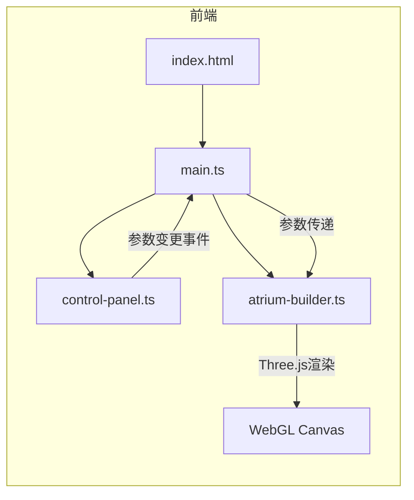

## 1. 架构设计



纯前端项目，无后端服务。Three.js直接操作WebGL Canvas，控制面板通过回调函数向主模块传递参数变更。

## 2. 技术说明

- 前端：TypeScript + Three.js + Vite（纯前端，无React/Vue）
- 构建工具：Vite
- 3D渲染：Three.js（场景、相机、灯光、几何体、材质、OrbitControls）
- 动画库：@tweenjs/tween.js（缓动过渡动画）
- 语言：TypeScript (strict模式, target ES2020, moduleResolution bundler)

## 3. 文件结构

| 文件路径 | 职责 |
|----------|------|
| package.json | 项目依赖和启动脚本 |
| index.html | 入口HTML，全屏无滚动 |
| tsconfig.json | TypeScript配置，strict模式 |
| vite.config.js | Vite基础配置 |
| src/main.ts | 场景/相机/灯光/渲染器初始化，动画循环，引入ControlPanel和AtriumBuilder |
| src/control-panel.ts | UI面板生成与事件绑定，输出参数变更回调 |
| src/atrium-builder.ts | 根据参数生成几何体，管理构件更新与TWEEN过渡动画 |

## 4. 数据模型

### 4.1 参数定义

```typescript
interface AtriumParams {
  floors: number;        // 层数 1-10
  floorHeight: number;   // 每层挑高 3-6米
  columnSpacing: number; // 柱子间距 2-4米
  windowRatio: number;   // 立面开窗率 0.3-0.8
}
```

默认值：`{ floors: 5, floorHeight: 4, columnSpacing: 3, windowRatio: 0.5 }`

### 4.2 构件类型

| 构件 | 几何体 | 尺寸 | 颜色 | 透明度 |
|------|--------|------|------|--------|
| 柱子 | CylinderGeometry | 半径0.15m | #94a3b8 | 1.0 |
| 梁 | BoxGeometry | 0.12×0.12m | #64748b | 1.0 |
| 楼层板 | BoxGeometry | 厚0.2m | #475569 | 0.85 |
| 玻璃幕墙 | PlaneGeometry | 按开窗率调整 | #60a5fa | 0.3 |
| 廊桥桥面 | BoxGeometry | 宽1.2m | #94a3b8 | 1.0 |
| 廊桥栏杆 | CylinderGeometry | 栏杆高0.8m | #94a3b8 | 1.0 |
| 地面 | PlaneGeometry | 大平面 | #1e293b | 1.0 |
| 城市剪影 | BoxGeometry | 随机10-15个 | #334155 | 1.0 |

## 5. 动画策略

- 使用@tweenjs/tween.js实现1秒过渡
- 缓动函数：ease-in-out cubic偏弹性（自定义缓动）
- 梁柱：位置从旧值插值到新值
- 楼板：从下到上逐层opacity淡出→重建→淡入
- 玻璃：scale从碎片化(0)到完整(1)，配合opacity过渡
- 动画期间保持40fps以上：使用Group管理构件，避免逐个更新材质
