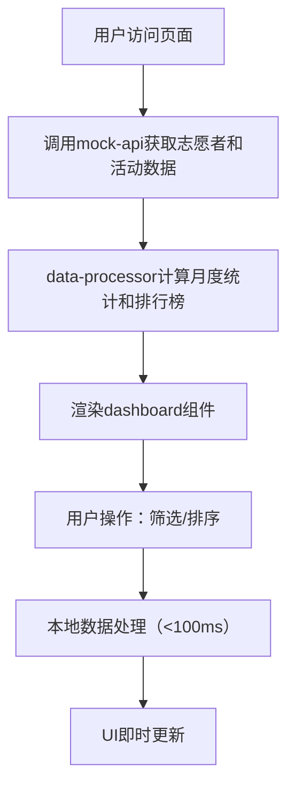

## 1. 产品概述
GreenTrack是一款面向社区环保志愿者团队的活动记录与统计看板工具，帮助团队高效记录和跟踪成员参与的各类环保活动（垃圾分类宣传、河道清洁、植树等），可视化展示个人参与数据和团队整体趋势，替代传统Excel表格手动统计方式。

- 解决问题：志愿者团队活动数据分散、手动统计效率低下、数据可视化不足
- 目标用户：社区环保志愿者团队管理者及成员
- 市场价值：提升环保志愿活动管理效率，激发成员参与热情，助力环保公益事业数字化

## 2. 核心功能

### 2.1 功能模块
1. **活动记录表格**：展示所有活动记录，支持按类型筛选和按日期排序
2. **月度统计图表**：按月份汇总活动总次数和总时长，双Y轴柱状图可视化
3. **志愿者排行榜**：按累计参与时长排名，展示Top 10志愿者
4. **活动类型筛选器**：顶部快捷筛选按钮，一键切换活动类型视图

### 2.2 页面详情
| 页面名称 | 模块名称 | 功能描述 |
|---------|---------|---------|
| 主仪表盘 | 活动记录表格 | 展示日期、志愿者姓名、活动类型标签、时长分钟数，支持hover高亮行 |
| 主仪表盘 | 活动类型筛选器 | 三个类型按钮（垃圾分类、河道清洁、植树），点击切换筛选状态 |
| 主仪表盘 | 月度统计图表 | 柱状图展示1-12月活动次数和时长，双Y轴，hover显示详细数值 |
| 主仪表盘 | 志愿者排行榜 | 前10名志愿者排名展示，榜首高亮，hover轻微左移动画 |

## 3. 核心流程
用户进入页面后，系统自动加载志愿者信息和活动记录数据，数据处理模块实时计算月度统计和排名数据并渲染到UI。用户点击筛选按钮或表头排序时，表格数据即时更新；所有数据交互响应时间不超过100毫秒。

## 4. 用户界面设计

### 4.1 设计风格
- **主色调**：绿色环保系，垃圾分类绿色#22c55e、河道清洁蓝色#3b82f6、植树橙色#f59e0b
- **背景色**：浅灰#f0f2f5，面板白色#ffffff，圆角12px
- **按钮风格**：圆角8px，选中状态背景色与标签色一致，文字白色
- **字体**：默认14px，行高1.6，清晰易读
- **布局**：左右分栏，左侧640px宽，右侧400px宽
- **阴影**：卡片阴影0 2px 8px rgba(0,0,0,0.06)
- **动画**：表格行hover背景过渡0.2s，排行榜项hover左移4px

### 4.2 页面设计概述
| 页面名称 | 模块名称 | UI Elements |
|---------|---------|-------------|
| 主仪表盘 | 活动记录表格 | 白色卡片、圆角12px、内边距24px、表头粗体、行hover#f9fafb |
| 主仪表盘 | 活动类型筛选器 | 三按钮组、圆角8px、选中态颜色标签色、切换动画 |
| 主仪表盘 | 月度统计图表 | 620x320px、双Y轴柱状图、柱宽20px间距10px、hover提示框 |
| 主仪表盘 | 志愿者排行榜 | 圆形头像40px、榜首金色#fbbf24底纹、hover左移4px |

### 4.3 响应式
桌面端优先设计，全屏自适应布局，主要面向桌面端使用场景。
