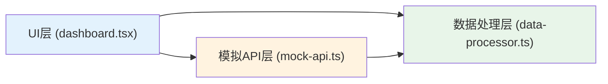

## 1. 架构设计



## 2. 技术描述
- **前端框架**：React@18 + TypeScript + Vite
- **构建工具**：Vite@5
- **类型系统**：TypeScript（严格模式）
- **样式方案**：原生CSS（styles.css）
- **图表实现**：原生Canvas API绘制柱状图（无需额外图表库）
- **状态管理**：React Hooks（useState、useEffect、useMemo）
- **事件通信**：自定义事件总线模式（组件内实现）
- **数据流向**：mock-api.ts → data-processor.ts → dashboard.tsx

## 3. 技术栈选择说明
- 采用Vite + React + TypeScript标准配置，确保开发效率和类型安全
- 使用原生Canvas绘制图表，避免引入重型图表库，保证性能响应<100ms
- 数据处理逻辑独立封装在data-processor.ts，便于单元测试和维护
- mock-api.ts提供稳定的模拟数据源，便于前后端并行开发

## 4. 数据类型定义

### 4.1 志愿者类型
```typescript
interface Volunteer {
  id: string;
  name: string;
  avatar: string;
}
```

### 4.2 活动记录类型
```typescript
interface Activity {
  id: string;
  date: string;
  volunteerId: string;
  type: '垃圾分类宣传' | '河道清洁' | '植树';
  duration: number;
}
```

### 4.3 月度统计类型
```typescript
interface MonthlyStats {
  month: number;
  count: number;
  duration: number;
}
```

### 4.4 排行榜项类型
```typescript
interface LeaderboardItem {
  rank: number;
  volunteerId: string;
  name: string;
  avatar: string;
  totalDuration: number;
}
```

## 5. 文件结构

```
project-root/
├── package.json
├── vite.config.js
├── tsconfig.json
├── index.html
└── src/
    ├── mock-api.ts
    ├── data-processor.ts
    ├── dashboard.tsx
    ├── main.tsx
    └── styles.css
```

## 6. 模块职责

### 6.1 mock-api.ts
- 导出`getVolunteers(): Promise<Volunteer[]>`
- 导出`getActivities(): Promise<Activity[]>`
- 生成足够数量的模拟数据（至少50条活动记录，15名志愿者）
- 数据覆盖2026年全年12个月

### 6.2 data-processor.ts
- 导出`computeMonthlyStats(activities: Activity[], year: number): MonthlyStats[]`
- 导出`computeLeaderboard(activities: Activity[], volunteers: Volunteer[]): LeaderboardItem[]`
- 纯函数实现，无副作用，便于缓存和测试

### 6.3 dashboard.tsx
- 主组件，使用React Hooks管理状态
- 左右分栏布局
- 实现活动类型筛选、日期排序
- 使用useMemo优化计算性能
- Canvas绑定ref绘制月度图表
- 实现hover事件显示tooltip

### 6.4 styles.css
- CSS变量定义主题色
- 全局样式重置
- 卡片、按钮、表格、排行榜等组件样式
- 动画和过渡效果定义

## 7. 性能优化策略
1. 使用`useMemo`缓存计算结果（月度统计、排行榜、筛选后数据）
2. 使用`useCallback`缓存事件处理函数
3. Canvas图表局部重绘，避免全量重渲染
4. 列表渲染使用稳定的key属性
5. 数据预处理在组件挂载时一次性完成
6. 筛选和排序操作在内存中完成，无网络请求
