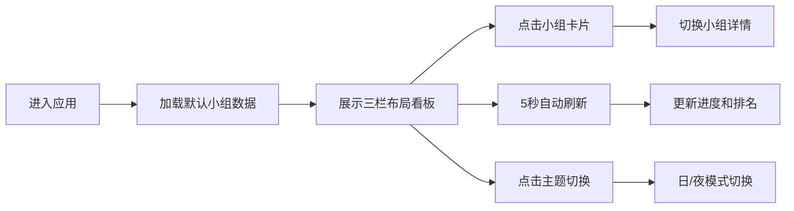

## 1. 产品概述

StudyHive 是一款在线学习小组协作与进度追踪应用，帮助学习者创建或加入学习小组，设定共同学习目标，通过每日打卡记录学习时长，并以可视化看板展示小组整体进度和个人排名，激发学习动力和社群归属感。

- **核心价值**：通过可视化数据和小组排名机制，提升学习者的自律性和参与感
- **目标用户**：学生、备考人群、自学爱好者、企业培训小组

## 2. 核心功能

### 2.1 用户角色
| 角色 | 注册方式 | 核心权限 |
|------|----------|----------|
| 学习者 | 模拟数据内置 | 查看小组、打卡记录、个人排名、进度可视化 |

### 2.2 功能模块
1. **小组列表**：展示所有学习小组卡片，支持切换查看不同小组详情
2. **主看板**：环形进度图展示小组总体进度，线性冲刺图展示成员学习时长对比
3. **个人动态**：前三名排行榜、最新打卡消息滚动展示
4. **主题切换**：支持日/夜模式切换，全局主题跟随变化
5. **实时数据更新**：每5秒刷新模拟数据，动态更新进度和排名

### 2.3 页面详情
| 页面名称 | 模块名称 | 功能描述 |
|----------|----------|----------|
| 主看板页 | 顶部导航栏 | 应用名称、主题切换按钮 |
| 主看板页 | 左栏小组列表 | 小组卡片展示、点击切换小组 |
| 主看板页 | 中央主看板 | 环形进度图、成员线性冲刺图 |
| 主看板页 | 右栏个人动态 | 前三名头像展示、打卡消息流 |

## 3. 核心流程

用户进入应用 → 默认展示第一个小组的看板数据 → 点击左栏小组卡片切换查看不同小组 → 每5秒自动刷新数据 → 可点击右上角切换日/夜主题 → 查看环形进度和冲刺条了解小组整体情况 → 查看右栏排名和动态了解成员表现

## 4. 用户界面设计

### 4.1 设计风格
- **主色调**：蓝色 `#3b82f6` 到紫色 `#8b5cf6` 渐变色
- **深色主题**：主体背景 `#0b1120`，卡片背景 `#1e293b`，导航栏 `#0f172a`
- **浅色主题**：主体背景 `#f8fafc`，卡片背景 `#ffffff`，导航栏 `#e2e8f0`
- **卡片风格**：圆角 12px，柔和阴影 `0 4px 12px rgba(0,0,0,0.2)`
- **字体**：现代无衬线字体，清晰层级
- **交互反馈**：所有可交互元素 hover 和 click 有 0.2-0.3s 过渡动画

### 4.2 页面设计概述
| 页面名称 | 模块名称 | UI元素 |
|----------|----------|--------|
| 主看板页 | 顶部导航栏 | 左侧应用名（粗体20px）、右侧主题切换按钮（太阳/月亮图标） |
| 主看板页 | 左栏小组列表 | 宽280px，深色背景，卡片高80px圆角12px，hover上移2px |
| 主看板页 | 中央主看板 | 环形进度图（直径200px，渐变进度条）、线性冲刺图（横条渐变） |
| 主看板页 | 右栏个人动态 | 宽300px，前三名头像（金/银/铜边框）、打卡消息滚动列表 |

### 4.3 响应式设计
- **桌面端**：三栏并排布局（左280px + 中间自适应 + 右300px）
- **平板端（<768px）**：左栏折叠为顶部下拉菜单，右栏置于底部
- **移动端**：纵向单列布局，小组选择使用下拉组件
- **触摸优化**：卡片和按钮增大点击区域，支持触摸滑动

### 4.4 动效设计
- 环形进度图：0.6s ease-out 过渡动画
- 卡片 hover：上移2px，背景色变化，0.2s ease
- 主题切换：0.3s ease 全局过渡
- 数据刷新：进度条平滑过渡，排名变化有微妙动画
