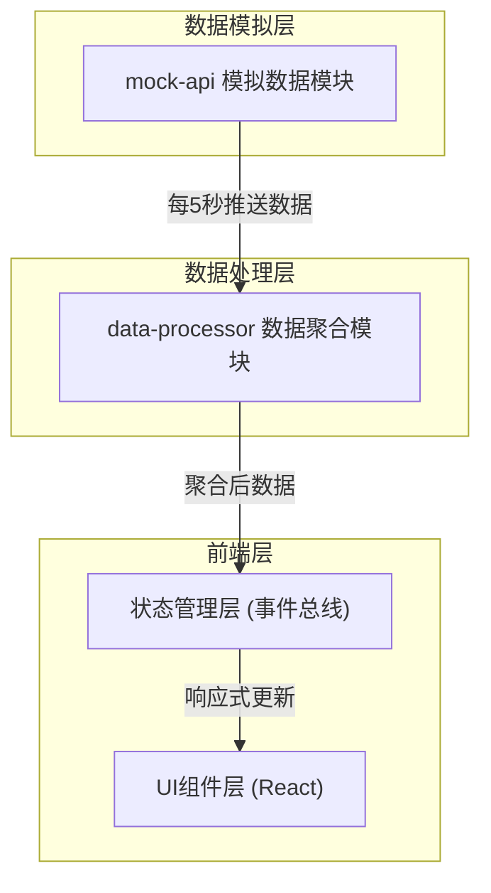

## 1. 架构设计



## 2. 技术描述

- **前端框架**：React 18 + TypeScript
- **构建工具**：Vite 5 + @vitejs/plugin-react
- **样式方案**：原生 CSS + CSS 变量（主题切换）
- **状态管理**：事件总线模式（Event Bus）+ React Hooks
- **数据模拟**：内置 mock-api 模块，每5秒生成随机打卡数据

## 3. 文件结构

```
├── package.json              # 项目依赖和脚本
├── index.html                # 入口HTML
├── tsconfig.json             # TypeScript配置（strict模式）
├── vite.config.js            # Vite配置
└── src/
    ├── main.tsx              # React入口
    ├── mock-api.ts           # 模拟API：小组数据、成员数据、打卡数据
    ├── data-processor.ts     # 数据聚合：平均时长、排名、完成率、图表数据
    └── dashboard.tsx         # 主界面组件：三栏布局、环形图、冲刺条
```

## 4. 模块接口定义

### 4.1 数据类型定义

```typescript
// 成员信息
interface Member {
  id: string;
  name: string;
  avatarUrl: string;
  streakDays: number;      // 连续打卡天数
  weeklyHours: number;     // 本周累计学习时长（分钟）
}

// 学习小组
interface StudyGroup {
  id: string;
  name: string;
  description: string;
  members: Member[];
  weeklyTargetMinutes: number; // 小组周目标总时长
}

// 打卡记录
interface CheckInRecord {
  memberId: string;
  memberName: string;
  duration: number;        // 学习时长（分钟）
  timestamp: number;
}

// 聚合后的数据
interface AggregatedData {
  groupId: string;
  groupName: string;
  avgWeeklyHours: number;  // 小组平均学习时长
  completionRate: number;  // 目标完成率
  membersRanked: RankedMember[];
  checkInMessages: CheckInRecord[];
}

// 排名成员
interface RankedMember extends Member {
  rank: number;
  rankChange: number;      // 排名变化（正数上升，负数下降）
}
```

### 4.2 mock-api 接口

- `getGroups(): StudyGroup[]` - 获取所有小组数据
- `subscribeToUpdates(callback: (records: CheckInRecord[]) => void): () => void` - 订阅实时打卡数据更新，返回取消订阅函数

### 4.3 data-processor 接口

- `processGroupData(group: StudyGroup, checkInRecords: CheckInRecord[]): AggregatedData` - 处理单个小组数据，返回聚合结果
- `updateMemberStats(group: StudyGroup, record: CheckInRecord): void` - 根据打卡记录更新成员数据

## 5. 性能优化策略

### 5.1 DOM 渲染优化
- 使用 React.memo 包裹子组件，避免不必要的重渲染
- 使用 useMemo 缓存计算结果（排名、图表数据）
- 使用 useCallback 缓存事件处理函数
- 列表使用稳定的 key 值（成员ID）

### 5.2 数据更新策略
- 每5秒数据刷新时，仅更新受影响的成员数据
- 环形图和冲刺条使用 CSS transition 实现平滑过渡
- 打卡消息使用虚拟滚动（如有大量数据）

### 5.3 首次加载优化
- 组件按需拆分，首屏只渲染必要内容
- 模拟数据同步生成，无异步等待
- 避免大型第三方依赖库

## 6. 主题系统

使用 CSS 变量实现日/夜主题切换：

```css
:root {
  --bg-primary: #0b1120;
  --bg-secondary: #1e293b;
  --bg-tertiary: #0f172a;
  --text-primary: #f8fafc;
  --text-secondary: #94a3b8;
  --accent-blue: #3b82f6;
  --accent-purple: #8b5cf6;
}

[data-theme="light"] {
  --bg-primary: #f8fafc;
  --bg-secondary: #ffffff;
  --bg-tertiary: #e2e8f0;
  --text-primary: #0f172a;
  --text-secondary: #64748b;
}
```

## 7. 响应式断点

- **桌面端**：≥ 1024px，三栏完整布局
- **平板端**：768px - 1023px，左栏收起，右栏保留
- **移动端**：< 768px，单列布局，小组选择下拉，右栏在底部
