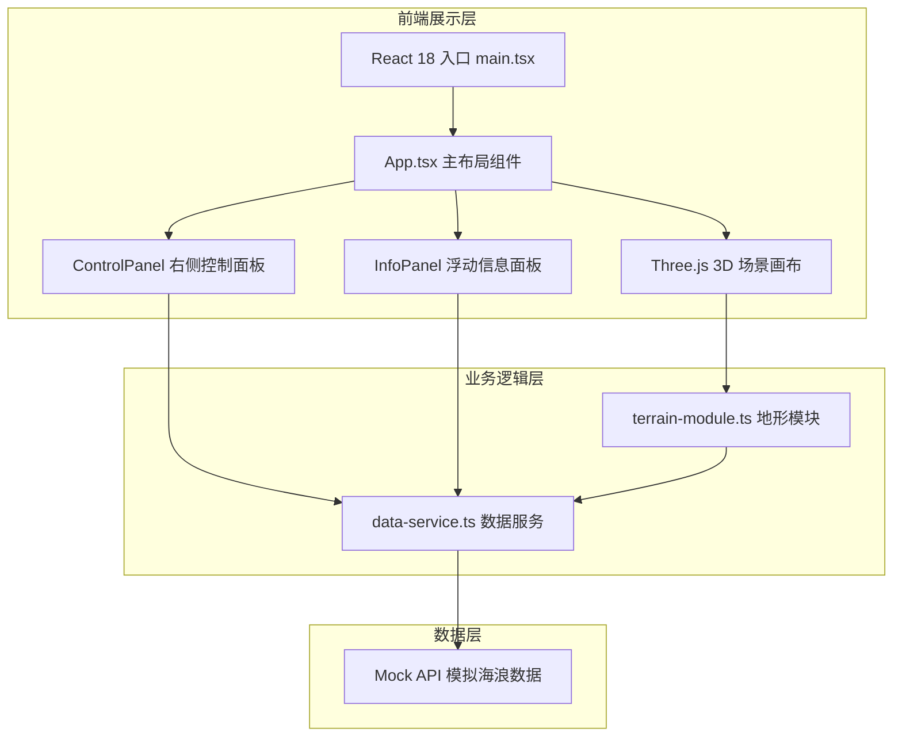

## 1. 架构设计



## 2. 技术描述

- **前端框架**：React 18 + TypeScript（严格模式，target ES2020）
- **构建工具**：Vite + @vitejs/plugin-react
- **3D 渲染引擎**：Three.js（原生 three，非 @react-three/fiber）
  - OrbitControls：相机拖拽旋转与缩放控制
  - PlaneGeometry：40×40 格点地形（顶点数 41×41 = 1681，≤2500）
  - MeshStandardMaterial + 程序化法线贴图（256×256）模拟海水流动
  - SphereGeometry：30 个站点小球（半径 0.15）
- **数据服务**：纯前端 Mock API，setInterval 每 10 秒轮询触发更新回调
- **样式方案**：内联 CSS + CSS 动画，无 Tailwind（按用户要求精简依赖）
- **状态管理**：React useState/useEffect，无需额外状态库

## 3. 路由定义

| 路由 | 用途 |
|-------|---------|
| / | WaveAtlas 主页面（全屏 3D 场景 + 控制面板） |

## 4. API 定义（Mock）

### 4.1 数据类型

```typescript
interface WaveDataPoint {
  lat: number;
  lon: number;
  height: number;
}

interface StationData {
  id: string;
  name: string;
  lat: number;
  lon: number;
  waveHeight: number;
  tideTime: string;
  tideType: "高潮" | "低潮";
  windDirection: string;
  windLevel: number;
}

interface WaveForecastResponse {
  grid: WaveDataPoint[];
  stations: StationData[];
  timestamp: string;
}
```

### 4.2 接口方法

| 方法名 | 参数 | 返回值 | 说明 |
|--------|------|--------|------|
| `getWaveForecast(lat, lon, datetime?)` | `lat: number, lon: number, datetime?: string` | `Promise<WaveForecastResponse>` | 获取指定经纬度附近的海浪网格与站点数据 |
| `subscribeWaveUpdates(callback)` | `callback: (data: WaveForecastResponse) => void` | `() => void` | 订阅每 10 秒自动更新，返回取消订阅函数 |

## 5. 项目文件结构

```
d:\VersionFastPro\tasks\auto174\
├── index.html                  # Vite 入口 HTML
├── package.json                # 依赖与脚本
├── vite.config.js              # Vite 配置
├── tsconfig.json               # TypeScript 严格模式配置
└── src/
    ├── main.tsx                # React 入口，挂载 App
    ├── App.tsx                 # 主组件，3D 画布 + 面板布局
    └── modules/
        ├── terrain-module.ts   # Three.js 地形/场景/站点管理
        ├── data-service.ts     # Mock API + 轮询数据服务
        ├── ui-panel.tsx        # 站点信息浮动面板组件
        └── control-panel.tsx   # 右侧日期/时间/刷新控制面板
```

## 6. 关键技术约束

- **地形顶点数**：40×40 格点 = 1681 顶点（PlaneGeometry(segment=40)），严格 ≤2500
- **法线贴图分辨率**：256×256，程序化生成 + UV 动画模拟流动
- **目标帧率**：≥30 FPS，通过限制几何体数量、避免每帧重建 Mesh 保证
- **地形高度范围**：-5 ~ 5，颜色插值 `#0f172a` → `#2dd4bf` → `#f8fafc`
- **面板尺寸**：信息面板与控制面板均宽 280px
- **动画时长**：信息面板弹入 0.2s ease-out，数据刷新过渡 0.3s 淡入淡出
