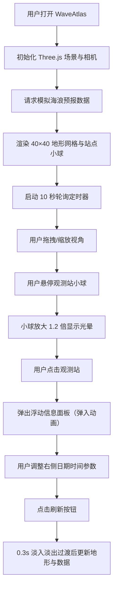

## 1. 产品概述

WaveAtlas 是一款基于 WebGL 3D 地形图的全球海浪与潮汐数据可视化工具，通过交互式三维地形展示替代传统二维海图，为海洋气象研究者、航海从业者和海洋爱好者提供更立体直观的数据浏览体验。

- 核心价值：将抽象的海浪高度与潮汐数据转化为可交互的三维视觉形态，降低认知门槛
- 目标用户：海洋气象研究员、航海导航员、冲浪爱好者、科普教育工作者

## 2. 核心功能

### 2.1 功能模块

1. **3D 地形可视化模块**：40×40 格点海浪地形网格，支持鼠标拖拽旋转视角与缩放
2. **气象站点模块**：30 个全球分布的观测站标记点，支持悬停高亮与点击交互
3. **信息面板模块**：点击站点弹出浮动面板，展示海浪高度、潮汐时间、风向等实时数据
4. **控制面板模块**：日期时间选择器与刷新按钮，支持参数调整与数据重载

### 2.2 页面详情

| 页面名称 | 模块名称 | 功能描述 |
|-----------|-------------|---------------------|
| 主页面 | 3D 地形场景 | 渲染 40×40 海浪网格、半透明法线贴图流动效果、极坐标辅助线 |
| 主页面 | 观测站标记 | 30 个发光小球，悬停放大 1.2 倍并显示光晕 |
| 主页面 | 浮动信息面板 | 280px 宽半透明面板，弹入动画，展示站点详细数据 |
| 主页面 | 右侧控制面板 | 日期选择、时间选择、刷新按钮，0.3s 淡入淡出过渡 |

## 3. 核心流程

用户进入页面 → 自动加载模拟海浪数据并渲染 3D 地形 → 每 10 秒自动刷新数据更新地形与站点 → 用户拖拽旋转/缩放视角 → 悬停站点触发高亮 → 点击站点弹出信息面板 → 通过右侧控制面板调整日期时间 → 点击刷新重新请求数据并带过渡动画更新

## 4. 用户界面设计

### 4.1 设计风格

- **主色调**：深海蓝 `#020617`（背景）、暗蓝 `#0f172a`（低海拔）、青绿 `#2dd4bf`（中海拔）、纯白 `#f8fafc`（高海拔）
- **强调色**：琥珀橙 `#f59e0b`（站点标记）、石板灰 `#1e293b`（面板背景）、辅助线灰 `#334155`
- **字体**：无衬线白色字体，暗色海洋主题
- **按钮风格**：圆角 12px，半透明背景，悬停微亮
- **动效**：信息面板 translateY 20px → 0（0.2s ease-out），数据切换 0.3s 淡入淡出

### 4.2 页面设计概要

| 页面名称 | 模块名称 | UI 元素 |
|-----------|-------------|-------------|
| 主页面 | 3D 场景 | 全屏 WebGL 画布，45° 俯角相机，OrbitControls 交互 |
| 主页面 | 地形网格 | 40×40 顶点（≤1681 顶点），深蓝→青绿→白渐变色，半透明法线流动 |
| 主页面 | 极坐标辅助线 | 半透明 `#334155` 环形网格线，线宽 1px |
| 主页面 | 站点小球 | 半径 0.15，`#f59e0b` 橙色，0.5px 外发光，悬停 1.2 倍缩放+白色光晕 |
| 主页面 | 浮动信息面板 | 宽 280px，背景 `#1e293b/80`，圆角 12px，阴影 `0 4px 16px rgba(0,0,0,0.4)` |
| 主页面 | 右侧控制面板 | 宽 280px，背景 `#0f172a`，圆角 12px 0 0 12px，padding 20px，fixed 定位右侧 |

### 4.3 响应式

桌面端优先设计，全屏 3D 画布为主视觉，右侧固定控制面板；窗口缩放时画布自适应，控制面板保持固定宽度。

### 4.4 3D 场景指引

- **环境氛围**：深海暗色背景 `#020617`，无额外 HDRI，营造深海神秘氛围
- **光照设置**：环境光 + 方向光，突出地形起伏与站点发光效果
- **相机设置**：默认俯角 45°，OrbitControls 支持拖拽旋转、滚轮缩放、阻尼平滑
- **构图焦点**：地形网格居中，站点小球散布于网格上方，视觉层次清晰
- **交互动效**：站点悬停缩放+光晕、信息面板弹入、数据刷新淡入淡出
- **后期效果**：无复杂后期，依赖材质自发光与法线贴图模拟海水流动
- **性能预算**：地形顶点 ≤1681（41×41），法线贴图 256×256，目标 FPS ≥30
