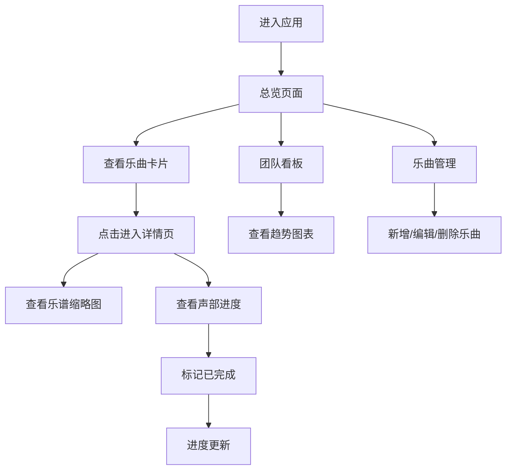

## 1. 产品概述

PartTracker 是一款面向音乐教育工作者的在线分声部练习管理工具，解决纸质乐谱分发后各声部成员练习进度无法统一追踪、合练时难以快速定位薄弱声部的问题。

- 核心用户：乐队指挥、合唱团指导教师、音乐教师
- 核心价值：数字化管理多声部练习进度，提升合练效率，精准定位薄弱环节

## 2. 核心功能

### 2.1 用户角色
| 角色 | 注册方式 | 核心权限 |
|------|----------|----------|
| 音乐教师 | 无需注册（前端演示） | 创建/编辑/删除乐曲、管理声部、追踪练习进度、查看趋势图表 |

### 2.2 功能模块
1. **总览页面**：乐曲总数、活跃声部数、平均完成度等统计信息
2. **乐曲管理**：乐曲的增删改查，声部配置，乐谱上传
3. **乐曲详情**：乐谱缩略图预览，声部进度表格，标记已完成
4. **团队看板**：近7天各声部完成进度折线图趋势展示

### 2.3 页面详情
| 页面名称 | 模块名称 | 功能描述 |
|----------|----------|----------|
| 总览页 | 统计卡片 | 展示乐曲总数、活跃声部数、平均完成度、本周目标完成率 |
| 总览页 | 乐曲卡片网格 | 以卡片形式展示所有乐曲，点击进入详情页 |
| 乐曲管理页 | 乐曲列表 | 表格形式展示所有乐曲，支持编辑和删除操作 |
| 乐曲管理页 | 新增/编辑弹窗 | 表单录入乐曲信息和声部配置 |
| 乐曲详情页 | 乐谱缩略图列表 | 左侧展示PDF乐谱缩略图，支持悬停高亮 |
| 乐曲详情页 | 声部进度表格 | 右侧展示各声部练习目标、进度条、标记完成按钮 |
| 团队看板页 | 折线图 | 展示近7天各声部完成进度变化趋势，支持交互tooltip |

## 3. 核心流程

用户登录应用 → 首页查看乐曲总览 → 点击乐曲卡片进入详情 → 查看各声部进度 → 标记声部练习完成 → 通过团队看板查看整体趋势 → 在乐曲管理页维护乐曲信息

## 4. 用户界面设计

### 4.1 设计风格
- **主色调**：深色主题，主背景 #0f172a，卡片背景 #1e293b
- **文字颜色**：白色 #f8fafc，次要文本 #94a3b8
- **强调色**：青绿 #2dd4bf（导航悬停）、蓝 #3b82f6（中级难度、女高音）、绿 #22c55e（初级难度）、红 #ef4444（高级难度、贝斯）
- **按钮风格**：圆角8-12px，悬停上移2px + 亮度增高，0.3秒ease-out过渡
- **字体**：现代无衬线字体，标题加粗，正文清晰易读
- **布局**：顶部固定导航栏 + 卡片式内容区
- **图标风格**：简约线性图标

### 4.2 页面设计概述
| 页面名称 | 模块名称 | UI元素 |
|----------|----------|--------|
| 总览页 | 统计卡片 | 深色卡片、渐变进度条、数字大字展示 |
| 总览页 | 乐曲卡片网格 | 三列网格、卡片悬停上移、难度徽章 |
| 乐曲管理页 | 列表 | 行悬停高亮、图标操作按钮 |
| 乐曲管理页 | 弹窗表单 | 模态框、动态声部列表、文件上传 |
| 乐曲详情页 | 缩略图列表 | 边框悬停变蓝、圆角设计 |
| 乐曲详情页 | 进度表格 | 渐变色进度条、步进按钮 |
| 团队看板页 | 折线图 | 多色线条、交互数据点、tooltip |

### 4.3 响应式
- 桌面端优先设计，适配移动端
- <768px：导航项折叠为汉堡菜单，卡片网格三列→两列→单列
- 表格在小屏上横向滚动
- 触控优化：增大点击区域

### 4.4 动效设计
- 所有交互动效平滑过渡（0.2-0.3秒）
- 卡片/按钮悬停：translateY(-2px) + 亮度增高
- 导航悬停：下划线从中间展开
- 折线图数据点：悬停显示白色圆点标记
- 页面切换：平滑过渡
