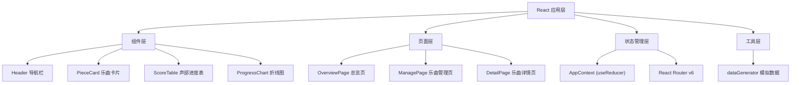

## 1. 架构设计



## 2. 技术描述

- **前端框架**：React 18 + TypeScript
- **构建工具**：Vite 5
- **路由管理**：React Router v6
- **状态管理**：useReducer + Context API
- **图表库**：Chart.js + react-chartjs-2
- **样式方案**：原生 CSS（CSS变量 + 模块化）
- **图标库**：lucide-react
- **数据来源**：前端模拟数据（纯函数生成）

## 3. 路由定义

| 路由路径 | 页面组件 | 用途 |
|----------|----------|------|
| `/` | OverviewPage | 总览页面，展示统计信息和乐曲卡片 |
| `/manage` | ManagePage | 乐曲管理页面，增删改乐曲 |
| `/piece/:id` | DetailPage | 乐曲详情页面，乐谱预览和进度追踪 |
| `/dashboard` | DashboardPage | 团队看板，折线图展示趋势 |

## 4. 数据模型

### 4.1 类型定义

```typescript
// 难度等级
type Difficulty = 'beginner' | 'intermediate' | 'advanced';

// 声部信息
interface VoicePart {
  id: string;
  name: string;
  difficulty: Difficulty;
  pdfUrl?: string;
  progress: number; // 0-100
  targetRange: string; // 练习目标，如 "1-16小节"
  color: string; // 图表线条颜色
}

// 乐曲信息
interface Piece {
  id: string;
  title: string;
  composer: string;
  key: string; // 调式
  voiceParts: VoicePart[];
  createdAt: string;
  updatedAt: string;
}

// 每日进度数据
interface DailyProgress {
  date: string;
  voicePartId: string;
  progress: number;
}

// 全局状态
interface AppState {
  pieces: Piece[];
  historyData: DailyProgress[];
}
```

### 4.2 状态管理 Actions

- `ADD_PIECE`: 新增乐曲
- `UPDATE_PIECE`: 更新乐曲信息
- `DELETE_PIECE`: 删除乐曲
- `UPDATE_VOICE_PROGRESS`: 更新声部进度（步进10%）
- `UPDATE_TARGET_RANGE`: 更新练习目标
- `LOAD_INITIAL_DATA`: 加载初始数据

## 5. 文件结构

```
src/
├── main.tsx              # 应用入口
├── App.tsx               # 根组件，路由配置
├── index.css             # 全局样式
├── components/           # 可复用组件
│   ├── Header.tsx        # 导航栏
│   ├── PieceCard.tsx     # 乐曲卡片
│   ├── ScoreTable.tsx    # 声部进度表格
│   └── ProgressChart.tsx # 折线图组件
├── pages/                # 页面组件
│   ├── OverviewPage.tsx  # 总览页
│   ├── ManagePage.tsx    # 乐曲管理页
│   ├── DetailPage.tsx    # 乐曲详情页
│   └── DashboardPage.tsx # 团队看板页
├── context/              # 状态管理
│   └── AppContext.tsx    # Context + Reducer
├── utils/                # 工具函数
│   └── dataGenerator.ts  # 模拟数据生成器
└── types/                # 类型定义（可内联）
    └── index.ts
```

## 6. 性能优化方案

### 6.1 渲染性能
- 使用 React.memo 优化列表项组件
- 分页/虚拟滚动处理长列表
- useCallback/useMemo 避免不必要重渲染

### 6.2 加载性能
- 路由级代码分割（React.lazy）
- PDF缩略图懒加载
- 首屏关键CSS内联

### 6.3 动画性能
- 使用 transform/opacity 实现动画，触发GPU加速
- 避免频繁重排重绘
- 60fps 滚动优化

## 7. 开发脚本

| 命令 | 用途 |
|------|------|
| `npm run dev` | 启动开发服务器 |
| `npm run build` | 构建生产版本 |
| `npm run preview` | 预览生产构建 |
