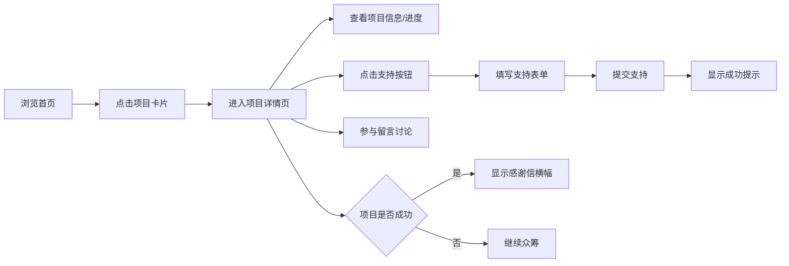

## 1. 产品概述

CrowdSpark是一个在线活动众筹与社区互动平台，让发起人可以创建众筹项目并设定阶梯目标，支持者可以支付（模拟）支持、实时留言讨论，项目达成后自动生成感谢信和成员排行榜。

- 主要用途：为创意项目提供众筹平台，连接发起人与支持者
- 目标用户：项目发起人、项目支持者
- 核心价值：降低众筹门槛，提供社区互动，增强众筹成功后的仪式感

## 2. 核心功能

### 2.1 用户角色

| 角色 | 注册方式 | 核心权限 |
|------|----------|----------|
| 项目发起人 | 无需注册，创建项目时填写信息 | 创建众筹项目、查看项目详情 |
| 支持者 | 无需注册，支持时填写昵称 | 浏览项目、支付支持、留言讨论 |
| 访客 | 无需注册 | 浏览项目、查看留言 |

### 2.2 功能模块

1. **首页**：项目卡片网格展示、虚拟滚动、进度条展示
2. **项目详情页**：项目信息展示、动态进度条、支持按钮模态框、留言板、感谢信横幅
3. **发起项目页**：创建项目表单、图片上传预览、表单验证

### 2.3 页面详情

| 页面名称 | 模块名称 | 功能描述 |
|-----------|-------------|---------------------|
| 首页 | 项目卡片网格 | 3列响应式布局，每张卡片显示缩略图、标题、进度条、已筹金额与目标 |
| 首页 | 虚拟滚动 | 最多渲染20张卡片，滚动时动态加载 |
| 项目详情页 | 信息展示区 | 封面大图、标题、描述、剩余天数 |
| 项目详情页 | 动态进度条 | 高24px，圆角12px，显示已筹金额/目标金额+🔥emoji |
| 项目详情页 | 支持模态框 | 昵称输入、金额滑块、留言文本区，提交后toast提示 |
| 项目详情页 | 留言板 | 加载最近20条，滚动加载更多，新留言滑入动画 |
| 项目详情页 | 感谢信横幅 | 众筹成功后显示，可关闭 |
| 发起项目页 | 创建表单 | 标题、描述、目标金额、封面上传，表单验证 |

## 3. 核心流程

用户浏览首页查看所有众筹项目 → 点击感兴趣的项目进入详情页 → 查看项目信息和进度 → 点击支持按钮填写信息并提交支持 → 可以在留言板参与讨论 → 项目成功后查看感谢信和排行榜

## 4. 用户界面设计

### 4.1 设计风格

- 主色调：蓝灰色系（#1e293b、#3b82f6、#f8fafc）
- 进度条颜色：从#ef4444渐变到#22c55e
- 按钮样式：圆角8px，高度40px，主按钮背景#3b82f6，悬停#2563eb，点击#1d4ed8
- 字体：系统默认字体
- 布局风格：卡片式布局，顶部导航栏
- 图标/emoji：使用🔥🎉等emoji增强视觉效果

### 4.2 页面设计概述

| 页面名称 | 模块名称 | UI元素 |
|-----------|-------------|-------------|
| 首页 | 导航栏 | 高64px，背景#1e293b，白色文字，Logo+用户头像 |
| 首页 | 项目卡片 | 宽280px，悬停放大1.03倍+阴影，过渡0.25秒ease-out |
| 项目详情页 | 封面大图 | 宽100%，高360px，object-fit: cover |
| 项目详情页 | 支持按钮 | 点击后粒子爆炸效果持续1秒 |
| 项目详情页 | 模态框 | 背景半透明黑色#00000080，圆角16px，宽400px |
| 项目详情页 | 留言项 | 头像40x40圆形，新留言0.5秒从底部向上滑入 |
| 发起项目页 | 表单 | 字符计数、图片上传预览（128x128圆形裁剪） |

### 4.3 响应式

- 桌面端优先设计
- 首页卡片3列布局，宽度280px
- 移动端自适应调整列数
- 滚动条样式统一：宽6px，轨道#f1f5f9，滑块#94a3b8，圆角3px

### 4.4 动画效果

- 路由切换：0.3秒fade过渡
- 卡片悬停：放大1.03倍+阴影，0.25秒ease-out
- 支持按钮点击：粒子爆炸效果持续1秒
- 新留言：0.5秒从底部向上滑入
- Toast提示：0.3秒淡入，2秒后淡出
