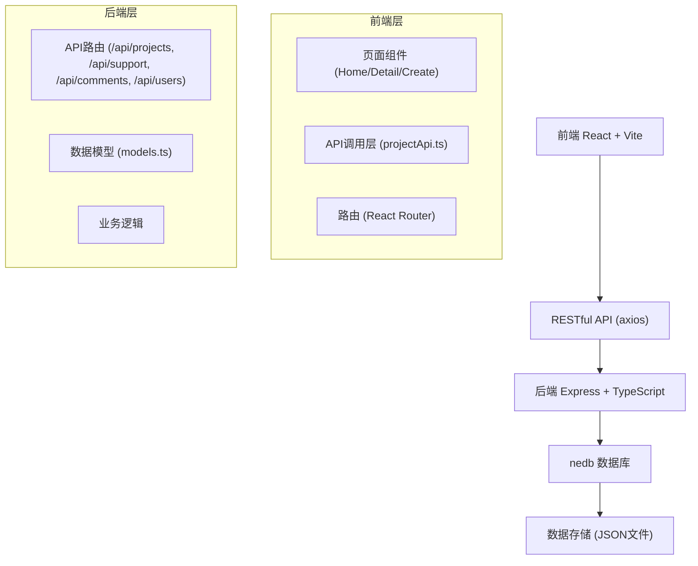
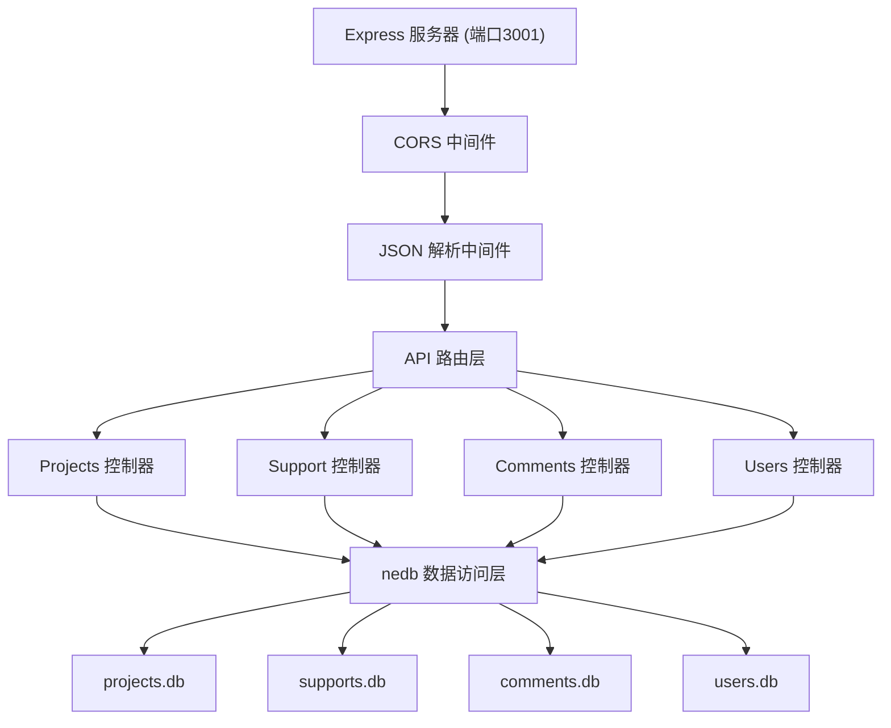
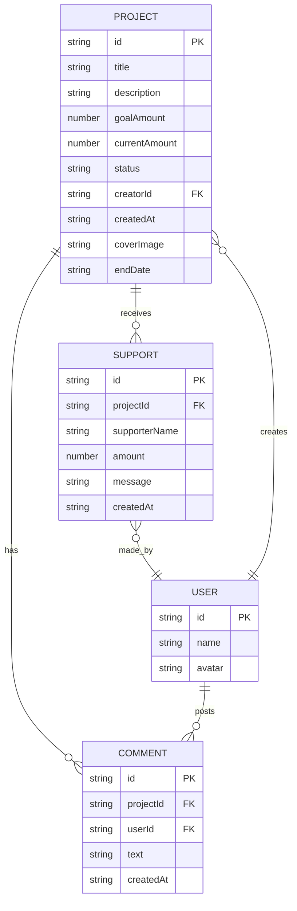

## 1. 架构设计



## 2. 技术描述

- 前端：React@18 + TypeScript + Vite + React Router
- HTTP客户端：axios
- 后端：Express@4 + TypeScript
- 数据库：nedb-promises（嵌入式NoSQL数据库）
- 工具库：uuid（生成唯一ID）
- 构建工具：Vite
- 代码规范：TypeScript严格模式

## 3. 路由定义

| 前端路由 | 页面组件 | 功能描述 |
|----------|----------|----------|
| / | HomePage | 首页，展示所有众筹项目 |
| /project/:id | ProjectDetailPage | 项目详情页 |
| /create | CreateProjectPage | 发起新项目 |

| 后端API路由 | 方法 | 功能描述 |
|-------------|------|----------|
| /api/projects | GET | 获取所有项目列表 |
| /api/projects | POST | 创建新项目 |
| /api/projects/:id | GET | 获取单个项目详情 |
| /api/projects/:id/thankyou | GET | 获取项目感谢信 |
| /api/support | POST | 提交支持记录 |
| /api/comments | GET | 获取留言列表（分页） |
| /api/comments | POST | 发布新留言 |
| /api/users | GET | 获取用户列表 |
| /api/users | POST | 创建/获取用户 |

## 4. API 类型定义

```typescript
// Project 项目
interface Project {
  id: string;
  title: string;
  description: string;
  goalAmount: number;
  currentAmount: number;
  status: 'ongoing' | 'completed';
  creatorId: string;
  createdAt: string;
  coverImage?: string;
  endDate?: string;
}

// Support 支持记录
interface Support {
  id: string;
  projectId: string;
  supporterName: string;
  amount: number;
  message: string;
  createdAt: string;
}

// Comment 留言
interface Comment {
  id: string;
  projectId: string;
  userId: string;
  text: string;
  createdAt: string;
}

// User 用户
interface User {
  id: string;
  name: string;
  avatar: string;
}

// ThankYouLetter 感谢信
interface ThankYouLetter {
  projectId: string;
  projectTitle: string;
  totalAmount: number;
  supporterCount: number;
  supporters: Array<{
    name: string;
    amount: number;
    message: string;
  }>;
  ranking: Array<{
    name: string;
    amount: number;
    rank: number;
  }>;
  generatedAt: string;
}
```

## 5. 服务器架构



## 6. 数据模型

### 6.1 实体关系图



### 6.2 数据库初始化

项目启动时自动创建数据库文件并插入示例数据：
- 3-5个示例众筹项目
- 若干支持记录和留言
- 几个示例用户

所有数据库文件存储在 `server/data/` 目录下。
