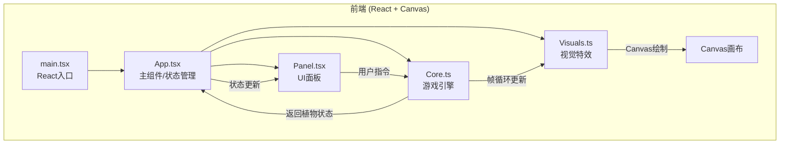

## 1. 架构设计



**数据流向：**
1. Panel.tsx 接收用户交互（浇水/光线/音效）→ 调用 Core.update() 传入指令
2. Core.ts 帧循环更新植物物理属性 → 调用 Visuals.ts 绘制
3. Core.ts 实时返回状态给 App.tsx → App.tsx 更新 React 状态 → Panel.tsx 重新渲染

## 2. 技术说明

- 前端：React@18 + TypeScript + Canvas API + Vite
- 初始化工具：vite-init（react-ts模板）
- 后端：无（纯客户端运行）
- 数据库：无（状态存储于内存/React状态）

### 核心依赖

| 依赖 | 版本 | 用途 |
|------|------|------|
| react | ^18.x | UI框架 |
| react-dom | ^18.x | DOM渲染 |
| vite | ^5.x | 构建工具 |
| @vitejs/plugin-react | ^4.x | Vite React插件 |
| typescript | ^5.x | 类型安全 |
| @types/react | ^18.x | React类型定义 |
| @types/react-dom | ^18.x | ReactDOM类型定义 |

## 3. 路由定义

| 路由 | 用途 |
|------|------|
| / | 主游戏页面（单页应用，无额外路由） |

## 4. API定义

无后端API，所有逻辑客户端运行。

### 游戏引擎接口定义

```typescript
interface PlantState {
  stage: 'seed' | 'sprout' | 'stem' | 'bud' | 'bloom';
  growthPercent: number;
  waterLevel: number;
  lightLevel: number;
  stemHeight: number;
  leafCount: number;
  bloomProgress: number;
  saturation: number;
  mood: number;
}

interface GameCommand {
  type: 'water' | 'light' | 'sound' | 'meditate';
  value?: number | string;
}
```

## 5. 服务器架构图

不适用（无后端服务）

## 6. 数据模型

不适用（无数据库，状态存储于内存）

### 文件结构与调用关系

```
ZenGarden/
├── index.html                    # 入口页面，div#app
├── package.json                  # 依赖与脚本
├── vite.config.ts                # Vite构建配置
├── tsconfig.json                 # TypeScript配置
└── src/
    ├── main.tsx                  # React入口 → 渲染App
    ├── App.tsx                   # 主组件 → 管理状态、布局、初始化Canvas循环
    │                             #   调用: Core.ts, Panel.tsx
    ├── game/
    │   └── Core.ts               # 游戏引擎 → Canvas上下文、帧循环、植物更新
    │                             #   接收: Panel指令  调用: Visuals.ts
    └── art/
        └── Visuals.ts            # 视觉特效 → 粒子系统、背景渐变、生长动画
                                  #   被调用: Core.ts
```

**关键数据流：**
- `Panel.tsx` → 用户点击 → `Core.update(command)` → 更新植物状态
- `Core.ts` → 每帧 → `Visuals.render(plantState, particles)` → Canvas绘制
- `Core.ts` → 状态变更回调 → `App.tsx` setState → `Panel.tsx` 重渲染
