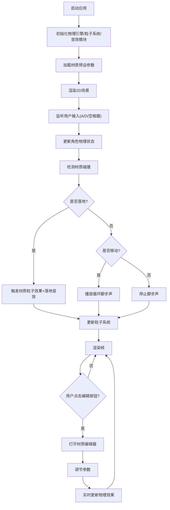

## 1. 产品概述

SurfaceSim 是一款面向游戏开发者的2D平台游戏材质交互效果预览工具，帮助开发者在设计音效和视觉反馈时快速预览和微调各种材质交互效果。

- 主要用途：模拟角色在不同材质表面奔跑和跳跃时产生的脚步声和粒子效果
- 目标用户：2D游戏开发者、音效设计师、视觉特效设计师
- 产品价值：减少材质交互效果的调试周期，提升游戏开发效率

## 2. 核心功能

### 2.1 功能模块

1. **交互式2D场景**：可操控角色在五种材质地面上移动跳跃，实时体验交互反馈
2. **粒子系统**：五种材质各有独特的粒子发射效果，参数可配置
3. **音效系统**：基于Web Audio API的合成音效，脚步声与落地重击音
4. **材质属性编辑器**：实时调节摩擦系数和弹性系数
5. **性能监控面板**：实时显示FPS和粒子数量
6. **预设持久化**：保存和加载自定义材质配置

### 2.2 页面详情

| 页面名称 | 模块名称 | 功能描述 |
|---------|---------|---------|
| 主场景页面 | 2D游戏画布 | 角色控制、材质地面渲染、粒子效果、阴影渲染 |
| 主场景页面 | 性能面板 | 左下角显示FPS和粒子总数，颜色动态变化 |
| 主场景页面 | 材质编辑按钮 | 每块地面右上角悬浮圆形按钮，点击弹出编辑器 |
| 主场景页面 | 全局设置面板 | 右侧固定面板，重置参数和暂停/继续功能 |
| 材质编辑面板 | 摩擦系数滑块 | 0.0-1.0范围调节，步长0.05 |
| 材质编辑面板 | 弹性系数滑块 | 0.0-1.0范围调节，步长0.05 |

## 3. 核心流程

## 4. 用户界面设计

### 4.1 设计风格

- **主色调**：深蓝渐变背景（#0f172a 到 #1e293b），营造专业游戏开发工具氛围
- **强调色**：角色头部绿色#22c55e，身体蓝色#3b82f6，滑块紫色#8b5cf6，按钮红色#ef4444
- **按钮样式**：圆角8px，0.2秒ease-out过渡动画
- **字体**：14px白色文字，材质标签半透明背景#00000060
- **布局风格**：画布居中，右侧固定面板，悬浮编辑按钮
- **动效**：所有交互元素带0.2秒ease-out过渡

### 4.2 页面设计概览

| 页面名称 | 模块名称 | UI元素 |
|---------|---------|--------|
| 主场景 | 游戏画布 | 1200x600px居中，五种材质地面各200px宽，角色40x60px方块 |
| 主场景 | 材质标签 | 每块地面左上角半透明黑底白字标签，圆角4px |
| 主场景 | 编辑按钮 | 每块地面右上角32px圆形半透明白色按钮，悬停变亮 |
| 主场景 | 性能面板 | 左下角200x80px半透明黑底，FPS彩色显示，粒子数白色 |
| 主场景 | 全局面板 | 右侧固定240px宽深色面板，圆角12px，两个功能按钮 |
| 编辑弹窗 | 编辑器 | 280px宽深色面板，两个滑块带标签，圆角12px |

### 4.3 响应式

- 桌面端优先设计，画布固定1200x600px居中显示
- 全局设置面板固定在屏幕右侧，自适应屏幕高度
- 材质编辑面板采用绝对定位，跟随对应地面按钮位置

## 5. 性能要求

- 锁定60FPS运行，帧率不低于50FPS
- 粒子总数控制在200个以内，自动回收过期粒子
- 物理计算60Hz固定更新频率
- 所有UI过渡动画0.2秒ease-out
