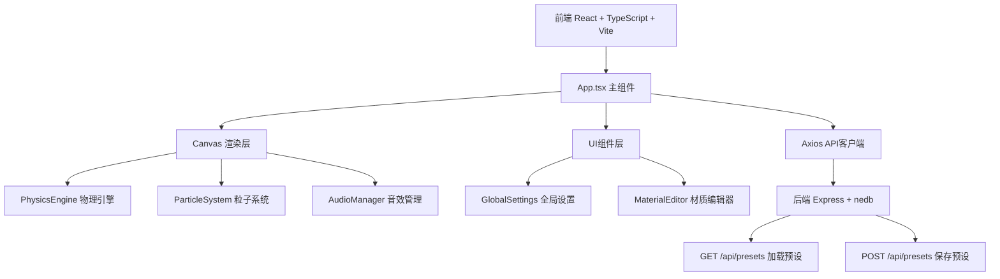
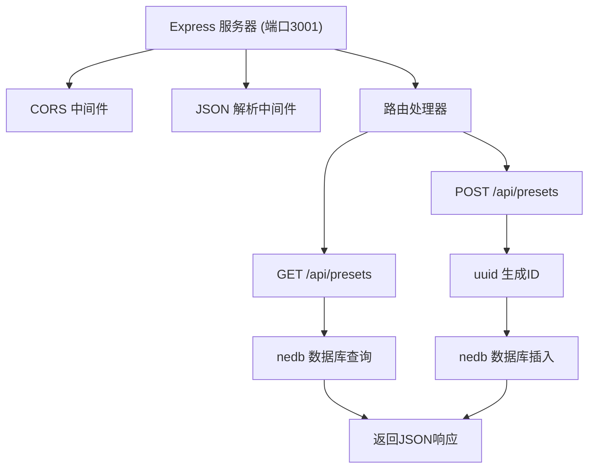

## 1. 架构设计



## 2. 技术描述

- **前端框架**：React 18 + TypeScript + Vite
- **渲染技术**：Canvas 2D API
- **音效技术**：Web Audio API（OscillatorNode, FilterNode, GainNode）
- **状态管理**：React useState/useRef（组件内状态）
- **HTTP客户端**：axios
- **后端**：Express 4 + TypeScript
- **数据库**：nedb-promises（嵌入式文档数据库）
- **工具库**：uuid（生成唯一ID）
- **构建工具**：Vite + ts-node
- **开发工具**：concurrently（同时启动前后端）

## 3. 目录结构

```
auto21/
├── package.json
├── index.html
├── vite.config.js
├── tsconfig.json
├── server/
│   └── index.ts
└── src/
    ├── App.tsx
    ├── PhysicsEngine.ts
    ├── ParticleSystem.ts
    ├── AudioManager.ts
    └── components/
        ├── GlobalSettings.tsx
        └── MaterialEditor.tsx
```

## 4. 核心模块说明

### 4.1 PhysicsEngine 物理引擎

- **位置**：`src/PhysicsEngine.ts`
- **功能**：
  - 角色位置、速度、加速度计算
  - 重力加速度：980像素/秒²
  - 摩擦系数影响水平速度衰减
  - 弹性系数影响落地弹跳
  - 碰撞检测与材质判定
  - 每帧更新返回声效触发信号

### 4.2 ParticleSystem 粒子系统

- **位置**：`src/ParticleSystem.ts`
- **功能**：
  - 管理五种材质粒子池（最大200个）
  - 粒子属性：位置、速度、寿命、颜色、大小
  - 五种材质粒子配置：
    - 草地：绿色草叶4x8px，朝上扩散，寿命0.6s，12-18颗
    - 沙地：黄色沙粒2x2px，四周散射，寿命0.4s，8-12颗
    - 石板：白色碎屑3x3px，寿命0.3s，4-6颗
    - 金属：橙色火星2x4px，弹跳下坠，寿命0.5s，6-10颗
    - 木地板：棕色木丝1x6px，寿命0.8s，10-14颗
  - 每帧更新位置和透明度衰减
  - 提供 `emit(x, y, type)` 方法

### 4.3 AudioManager 音效管理

- **位置**：`src/AudioManager.ts`
- **功能**：
  - Web Audio API合成音效，无需外部文件
  - 脚步声循环播放，间隔与移动速度相关
  - 五种材质音效：
    - 草地：沙沙声，低通500Hz，音量0.3
    - 沙地：闷响，低通300Hz，音量0.4
    - 石板：清脆撞击，高通2000Hz，音量0.5
    - 金属：金属碰撞，带混响，音量0.6
    - 木地板：空洞撞击，低频增强，音量0.45
  - 落地重击音效：音量0.7
  - 公共方法：`playStep(type, speed)`、`playLand(type)`

### 4.4 App.tsx 主组件

- **位置**：`src/App.tsx`
- **功能**：
  - 管理canvas引用
  - 全局暂停状态
  - 五种材质参数状态（摩擦系数、弹性系数）
  - 初始化所有模块
  - 材质参数传递给渲染循环
  - 与后端API通信加载/保存预设

### 4.5 UI组件

#### GlobalSettings.tsx

- 右侧固定面板，宽240px
- 重置按钮：恢复所有材质默认参数
- 暂停/继续按钮：控制游戏循环

#### MaterialEditor.tsx

- 点击地面按钮弹出，宽280px
- 摩擦系数滑块：0.0-1.0，步长0.05
- 弹性系数滑块：0.0-1.0，步长0.05
- 参数变化实时回调父组件

## 5. API定义

### 5.1 数据类型

```typescript
interface MaterialPreset {
  id: string;           // uuid
  name: string;
  grass: { friction: number; bounce: number };
  sand: { friction: number; bounce: number };
  stone: { friction: number; bounce: number };
  metal: { friction: number; bounce: number };
  wood: { friction: number; bounce: number };
  createdAt: number;
}

interface MaterialParams {
  friction: number;     // 0.0-1.0
  bounce: number;       // 0.0-1.0
}

type MaterialType = 'grass' | 'sand' | 'stone' | 'metal' | 'wood';
```

### 5.2 接口定义

#### GET /api/presets
- 描述：获取所有材质预设列表
- 响应：`MaterialPreset[]`

#### POST /api/presets
- 描述：创建新的材质预设
- 请求体：`Omit<MaterialPreset, 'id' | 'createdAt'>`
- 响应：创建的 `MaterialPreset` 对象

## 6. 后端架构



## 7. 配置文件

### package.json 依赖

```json
{
  "dependencies": {
    "react": "^18.2.0",
    "react-dom": "^18.2.0",
    "axios": "^1.6.0",
    "express": "^4.18.2",
    "nedb-promises": "^6.2.3",
    "uuid": "^9.0.0"
  },
  "devDependencies": {
    "@vitejs/plugin-react": "^4.2.0",
    "vite": "^5.0.0",
    "typescript": "^5.3.0",
    "@types/react": "^18.2.0",
    "@types/react-dom": "^18.2.0",
    "@types/express": "^4.17.21",
    "@types/node": "^20.10.0",
    "concurrently": "^8.2.0",
    "ts-node": "^10.9.0"
  },
  "scripts": {
    "dev": "vite",
    "server": "ts-node server/index.ts",
    "start": "concurrently \"npm run dev\" \"npm run server\""
  }
}
```

### vite.config.js

- 端口：5173（Vite默认）
- 代理：`/api` → `http://localhost:3001`

### tsconfig.json

- 严格模式
- ESNext 模块
- jsx: react-jsx
- 目标：ES2020

## 8. 默认材质参数

| 材质 | 摩擦系数 | 弹性系数 |
|------|---------|---------|
| 草地(grass) | 0.6 | 0.1 |
| 沙地(sand) | 0.8 | 0.0 |
| 石板(stone) | 0.1 | 0.3 |
| 金属(metal) | 0.2 | 0.5 |
| 木地板(wood) | 0.4 | 0.2 |

## 9. 性能配置

- 固定60FPS游戏循环
- requestAnimationFrame 渲染
- 粒子池上限：200个
- 物理更新：60Hz固定时间步长
- Vite 代理转发后端API
