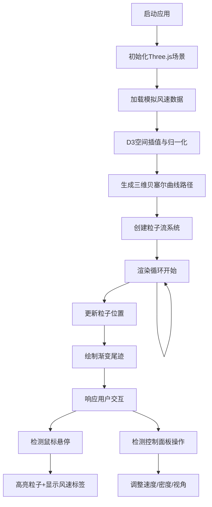

## 1. 产品概述

WindSculpt 是一款面向气象研究团队的三维大气气流动态可视化应用，将高空风速风向观测数据转化为直观的立体粒子流线动画，帮助气象分析师洞察不同海拔高度的气流轨迹和漩涡结构，辅助台风形成机制研究与路径预测分析。

- 核心价值：通过三维可视化技术，将抽象的气象数据转化为可交互的立体视觉体验
- 目标用户：气象研究人员、台风预报分析师、大气科学教育工作者

## 2. 核心功能

### 2.2 功能模块

1. **数据处理模块**：三维网格风速数据生成、D3空间插值、风速归一化处理
2. **粒子流系统**：贝塞尔曲线路径生成、粒子运动与拖尾效果、渐变色彩映射
3. **三维场景渲染**：Three.js场景管理、地球参考网格、光照与背景渐变
4. **交互控制面板**：速度调节、粒子密度控制、播放/暂停、视角模式切换
5. **悬停交互**：粒子高亮显示、风速数值标签、拖拽锁定机制

### 2.3 页面详情

| 页面名称 | 模块名称 | 功能描述 |
|-----------|-------------|---------------------|
| 主可视化页面 | 三维粒子流场景 | 2000条粒子流线动画，80个控制点贝塞尔曲线，渐变拖尾效果 |
| 主可视化页面 | 地球参考网格 | 半径200单位，经纬度间隔15度，半透明蓝色网格线 |
| 主可视化页面 | 色阶图例 | 左侧垂直色条，0-50m/s风速刻度，蓝到橙渐变 |
| 主可视化页面 | 控制面板 | 速度滑块0.5x-2x，粒子密度500-4000，播放/暂停，2D/3D视角切换 |
| 主可视化页面 | 地形叠加层 | Canvas 2D绘制地形高度图，底层半透明叠加 |

## 3. 核心流程

## 4. 用户界面设计

### 4.1 设计风格

- **主色调**：深蓝灰 `#0b1120` → `#1e293b` 渐变背景
- **强调色**：粒子从深蓝 `#1e3a8a` 到亮橙 `#f97316` 渐变
- **网格色**：半透明蓝色 `#3b82f6`（透明度0.3）
- **面板背景**：深灰半透明 `rgba(15,23,42,0.8)` + 毛玻璃 `backdrop-filter: blur(10px)`
- **字体**：Inter 字体家族，14px 字号，浅灰 `#e2e8f0` 文字色
- **圆角**：控制面板 16px 圆角
- **动画**：所有过渡使用 `ease-in-out` 缓动，时长 0.3s

### 4.2 页面设计概述

| 页面名称 | 模块名称 | UI 元素 |
|-----------|-------------|-------------|
| 主可视化页面 | 全屏3D场景 | 深蓝色渐变背景，相机默认位置 (0, 50, 200)，黑色页面背景 |
| 主可视化页面 | 左侧色阶图例 | 20px×300px 垂直色条，0-50m/s 刻度标注，蓝到橙渐变 |
| 主可视化页面 | 右下角控制面板 | 260px宽，24px内边距，速度滑块、密度滑块、播放按钮、视角切换 |
| 主可视化页面 | 悬停标签 | 30px检测范围，1.5倍亮度高亮，风速精度0.1m/s |
| 主可视化页面 | 地形叠加层 | Canvas 2D绘制，半透明底层叠加 |

### 4.3 响应性

- 桌面端优先设计，全屏自适应
- 控制面板固定右下角，不随窗口缩放位移
- 色阶图例固定左侧，保持垂直居中
- Canvas容器响应窗口 resize 事件自动调整

### 4.4 3D 场景指引

- **环境氛围**：深邃太空感，深蓝渐变背景模拟大气透视效果
- **光照设置**：环境光 + 方向光组合，粒子自发光材质增强可见度
- **摄像机设置**：PerspectiveCamera，默认位置 (0, 50, 200)，fov=60
- **视角切换**：3D模式 → 俯视2D模式，z轴归位，0.6s平滑过渡
- **交互**：OrbitControls 轨道控制，拖拽时禁用悬停检测
- **后处理**：无复杂后处理，保证60FPS性能
- **性能预算**：2000粒子，每粒子80控制点，目标55FPS以上
