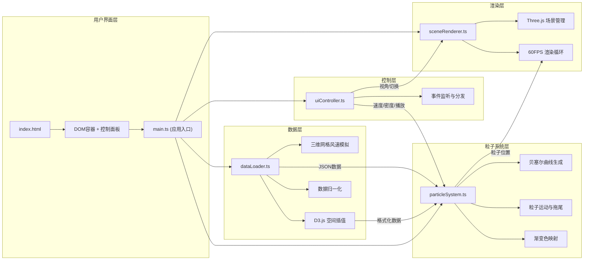

## 1. 架构设计



## 2. 技术描述

- **前端框架**：TypeScript + Three.js + D3.js
- **构建工具**：Vite 5.x + @vitejs/plugin-react
- **类型定义**：@types/three、@types/d3
- **无后端**：纯前端模拟数据，无需服务器
- **数据来源**：内置模拟生成 2023年摩羯台风简化风力数据

**文件调用关系与数据流向**：

```
index.html
   ↓ (加载入口)
main.ts
   ├→ dataLoader.ts (loadWindData())
   │   └→ 生成 { grid, u, v, w, normalized } JSON
   │       └→ particleSystem.ts (receiveData())
   ├→ particleSystem.ts (init(), update(deltaTime))
   │   ├→ 生成控制点 → 贝塞尔曲线
   │   ├→ 计算粒子位置 → THREE.Vector3[]
   │   │   └→ sceneRenderer.ts (updateParticles())
   │   └→ 接收 uiController 指令 (setSpeed(), setDensity())
   ├→ sceneRenderer.ts (init(), renderLoop())
   │   ├→ Three.js 场景/相机/光照
   │   ├→ 地球参考网格渲染
   │   ├→ 粒子材质与几何体更新
   │   └→ 接收 uiController 指令 (toggleViewMode())
   ├→ uiController.ts (init())
   │   ├→ 监听 DOM 事件 (滑块、按钮、鼠标)
   │   ├→ 悬停检测 (raycaster)
   │   └→ 调用粒子系统/渲染器接口
   └→ Canvas 2D 地形叠加层
       └→ 独立绘制，z-index 层级管理
```

## 3. 目录结构

```
auto23/
├── .trae/documents/
│   ├── PRD.md
│   └── tech-arch.md
├── index.html
├── package.json
├── vite.config.ts
├── tsconfig.json
└── src/
    ├── main.ts              # 应用入口，初始化所有模块
    ├── dataLoader.ts        # 数据加载与D3插值处理
    ├── particleSystem.ts    # 粒子流系统，贝塞尔曲线与拖尾
    ├── sceneRenderer.ts     # Three.js场景渲染管理
    └── uiController.ts      # UI控制与交互逻辑
```

## 4. 核心数据结构

### 4.1 风速网格数据
```typescript
interface WindData {
  gridSize: { x: number; y: number; z: number };  // 50x50x10
  bounds: { minX: number; maxX: number; minY: number; maxY: number; minZ: number; maxZ: number };
  u: Float32Array;  // x方向风速分量 (m/s)
  v: Float32Array;  // y方向风速分量 (m/s)
  w: Float32Array;  // z方向风速分量 (m/s)
  speed: Float32Array;  // 合速度
  normalizedSpeed: Float32Array;  // 归一化速度 [0,1]
}
```

### 4.2 粒子流线数据
```typescript
interface Particle {
  id: number;
  path: THREE.CubicBezierCurve3[];  // 80个控制点构成的曲线段
  pathLength: number;
  progress: number;  // 当前路径进度 [0,1]
  speed: number;     // 运动速度倍率
  trailPositions: THREE.Vector3[];  // 尾迹点数组
  currentPosition: THREE.Vector3;
  windSpeed: number;  // 当前位置风速 (m/s)
  color: THREE.Color;
  size: number;  // 粒子大小（随高度递减）
}
```

### 4.3 控制面板状态
```typescript
interface ControlState {
  speedMultiplier: number;  // 0.5 - 2.0
  particleCount: number;    // 500 - 4000
  isPlaying: boolean;
  viewMode: '3D' | '2D';
  isDragging: boolean;
}
```

## 5. 性能优化策略

### 5.1 渲染性能
- **实例化渲染**：使用 `THREE.InstancedMesh` 批量渲染粒子，减少Draw Call
- **BufferGeometry**：使用 `BufferGeometry` 而非 `Geometry`，提升GPU内存效率
- **尾迹优化**：每条流线尾迹限制为20个点，使用 `LineSegments` 渐变材质
- **帧率控制**：requestAnimationFrame 自适应，目标60FPS，最低保证55FPS

### 5.2 计算优化
- **预计算曲线**：贝塞尔曲线控制点一次性生成，缓存采样点
- **空间网格查询**：三维网格数据使用线性插值，O(1)查询
- **粒子池复用**：调整粒子密度时复用已有粒子对象，避免频繁GC
- **Web Worker**：数据插值与曲线生成在Worker中执行（可选，根据性能测试）

### 5.3 交互优化
- **射线检测节流**：鼠标悬停检测使用 requestAnimationFrame 节流
- **拖拽锁定**：OrbitControls 拖拽时暂停悬停检测，避免性能波动
- **距离检测优化**：悬停距离检测使用距离平方比较，避免开方运算

## 6. 技术约束与注意事项

1. **TypeScript 严格模式**：启用 `strict: true`，禁止隐式 any
2. **ES2020 目标**：使用现代JS特性，Optional Chaining、Nullish Coalescing 等
3. **Three.js 版本**：使用 r160+，确保 InstancedMesh 和 Line2 支持
4. **D3.js 版本**：使用 v7+，主要使用 `d3-interpolate` 和 `d3-scale`
5. **无外部资源**：所有数据模拟生成，不加载外部纹理或模型
6. **内存管理**：粒子对象池化，场景对象销毁时手动 dispose 几何体和材质
