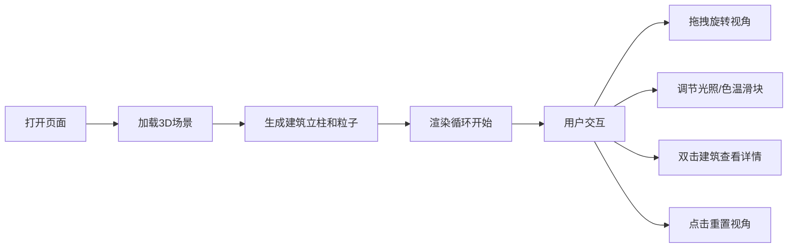

## 1. 产品概述
LumiScape 是一款面向城市光污染研究的沉浸式 3D 可视化应用，将城市夜间灯光数据转化为可交互的 3D 场景，让研究人员和公众直观感知不同区域的光照强度、色温和分布密度。
- 核心用途：评估城市光污染对生物节律和天文观测的影响，辅助环保机构的研究与科普工作
- 目标价值：通过 3D 沉浸式体验将抽象的光污染数据具象化，提升研究效率和公众认知

## 2. 核心功能

### 2.1 用户角色
| 角色 | 注册方式 | 核心权限 |
|------|----------|----------|
| 研究人员 | 无需注册，直接访问 | 查看 3D 场景、调节参数、查看建筑详情 |
| 公众用户 | 无需注册，直接访问 | 浏览 3D 场景、切换视角、重置视图 |

### 2.2 功能模块
1. **主场景页面**：3D 城市地图、导航栏、控制面板、色温映射条、建筑信息浮窗

### 2.3 页面详情
| 页面名称 | 模块名称 | 功能描述 |
|----------|----------|----------|
| 主场景页面 | 3D 城市地图 | 20x20 网格建筑立柱，随色温/强度动态变色发光，顶部点光源，支持鼠标拖拽旋转 |
| 主场景页面 | 导航栏 | 应用名称展示、重置视角按钮（0.5 秒平滑过渡） |
| 主场景页面 | 控制面板 | 光照强度缩放滑块（0.5x-2x）、色温偏移滑块（-1500K~+1500K）、视角坐标和平均强度显示 |
| 主场景页面 | 色温映射条 | 右侧垂直渐变色条（2000K-6500K），带刻度标签 |
| 主场景页面 | 粒子系统 | 3000 个发光粒子，分布在建筑顶部，缓慢旋转，带 Bloom 后处理 |
| 主场景页面 | 建筑信息浮窗 | 双击建筑弹出详情（坐标、高度、强度、色温），3 秒后自动淡出 |

## 3. 核心流程
用户打开页面后，自动加载 20x20 网格的 3D 城市灯光场景。可以通过鼠标拖拽旋转视角、使用滑块调节光照参数、双击建筑查看详情、点击重置按钮回到初始视角。

## 4. 用户界面设计

### 4.1 设计风格
- **主色调**：深蓝黑 #0f172a，纯黑背景 #000000
- **高亮色**：天蓝色 #38bdf8（数据强调）、橙黄→蓝白渐变（温度映射）
- **按钮风格**：圆角 6px，半透明深色背景，hover 时变浅
- **字体**：现代无衬线字体，标题 20px 加粗，正文 14px，标签 12px
- **布局**：全屏 3D 画布 + 悬浮 UI 层（顶部导航、左下控制面板、右侧色条）
- **视觉风格**：深色科幻风格，发光材质、Bloom 光晕、半透明毛玻璃效果

### 4.2 页面设计概述
| 页面名称 | 模块名称 | UI 元素 |
|----------|----------|---------|
| 主场景页面 | 3D 画布 | 全屏 Three.js 渲染，黑色背景，半透明网格地面 |
| 主场景页面 | 顶部导航栏 | 高 48px，半透明深蓝黑背景 + blur(10px)，左侧标题，右侧按钮 |
| 主场景页面 | 控制面板 | 220px 宽，半透明黑背景 #00000080，圆角 12px，左下悬浮 |
| 主场景页面 | 色温映射条 | 20×300px 垂直渐变条，右侧刻度标签 2000K/3000K/4000K/5000K/6500K |
| 主场景页面 | 信息浮窗 | 240px 宽，深色背景 #1e293b，圆角 8px，阴影 0 0 20px #00000040 |

### 4.3 响应式
- 桌面端优先设计（≥768px）
- 移动端（<768px）：控制面板改为可折叠抽屉，折叠时显示图标按钮，展开时从左侧滑入（宽 180px）

### 4.4 3D 场景指导
- **环境**：纯黑背景，营造夜空氛围
- **光照**：建筑顶部 PointLight，范围 5-12 单位随强度变化；环境光微弱
- **相机**：PerspectiveCamera，初始 45° 俯角，距离原点 30 单位，OrbitControls 控制
- **构图**：20×20 网格居中，建筑立柱向上延伸，粒子浮动在顶部
- **交互**：鼠标拖拽旋转、滚轮缩放、双击选中
- **后处理**：Bloom 发光效果增强粒子和建筑发光感
- **性能预算**：建筑 ≤400 个，粒子 ≤5000 个，总面数 ≤50 万，帧率 ≥30fps
