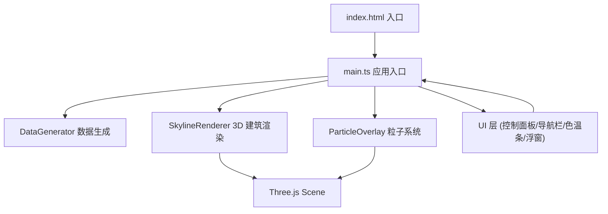

## 1. 架构设计



**数据流向说明：**
- `main.ts` 作为调度中心，从 `DataGenerator.getData()` 获取灯光数据
- 数据传递至 `SkylineRenderer.render()` 创建建筑立柱和点光源
- 数据传递至 `ParticleOverlay.init()` 生成对应颜色的粒子
- UI 控件事件回传至 `main.ts`，实时调用渲染器的 `updateIntensityScale()` 和 `updateColorTempOffset()` 方法

## 2. 技术描述
- **前端框架**：原生 TypeScript（不使用 React，因需求明确要求 Three.js + Vite + TS 直接实现）
- **3D 渲染**：three@0.160 + @types/three
- **构建工具**：vite@5 + @vitejs/plugin-react（用于兼容 TypeScript）
- **语言**：TypeScript@5，严格模式，模块解析 bundler
- **额外依赖**：canvas-confetti（预留庆祝效果）
- **样式**：原生 CSS，响应式设计
- **后端**：无，纯前端模拟数据

## 3. 目录结构
```
auto29/
├── index.html              # 入口 HTML，含 #app 容器和全屏 meta
├── package.json            # 依赖和脚本
├── vite.config.ts          # Vite 配置
├── tsconfig.json           # TS 严格模式配置
└── src/
    ├── main.ts             # 应用入口，场景/相机/控制器初始化，渲染循环
    ├── DataGenerator.ts    # 20x20 网格灯光数据模拟
    ├── SkylineRenderer.ts  # 建筑立柱 + 点光源 + OrbitControls
    ├── ParticleOverlay.ts  # 粒子系统 + Bloom 后处理
    └── styles/
        └── main.css        # UI 样式（深色科幻风 + 响应式）
```

## 4. 核心数据模型

### BuildingData 类型定义
```typescript
interface BuildingData {
  x: number;          // 网格 X 坐标 (0-19)
  z: number;          // 网格 Z 坐标 (0-19)
  height: number;     // 建筑高度 (3-20 单位)
  intensity: number;  // 光照强度 (30-100 lux)
  colorTemp: number;  // 色温 (2500-6500K)
}
```

### 色温转 RGB 算法
使用 Planckian locus 近似公式，将 2000K-6500K 映射到橙黄(#ffa040) → 蓝白(#cfd8ff)的渐变。

### 渲染参数
| 参数 | 值 | 说明 |
|------|-----|------|
| 网格尺寸 | 20×20 | 400 栋建筑，不超过上限 |
| 粒子数量 | 3000 | 不超过 5000 上限 |
| 建筑宽度 | 1 单位 | BoxGeometry(1, height, 1) |
| 初始相机距离 | 30 单位 | 俯视 45° |
| 点光源范围 | 5-12 单位 | 随强度线性映射 |
| 粒子旋转速度 | 0.1 rad/s | 绕 Y 轴缓慢旋转 |

## 5. 模块间调用关系

### main.ts → DataGenerator
```typescript
import { DataGenerator } from './DataGenerator';
const generator = new DataGenerator(20, 20);
const data: BuildingData[] = generator.getData();
```

### main.ts → SkylineRenderer
```typescript
import { SkylineRenderer } from './SkylineRenderer';
const skyline = new SkylineRenderer(scene, camera, renderer.domElement);
skyline.render(data);
skyline.updateIntensityScale(1.5);       // UI 滑块联动
skyline.updateColorTempOffset(500);      // UI 滑块联动
skyline.resetCamera();                   // 重置视角按钮
```

### main.ts → ParticleOverlay
```typescript
import { ParticleOverlay } from './ParticleOverlay';
const particles = new ParticleOverlay(scene, renderer);
particles.init(data);
particles.updateColorTempOffset(500);    // 与色温滑块同步
```

## 6. 性能优化策略
1. **几何体复用**：所有建筑共享相同的 BoxGeometry 引用，仅修改 scale
2. **材质复用**：按色温档位预创建有限数量的 MeshStandardMaterial
3. **粒子合并**：使用单个 BufferGeometry + Points 渲染 3000 粒子
4. **后处理节流**：Bloom 阈值设为 0.8，减少发光像素计算量
5. **帧率监控**：渲染循环内使用 performance.now() 监控，必要时降低粒子渲染精度
