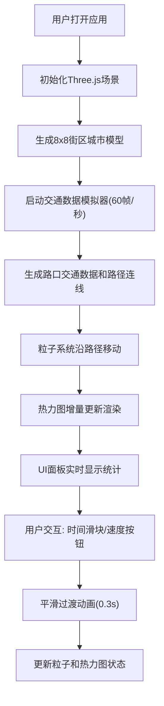

## 1. 产品概述

CityFlowHub是一个3D城市交通流量时空可视化应用，帮助数据新闻编辑将复杂的城市交通流量数据转化为直观的3D可视化叙事。通过Three.js渲染动态粒子流模拟车流潮汐变化，Canvas 2D叠加热力图层展示拥堵热力扩散，让读者能在地图上直观感受时空分布感。

- 核心目标：解决传统2D图表难以传达交通数据时空分布感的问题，为数据新闻提供沉浸式3D可视化叙事工具
- 目标用户：数据新闻编辑、交通分析人员、城市规划者
- 技术特点：纯客户端运行，无需后端服务，模块化架构，高性能实时渲染

## 2. 核心特征

### 2.1 用户角色
| 角色 | 注册方式 | 核心权限 |
|------|---------|----------|
| 数据编辑者 | 无需注册 | 浏览3D场景、调整时间轴、切换播放速度、查看统计数据 |

### 2.2 功能模块
1. **3D城市街道场景**：8x8街区网格地图，带纹理贴图的街道网络，随机高度建筑群，支持鼠标交互
2. **动态粒子流系统**：5000个彩色粒子沿街道移动，颜色映射速度，形成连续流动效果
3. **热力图叠加层**：Canvas 2D半透明热力图，实时映射车流量拥堵程度
4. **时间浏览控制器**：24小时时间滑块，支持时段切换和平滑过渡动画
5. **数据统计面板**：实时显示当前时段车流总量和平均速度
6. **播放控制**：流畅/加速/暂停三种速度模式切换
7. **性能监控**：实时帧率检测，确保55FPS以上稳定运行

### 2.3 页面详情
| 页面名称 | 模块名称 | 功能描述 |
|---------|----------|----------|
| 主页面 | 3D场景容器 | Three.js渲染城市街道、建筑物、粒子流，支持鼠标旋转/平移/缩放 |
| 主页面 | 热力图叠加层 | Canvas 2D实时绘制拥堵热力图，半透明叠加在3D场景上方 |
| 主页面 | UI控制面板 | 右下角悬浮面板，包含时间滑块、播放控制按钮、数据统计 |
| 主页面 | 性能监控 | 左上角实时显示帧率、渲染耗时等性能指标 |

## 3. 核心流程

用户打开应用 → 初始化3D场景和城市模型 → 启动交通数据模拟 → 粒子系统开始流动 → 热力图实时更新 → 用户拖动时间滑块 → 数据平滑过渡到目标时段 → 粒子和热力图同步更新 → 用户切换播放模式 → 调整动画速度

## 4. 用户界面设计

### 4.1 设计风格
- **主色调**：深色科幻风格，背景渐变#0a0f1a到#1a2744
- **强调色**：蓝色系 #1e3a5f、#3b82f6、#2563eb
- **文字颜色**：白色#e2e8f0和灰色#94a3b8
- **粒子颜色**：速度映射 - 红#ff4444(<30km/h) → 黄#ffaa00(30-60) → 绿#44ff44(>60)
- **热力颜色**：流量映射 - 蓝#0066ff → 黄#ffff00 → 红#ff0000
- **按钮样式**：圆角8px，悬停背景变化，点击缩放动画(0.95-1.0)
- **字体**：UI面板使用系统字体，数字使用monospace
- **布局**：全屏3D场景，右下角悬浮控制面板，左上角性能监控

### 4.2 页面设计概要
| 页面名称 | 模块名称 | UI元素 |
|---------|----------|--------|
| 主页面 | 3D场景 | 8x8网格街道(灰白色半透明#d1d5db, 透明度0.3)、建筑物(颜色#334155到#475569渐变)、5000粒子流、默认45度俯视视角 |
| 主页面 | 热力图层 | Canvas 2D叠加，透明度0.7，半径30-50像素，高斯衰减 |
| 主页面 | UI面板 | 宽度280px，背景rgba(10,15,26,0.85)，圆角12px，边框1px solid #3b82f6，backdrop-filter: blur(8px) |
| 主页面 | 时间滑块 | 范围0-23时，步长1小时，轨道高6px#1e3a5f，滑块圆点直径16px#3b82f6，悬停变#60a5fa |
| 主页面 | 速度按钮 | 三个按钮(流畅/加速/暂停)，选中背景#2563eb，其他#1e293b，过渡0.2s |
| 主页面 | 统计文本 | 当前时段车流总量、平均速度，白色0.875rem，数字monospace |
| 主页面 | 条形图 | 滑块旁动态条形图，高度10px，宽度随车流量变化，颜色#3b82f6 |
| 主页面 | 性能监控 | 帧率FPS、每帧渲染耗时ms，小字显示在左上角 |

### 4.3 响应式设计
- 桌面端优先设计
- 宽度<768px时：UI面板宽度缩小至240px，按钮竖向排列，字号0.9rem
- 使用ResizeObserver监听窗口尺寸变化
- 3D场景自动适配窗口大小，保持正确的宽高比

### 4.4 3D场景指引
- **环境**：深色背景，雾效增强深度感，无HDRI
- **光照**：环境光(强度0.4) + 方向光(强度0.8, 45度角) + 点光源模拟街灯
- **相机**：PerspectiveCamera，fov 60，近/远裁剪面 0.1-1000，初始位置(20, 20, 20)看向原点
- **控制器**：OrbitControls，enableDamping=true，阻尼系数0.05，左键旋转、右键平移、滚轮缩放
- **构图**：城市居中，粒子流为视觉焦点，建筑物作为背景衬托
- **动画**：粒子沿路径连续移动，时间切换时线性插值平滑过渡
- **后处理**：无，保证性能优先
- **性能预算**：每帧渲染<18ms，5000粒子，热力图每2帧更新一次
