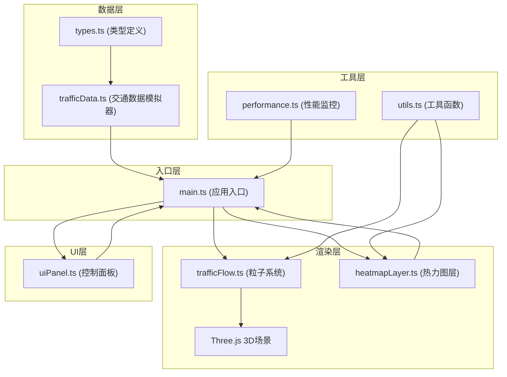
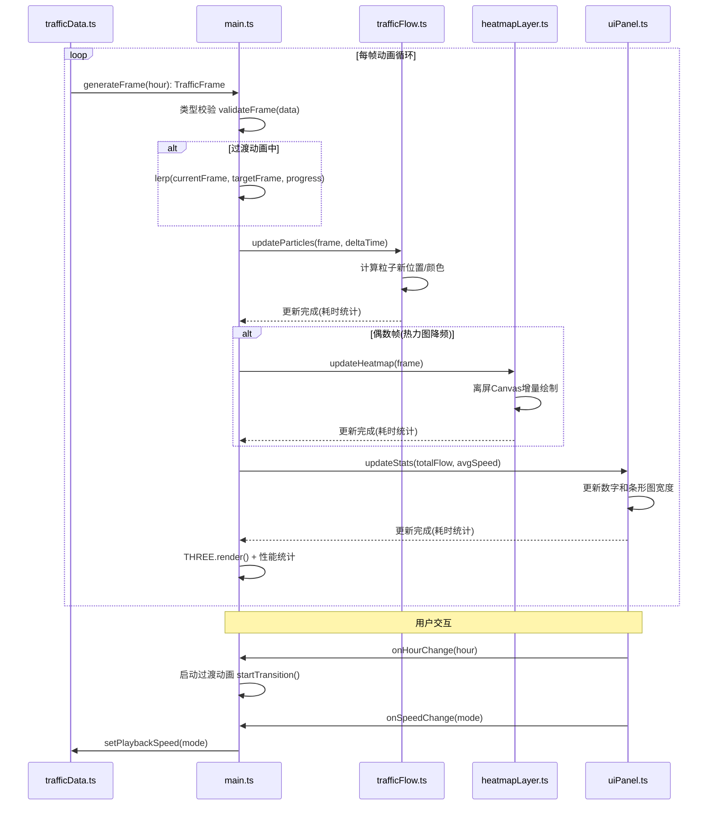

## 1. 架构设计

整体采用模块化分层架构，各模块职责单一，通过明确的类型定义进行数据交互。纯客户端运行，无需后端服务。



**数据流说明**：
1. `types.ts` 定义所有数据接口，确保模块间数据格式一致
2. `trafficData.ts` 按60帧/秒生成模拟数据，包含路口信息、车流量、速度和路径连线
3. `main.ts` 接收数据后通过类型安全的方式分发给 `trafficFlow.ts`、`heatmapLayer.ts` 和 `uiPanel.ts`
4. `trafficFlow.ts` 管理粒子系统，粒子沿路径连线移动，颜色随速度变化
5. `heatmapLayer.ts` 使用离屏Canvas缓存，每2帧增量更新热力图
6. `uiPanel.ts` 通过ResizeObserver实现响应式，接收数据更新统计信息和条形图
7. `performance.ts` 监控帧率和渲染耗时，确保性能达标

## 2. 技术栈描述

- **前端框架**：原生 TypeScript + Three.js，不使用React/Vue，直接操作DOM和WebGL
- **构建工具**：Vite 5.x，dev server端口5173
- **语言**：TypeScript 5.x，严格模式，target ES2020
- **3D渲染**：Three.js 0.160.x + @types/three
- **数据处理**：D3 7.x + d3-scale 用于颜色映射和数据聚合
- **样式**：原生CSS + CSS变量，无Tailwind
- **状态管理**：原生变量管理，无额外状态库
- **后端**：无，纯客户端运行

## 3. 文件结构与职责

| 文件路径 | 职责描述 | 输出 | 依赖 |
|---------|---------|------|------|
| `package.json` | 项目配置，依赖声明，启动脚本 | - | - |
| `vite.config.js` | Vite构建配置，dev server端口5173 | - | - |
| `tsconfig.json` | TypeScript严格模式配置 | - | - |
| `index.html` | 入口页面，全屏canvas容器，深色渐变背景 | DOM容器 | - |
| `src/types.ts` | 全局类型定义，接口约束 | Intersection、TrafficData、Particle等类型 | - |
| `src/main.ts` | 应用初始化，创建场景、相机、控制器，动画循环，数据分发 | 渲染循环、性能监控 | types, trafficData, trafficFlow, heatmapLayer, uiPanel |
| `src/trafficData.ts` | 60帧/秒交通数据模拟器，路径生成算法 | TrafficFrame数据 | types |
| `src/trafficFlow.ts` | 5000粒子系统管理，路径移动逻辑，颜色映射 | THREE.Points | types, three, d3-scale |
| `src/heatmapLayer.ts` | Canvas 2D热力图，增量更新，离屏缓存 | HTMLCanvasElement | types |
| `src/uiPanel.ts` | 响应式UI面板，时间滑块，速度控制，条形图 | HTMLElement | types |
| `src/utils/performance.ts` | 帧率监控，渲染耗时统计 | PerformanceMetrics | - |
| `src/utils/easing.ts` | 缓动函数，平滑过渡动画 | 插值函数 | - |
| `src/utils/color.ts` | 颜色映射工具函数 | Color | d3-scale |

## 4. 类型定义与接口约束

```typescript
// src/types.ts

export interface Intersection {
  id: string;
  x: number;
  y: number;
  lat: number;
  lng: number;
}

export interface StreetSegment {
  id: string;
  from: string;
  to: string;
  fromIntersection: Intersection;
  toIntersection: Intersection;
  pathPoints: THREE.Vector3[];
}

export interface TrafficDataPoint {
  intersectionId: string;
  flow: number;
  speed: number;
}

export interface TrafficFrame {
  timestamp: number;
  hour: number;
  data: TrafficDataPoint[];
  totalFlow: number;
  avgSpeed: number;
}

export interface Particle {
  id: number;
  position: THREE.Vector3;
  segmentId: string;
  progress: number;
  speed: number;
  color: THREE.Color;
  size: number;
  active: boolean;
}

export interface HeatmapPoint {
  x: number;
  y: number;
  intensity: number;
  radius: number;
}

export type PlaybackSpeed = 'normal' | 'fast' | 'paused';

export interface UIState {
  currentHour: number;
  playbackSpeed: PlaybackSpeed;
  totalFlow: number;
  avgSpeed: number;
  isDragging: boolean;
}

export interface PerformanceMetrics {
  fps: number;
  frameTime: number;
  particleUpdateTime: number;
  heatmapUpdateTime: number;
  uiUpdateTime: number;
}
```

## 5. 核心算法说明

### 5.1 路径生成算法
- 输入：8x8网格路口坐标
- 输出：每个街道段的路径点数组
- 算法：
  1. 生成8x8网格路口，间距4个单位
  2. 连接相邻路口形成水平和垂直街道段
  3. 每个街道段生成等间距路径点(步长0.5单位)
  4. 为每个段生成双向路径(正向和反向)

### 5.2 粒子路径移动逻辑
- 粒子从路口出发，沿街道段路径点移动
- `progress` 属性表示当前在段上的进度(0-1)
- 每帧更新：`progress += deltaTime * speed * 0.01`
- 到达终点(progress >= 1)时，选择相邻段继续或重置
- 位置计算：根据progress在路径点数组中线性插值

### 5.3 热力图增量更新
- 使用离屏Canvas预渲染热力点
- 主Canvas每帧只更新变化区域
- 降频策略：每2帧更新一次热力图
- 衰减函数：高斯衰减 `intensity * exp(-(dist^2)/(2*radius^2))`
- 半径：根据车流量动态调整(30-50像素)

### 5.4 平滑过渡动画
- 时间滑块切换时，使用线性插值(lerp)过渡0.3秒
- 粒子位置、颜色、热力强度同步过渡
- 缓动函数：easeInOutCubic
- 过渡期间数据来源：当前帧数据与目标帧数据插值

### 5.5 性能监控
- 基于requestAnimationFrame时间戳计算FPS
- 每帧记录各模块耗时(粒子更新/热力图/UI)
- 滑动窗口平均计算最近10帧的平均耗时
- 当FPS < 55时自动降级：减少粒子数或降低热力图更新频率

## 6. 性能约束实现方案

| 约束 | 实现方案 |
|-----|---------|
| 每帧渲染<18ms | 1. Three.js InstancedBufferGeometry渲染粒子<br>2. 热力图每2帧更新<br>3. 离屏Canvas缓存热力点 |
| 帧率>=55FPS | 性能监控+自动降级策略 |
| 热力图>=30FPS | 每2帧更新=30FPS @60FPS刷新率 |
| 滑块响应<50ms | 防抖+requestAnimationFrame批量更新 |
| 5000粒子流畅移动 | BufferGeometry + 单次draw call |

## 7. 数据流向图


