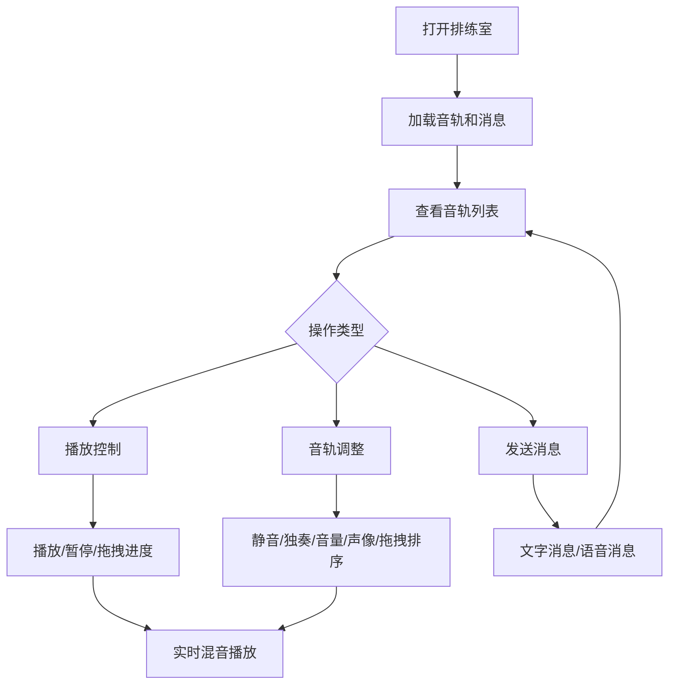

## 1. 产品概述

TuneBite 是一个面向家庭乐队和音乐爱好者的在线协作排练室平台，解决传统排练协作中微信语音条分散、离线混音软件操作繁琐的痛点。成员可上传各自乐器音轨，在时间轴上拖拽同步播放与叠加混音，同时通过文字/语音消息实时讨论排练效果，让排练协作更流畅集中。

## 2. 核心功能

### 2.1 用户角色

| 角色 | 注册方式 | 核心权限 |
|------|----------|----------|
| 乐队成员 | 加入排练室 | 上传音轨、调音、发送消息 |
| 排练室创建者 | 创建排练室 | 管理音轨顺序、管理成员 |

### 2.2 功能模块

1. **排练室主界面**: 项目标题、播放控制条、成员音轨列表、消息区
2. **音轨编辑面板**: 波形显示、静音/独奏、音量滑块、声像旋钮

### 2.3 页面详情

| 页面名称 | 模块名称 | 功能描述 |
|----------|----------|----------|
| 排练室主界面 | 播放控制条 | 播放/暂停按钮（圆形40px，背景#1db954）、进度条（宽80%，轨道色#404040，缓冲条#1db95433半透明）、播放头（12px白色圆点，拖拽0.1s缓动） |
| 排练室主界面 | 音轨列表区 | 每个音轨高70px，左侧乐器图标+成员昵称，右侧波形缩略图（Canvas实时绘制，波形颜色取成员配色如#ff6b6b/#4ecdc4），选中高亮#1e2a3a，可拖拽调整顺序 |
| 排练室主界面 | 静音/独奏按钮 | 静音28px圆角6px背景#555，独奏同尺寸背景#f59e0b，点击填充变为强调色+0.15s缩放弹跳动画 |
| 排练室主界面 | 音量滑块 | 宽180px轨道色#4a4a4a，滑块圆形16px填充#1db954 |
| 排练室主界面 | 声像旋钮 | -50到+50范围，旋钮直径24px，旋转时tooltip显示数值 |
| 排练室主界面 | 消息输入区 | 固定底部高60px，输入框圆角12px背景#2a2a3a，语音按钮36px圆形背景#6366f1，录制10s音频 |
| 排练室主界面 | 消息列表 | 气泡形式显示在播放器上方，支持文字/语音混排，语音气泡220px×48px含波形+播放按钮 |

## 3. 核心流程

用户打开排练室 → 查看已有音轨列表 → 点击播放控制条播放所有音轨 → 在时间轴上拖拽同步 → 对单个音轨调整静音/独奏/音量/声像 → 在消息区实时讨论排练效果

## 4. 界面设计

### 4.1 设计风格

- **主色调**: 暗色主题，背景#121212，卡片#1e1e1e，分割线#2a2a2a
- **强调色**: 播放控制主色#1db954（Spotify绿），独奏#f59e0b，语音#6366f1
- **按钮风格**: 圆形/圆角按钮，悬浮变色或轻微放大
- **字体**: system-ui 无衬线，简洁现代
- **布局风格**: 纵向布局，顶部播放控制+下方音轨列表+底部消息区
- **图标风格**: 简洁线性图标（lucide-react）

### 4.2 页面设计概览

| 页面名称 | 模块名称 | UI元素 |
|----------|----------|--------|
| 排练室主界面 | 播放控制条 | 深色背景，绿色圆形播放按钮，细长进度条带缓冲指示，白色播放头 |
| 排练室主界面 | 音轨列表 | 深色卡片行，左侧彩色乐器图标，Canvas波形，悬浮高亮 |
| 排练室主界面 | 音轨控件 | 小型方形静音按钮，琥珀色独奏按钮，绿色圆形音量滑块，小型声像旋钮 |
| 排练室主界面 | 消息区 | 固定底部输入框，紫色语音按钮，气泡式消息列表 |

### 4.3 响应式

- 桌面优先设计，屏幕宽度<768px时音轨列表变为单列卡片布局
- 触摸优化：音轨拖拽支持触摸操作，滑块和旋钮适配触摸尺寸

### 4.4 动效

- 播放头拖拽：0.1秒缓动过渡
- 静音/独奏切换：0.15秒缩放弹跳动画
- 按钮悬浮：变色或轻微放大
- 波形绘制：30fps以上刷新率
- 时间轴拖动：精确到帧（30fps）
